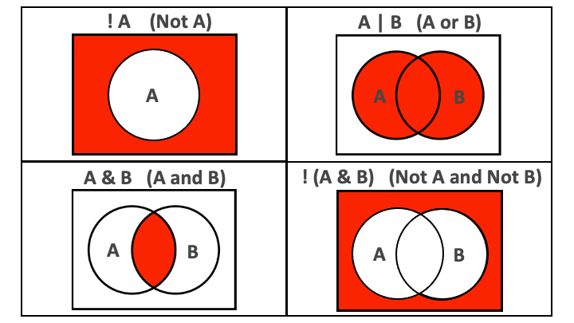

```{r, echo = F, message = F, warning = F}
library(tidyverse)
library(knitr)

## functions
source(here::here("global/functions/misc_functions.R"))

## default render
registerS3method("reactable_5_rows", "data.frame", reactable_5_rows)
knitr::opts_chunk$set(class.source = "tgc-code-block", render = reactable_5_rows)

## autograders
suppressMessages(source(here::here("ch04_data_wrangling/lessons/ls02_filter_autograder.R")))
```

# Data wrangling: filtering rows

------------------------------------------------------------------------

## Learning objectives

1.  You will use `dplyr::filter()` to keep or drop rows from a dataframe.

2.  You will filter rows by specifying conditions on numbers or strings using relational operators like greater than (`>`), less than (`<`), equal to (`==`), and not equal to (`!=`).

3.  You will filter rows by combining conditions using logical operators like the ampersand (`&`) and the vertical bar (`|`).

4.  You will filter rows by negating conditions using the exclamation mark (`!`) logical operator.

5.  You will filter rows with missing values using the `is.na()` function.

------------------------------------------------------------------------

## The Yaounde COVID-19 dataset

We continue to use the data from the COVID-19 serological survey from Yaounde.

```{r, message = F}
yaounde <- read_csv(here::here('ch04_data_wrangling/data/yaounde_data.csv'))
## a smaller subset of variables
yao <- yaounde %>% 
  select(age, sex, weight_kg, highest_education, neighborhood, 
         occupation, is_smoker, is_pregnant, 
         igg_result, igm_result)
yao
```

## Introducing `filter()`

We use `filter()` to keep rows that satisfy a set of conditions.

Let's take a look at a simple example.

If we want to keep just the male records, we run:

```{r}
yao %>% filter(sex == "Male")
```

Note the use of the double equal sign `==` rather than the single equal sign `=`.

The `==` sign tests for equality, as demonstrated below:

```{r, render = normal_print}
## create the object `sex_vector` with three elements
sex_vector <- c("Male", "Female", "Female")
## test which elements are equal to "Male"
sex_vector == "Male"
```

`yao %>% filter(sex == "Male")` keeps all rows where `sex == "Male"` evaluates to `TRUE`.

------------------------------------------------------------------------

We can chain `filter()` with `nrow()` to get the number of rows fulfilling a condition.

```{r, render = normal_print}
## how many respondents were male?
yao %>% 
  filter(sex == "Male") %>% 
  nrow()
```

::: key-point
The double equal sign, `==`, tests for equality,

while the single equals sign, `=`, is used for specifying values to arguments inside functions.
:::

::: practice
Filter the `yao` data frame to respondents who were pregnant during the survey. Store in `q1`.

```{r, eval = F, echo = FALSE}
q1 <- "YOUR_ANSWER_HERE" 
.check_q1()
.hint_q1()
```

How many respondents were female? (Use `filter()` and `nrow()`)

```{r, eval = F, echo = FALSE}
q2 <- "YOUR_ANSWER_HERE"
.check_q2()
.hint_q2()
```
:::

## Relational operators

The `==` operator introduced above is an example of a "relational" operator

Here is a list of some of these operators.

|              |                                     |
|:-------------|:------------------------------------|
| **Operator** | **is TRUE if**                      |
| A \< B       | A is **less than** B                |
| A \<= B      | A is **less than or equal** to B    |
| A \> B       | A is **greater than** B             |
| A \>= B      | A is **greater than or equal to** B |
| A == B       | A is **equal** to B                 |
| A != B       | A is **not equal** to B             |
| A %in% B     | A **is an element of** B            |

Take your time to pause the video and look over them.

You can also save the resource to come back to it when you code.

{width="450"}

Let's see how to use these within `filter()`:

```{r}
yao %>% filter(sex != "Male") ## keep rows where `sex` is not "Male"
yao %>% filter(age < 6) ## keep respondents under 6
yao %>% filter(age >= 70) ## keep respondents aged at least 70

## keep respondents whose highest education is "Primary" or "Secondary"
yao %>% filter(highest_education %in% c("Primary", "Secondary"))
```

::: practice
From `yao`, keep only respondents who were children (under 18).

```{r, eval = F, echo = FALSE}
q3 <- "YOUR_ANSWER_HERE" 
.check_q3()
.hint_q3()
```

With `%in%`, keep only respondents who live in the "Tsinga" or "Messa" neighborhoods.

```{r, eval = F, echo = FALSE}
q4 <- "YOUR_ANSWER_HERE" 
.check_q4()
.hint_q4()
```
:::

## Combining conditions with `&` and `|`

A single `filter()` statement can encompass multiple conditions.

The conditions are separated by commas:

```{r}
## keep respondents who are pregnant and are ex-smokers
yao %>% filter(is_pregnant == "Yes", is_smoker == "Ex-smoker") ## only one row
```

When multiple conditions are separated by a comma, they are implicitly combined with an **and** (`&`).

Good practice is to replace the comma with `&` to make this more explicit.

```{r}
## same result as before, but `&` is more explicit
yao %>% filter(is_pregnant == "Yes" & is_smoker == "Ex-smoker")
```

::: side-note
Don't confuse:

-   the "," in listing several conditions in filter `filter(A,B)` i.e. filter based on condition A and (`&`) condition B

-   the "," in lists `c(A,B)` which is listing different components of the list (and has nothing to do with the `&` operator)
:::

If we want to combine conditions with an **or**, we use the vertical bar symbol, `|`.

```{r}
## respondents who are pregnant OR who are ex-smokers
yao %>% filter(is_pregnant == "Yes" | is_smoker == "Ex-smoker")
```

::: practice
Filter `yao` to only keep men who tested IgG positive.

```{r, eval = F, echo = FALSE}
q5 <- "YOUR_ANSWER_HERE" 
.check_q5()
.hint_q5()
```

Filter `yao` to include just children (under 18) and those whose highest education is primary school.

```{r, eval = F, echo = FALSE}
q6 <- "YOUR_ANSWER_HERE" 
.check_q6()
.hint_q6()
```
:::

## Negating conditions with `!`

To negate conditions, we wrap them in `!()`.

Below, we drop respondents:

-   who are children (less than 18 years)

OR

-   who weigh less than 30kg:

```{r}
## drop respondents < 18 years OR < 30 kg
yao %>% filter(!(age < 18 | weight_kg < 30))
```

If you combine `!` with `%in%` then it is like writing the operator **NOT in**:

```{r}
## drop respondents whose highest education is NOT "Primary" or "Secondary"
yao %>% filter(!(highest_education %in% c("Primary", "Secondary")))

```

::: key-point
It is easier to read `filter()` statements as **keep** statements,

to avoid confusion over whether we are filtering **in** or filtering **out**!

So the code below would read: "**keep** respondents who are under 18 or who weigh less than 30kg".

```{r, eval = F}
yao %>% filter(age < 18 | weight_kg < 30)
```

And when we wrap conditions in `!()`, we can then read `filter()` statements as **drop** statements.

So the code below would read: "**drop** respondents who are under 18 or who weigh less than 30kg".

```{r, eval = F}
yao %>% filter(!(age < 18 | weight_kg < 30))
```
:::

::: practice
Drop respondents who live in the Tsinga or Messa neighborhoods.

```{r, eval = F, echo = FALSE}
q7 <- "YOUR_ANSWER_HERE" 
.check_q7()
.hint_q7()
```
:::

## `NA` values

The relational operators introduced so far do not work with `NA`.

Let's make a data subset to illustrate this.

```{r}
yao_mini <- yao %>% 
  select(sex, is_pregnant) %>% 
  slice(1,11,50,2) ## custom row order

yao_mini
```

In `yao_mini`, the last respondent has an `NA` for the `is_pregnant` column, because he is male.

Trying to select this row using `== NA` will not work.

```{r}
yao_mini %>% filter(is_pregnant == NA) ## does not work
yao_mini %>% filter(is_pregnant == "NA") ## does not work
```

`NA` is a non-existent value.

So R cannot evaluate whether it is "equal to" or "not equal to" anything.

The special function `is.na()` is therefore necessary:

```{r}
## keep rows where `is_pregnant` is NA
yao_mini %>% filter(is.na(is_pregnant)) 
```

This function can be negated with `!`:

```{r}
## drop rows where `is_pregnant` is NA
yao_mini %>% filter(!is.na(is_pregnant))
```

This is super useful to remove any `NA` values from your variables. More on this in the future.

::: side-note
For tibbles, RStudio will highlight `NA` values bright red to distinguish them from other values:

{width="200"}
:::

::: side-note
`NA` values can be identified but any other encoding such as `"NA"` or `"NaN"`, which are encoded as strings, will be imperceptible to the functions (they are strings, like any others).
:::

::: practice
Keep all the responders who had missing records for the report of their smoking status

```{r, eval = F, echo = FALSE}
q8 <- "YOUR_ANSWER_HERE" 
.check_q8()
.hint_q8()
```
:::

### A common error with `NA`

Handling `NA`s improperly is often a source of error.

Imagine, for example, that we we wanted to drop pregnant women from the dataset.

We could think of writing `filter(is_pregnant != "Yes")`

(which would be read as "keep respondents who are not pregnant")

But this would be WRONG !

```{r}
## keep rows where `is_pregnant` is not "Yes"
yao_mini %>% filter(is_pregnant != "Yes") ## bad
```

Do you see what went wrong?

We wanted to drop the pregnant woman, but we dropped the men too!

This is because `filter()` drops all rows where the test evaluates to `NA`.

The test `NA != "Yes"` evaluates to `NA`

because R does not know whether `NA` is equal to or not equal to "Yes".

```{r render = normal_print}
NA != "Yes" ## R does not know whether `NA` is equal to or not equal to "Yes"
```

So how do we correctly filter on a column that contains `NA`s??

We make a condition using the `is.na()` function !

To drop pregnant women without accidentally dropping the man, we could write:

```{r}
## keep rows where `is_pregnant` is not "Yes"
yao_mini %>% filter(is_pregnant != "Yes" |
                    is.na(is_pregnant)) ## OR `is_pregnant` is NA
```

Alternatively, we could write:

```{r}
## keep rows where `is_pregnant` is `NA`, "No" or "No response"
yao_mini %>% 
  filter(is.na(is_pregnant) | is_pregnant == "No" | is_pregnant == "No response")
```

{width="300",height="1000"} ::: pro-tip Useful for your next practice question !

Remember that dropping some rows is like keeping their opposite.

An example:

-   dropping anyone younger than 45 (in code: `filter(!(age < 45))`)

**is THE SAME as**

-   keeping anyone over 45 (in code: `filter(age >= 45)`)

**Advantage**: less parenthesis and clearer to reread ! You should always go for the simplest code. :::

::: practice
For some respondents the respiration rate, in breaths per minute, was recorded in the `respiration_frequency` column. From `yaounde`, drop those with a respiration frequency under 20.

```{r, eval = F, echo = FALSE}
q9 <- "YOUR_ANSWER_HERE" 
.check_q9()
.hint_q9()
```
:::

## Other common filters

### `row_number()`

We sometimes need to filter based on row numbers.

The dplyr helper `row_number()` can help achieve this.

To keep rows 7 to 10 and row 70 we write:

```{r}
yao %>% filter(row_number() %in% c(7:10, 70))
```

To drop rows 7 to 10 we write:

```{r}
yao %>% filter(!row_number() %in% 7:10)
```

::: practice
From `yao`, keep rows 8 to 20 and row 80.

```{r, eval = F, echo = FALSE}
q10 <- "YOUR_ANSWER_HERE" 
.check_q10()
.hint_q10()
```
:::

### `stringr::str_detect()`

The `yaounde` dataset has a number of multiple response variables.

The `occupation` variable, for example, lists multiple responses separated by "--":

```{r}
## the fifth respondent is a trader and a farmer
yao %>% select(occupation) 
```

Such variables require special handling.

If we want to subset the data to farmers, we should not write `filter(occupation == "Farmer")`

Because that would drop anyone who has a second or third occupation (e.g. "Trader--Farmer").

So how do we perform our filtering?

We use the `str_detect()` function

This function checks a given string (first argument) for a provided pattern (second argument).

```{r, render = normal_print}
test_string <- "Trader--Farmer"
## returns TRUE since the test string contains "Farmer"
str_detect(string = test_string, pattern = "Farmer")

## returns FALSE since the test string does not contain "Student"
str_detect(test_string, "Student")
```

We can use this within `filter()`:

```{r}
yao %>% 
  select(occupation) %>% 
  ## keep farmers
  filter(str_detect(occupation, "Farmer"))
```

::: practice
From `yao`, keep respondents who are students.

Please submit the entire dataframe (unlike the example above showing only the occupation column).

```{r, eval = F, echo = FALSE}
q11 <- "YOUR_ANSWER_HERE" 
.check_q11()
.hint_q11()

.score_print()
```
:::

## Contributors {.unlisted .unnumbered}

The following team members contributed to this lesson:

`r tgc_contributors_list(ids = c("lolovanco", "avallecam", "kendavidn"))`

## References {.unlisted .unnumbered}

Some material in this lesson was adapted from the following sources:

-   Horst, A. (2021). *Dplyr-learnr*. <https://github.com/allisonhorst/dplyr-learnr> (Original work published 2020)

-   *Subset rows using column values---Filter*. (n.d.). Retrieved 12 January 2022, from <https://dplyr.tidyverse.org/reference/filter.html>

Artwork was adapted from:

-   Horst, A. (2021). *R & stats illustrations by Allison Horst*. <https://github.com/allisonhorst/stats-illustrations> (Original work published 2018)

```{r, include = F}
# knitr::purl(input = here::here("ch04_data_wrangling/lessons/01_select_rename.Rmd"),
#             output = here::here("ch04_data_wrangling/lessons/01_select_rename.R"),
#             documentation = 2)
```
