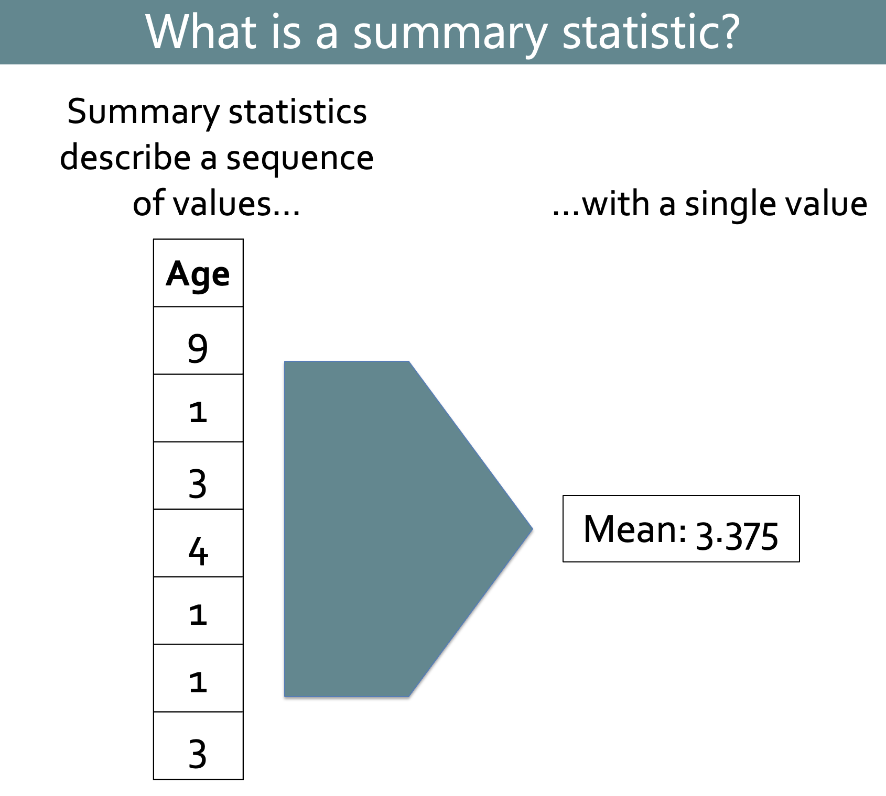
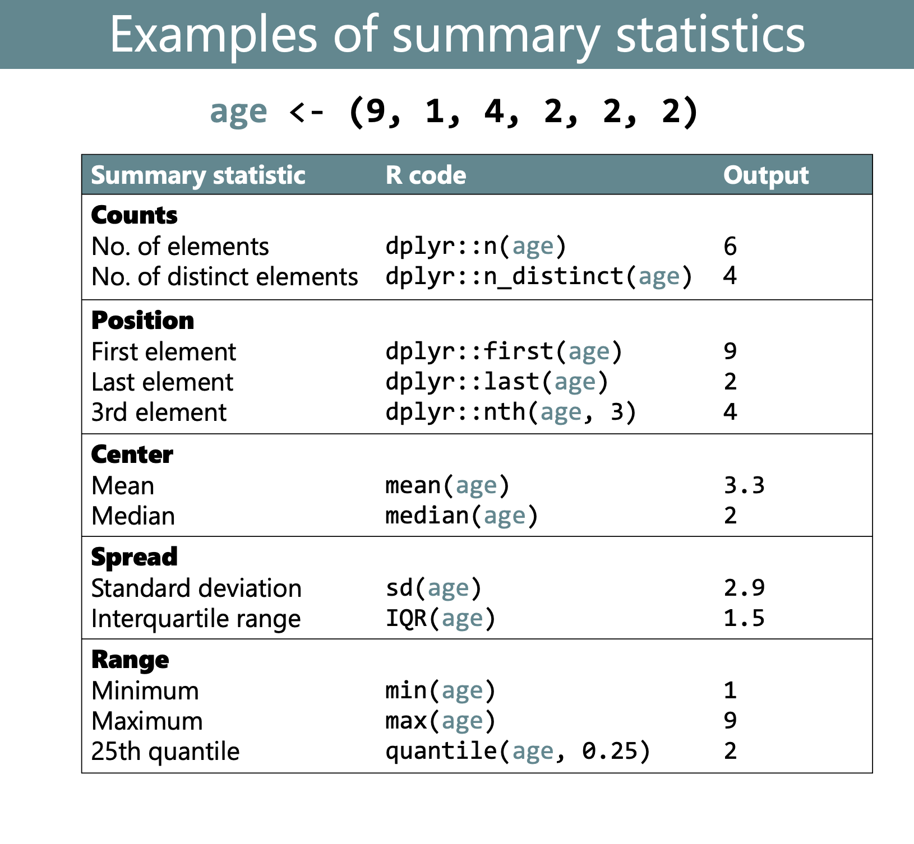

```{r, echo = F, message = F, warning = F}
library(tidyverse)
library(knitr)

## functions
source(here::here("global/functions/misc_functions.R"))

## default render
knitr::opts_chunk$set(class.source = "tgc-code-block")

## autograders
suppressMessages(source(here::here("ch04_data_wrangling/lessons/ls05_groupby_summarize_autograder.R")))
```

## Learning objectives

1.  You can use `dplyr::summarize()` to extract summary statistics from datasets.

2.  You can use `dplyr::group_by()` to group data by one or more variables before performing operations on them.

3.  You understand why and how to **ungroup** grouped data frames.

4.  You can use `dplyr::n()` together with `group_by()`-`summarize()` to count rows per group.

5.  You can use `sum()` together with `group_by()`-`summarize()` to count rows that meet a condition.

6.  You can use `dplyr::count()` as a handy function to count rows per group.

------------------------------------------------------------------------

## The Yaounde COVID-19 dataset

```{r, message = F}
yaounde <- read_csv(here::here('ch04_data_wrangling/data/yaounde_data.csv'))

# A smaller subset of variables
yao <- yaounde %>% 
  select(
  age, age_category_3, sex, weight_kg, height_cm,
  neighborhood, is_smoker, is_pregnant, occupation,
  treatment_combinations, symptoms, n_days_miss_work, n_bedridden_days,
  highest_education, igg_result) %>%
  rename(age_years = age)

yao
```

------------------------------------------------------------------------

## What are summary statistics?

{width="300"}

{width="300"}

------------------------------------------------------------------------

-   **Why does it matter?**

-   A common operation in most data analysis workflows

-   You need to become fluent in computing them

-   There is no better tool than the {dplyr} function `summarize()`!

------------------------------------------------------------------------

## Introducing `dplyr::summarize()`

-   To start, let's compute summary statistics ***without*** using `summarize()`

-   Then we will see **why you *should* use it**.

-   Let's see how you would find the mean age of respondents in the `yao` data frame.

------------------------------------------------------------------------

```{r}
# $ allows you to extract a data frame column to a vector
# then let's look at the first 10 items of the vector
yao_age <- yao$age_years
head(yao_age)
```

------------------------------------------------------------------------

```{r}
# let's pass this yao$age vector into mean()
mean(yao_age)
```

And that's it! Extremely easy, right?

------------------------------------------------------------------------

-   Now let's see *how* to obtain summary statistics with `summarize()`

-   Going back to the the previous example:

```{r}
yao %>% 
  # let's use summarize to get the mean age
  summarize(mean_age = mean(age_years))
```


------------------------------------------------------------------------

-   You can also compute **multiple summary statistics**

```{r}
yao %>%
  # let's calculate the mean and the median age at the same time !
  summarize(mean_age = mean(age_years),
            median_age = median(age_years))
```

Nice and simple!

------------------------------------------------------------------------

-   The resulting `summarize()` **data frame** has **each statistic** in **its respective column**.

-   The main **benefit** is for producing ***grouped*** **summaries:** coming in the next section !

------------------------------------------------------------------------

PRACTICE TIME !

::: practice
Use `summarize()` and the relevant summary functions to obtain the mean, median and standard deviation of respondent weights from the `weight_kg` variable of the `yao` data frame.

Your output should be a data frame with three columns named as shown below:

| mean_weight_kg | median_weight_kg | sd_weight_kg |
|----------------|------------------|--------------|
|                |                  |              |

```{r, eval = FALSE}
Q_weight_summary <- 
  yao %>%
  ____________________________
```

```{r, include = FALSE}
.CHECK_Q_weight_summary()
.HINT_Q_weight_summary()
```
:::

::: practice
Use `summarize()` and the relevant summary functions to obtain the minimum and maximum respondent heights from the `height_cm` variable of the `yao` data frame.

Your output should be a data frame with two columns named as shown below:

| min_height_cm | max_height_cm |
|---------------|---------------|
|               |               |

```{r, eval = FALSE}
Q_height_summary <- 
  yao %>% 
  ____________________________
```

```{r, eval = FALSE}
.CHECK_Q_height_summary()
.HINT_Q_height_summary()
```
:::

------------------------------------------------------------------------

## Grouped summaries with `dplyr::group_by()`

-   `dplyr::group_by()` lets you **group values together within a variable.**

-   An intuitive grouping **example**: male vs female.

-   **Operations** are then **split** (i.e. performed in parallel) according to each of the groups.

------------------------------------------------------------------------

```{r}
yao %>% 
  # let's group by sex
  group_by(sex)
```

Let's look at the header !

      # A tibble: 971 × 10
    👉# Groups:   sex [2]👈

Let's combine `group_by()` and `summarize()` !

```{r}
yao %>% 
  # we group by sex
  group_by(sex) %>% 
  # we summarize to get the mean and median
  summarize(mean_age = mean(age_years),
            median_age = median(age_years))
```

This kind of grouped summary is the primary reason the `summarize()` is so useful!

------------------------------------------------------------------------

-   Let's see another example:

```{r}
yao %>% 
  # group by neighborhoods
  group_by(neighborhood) %>% 
  # calculate the min and max weight
  summarize(min_weight = min(weight_kg),
            max_weight = max(weight_kg))
```

Great! With just a few code lines you are able to extract quite a bit of information.

------------------------------------------------------------------------

-   Let's see one more example for good measure.

-   The variable `n_days_miss_work` tells us the number of days that respondents missed work due to COVID-like symptoms.

```{r}
yao %>% 
  # let's keep only n_days_miss_work
  select(n_days_miss_work)
```

```{r}
yao %>%
  # let's group by sex
  group_by(sex) %>% 
  # let's sum the number of work days missed
  summarise(total_days_missed = sum(n_days_miss_work, na.rm=TRUE))
```

------------------------------------------------------------------------

-   `summarize()` is so **powerful**.

-   This practice is **very hands-on** and similar to what you will need in the field !

------------------------------------------------------------------------

PRACTICE TIME !

::: practice
Use `group_by()` and `summarize()` to obtain the mean weight (kg) by smoking status in the `yao` data frame. Name the average weight column `weight_mean`

The output data frame should look like this:

| is_smoker  | weight_mean |
|------------|-------------|
| Ex-smoker  |             |
| Non-smoker |             |
| Smoker     |             |
| NA         |             |

```{r eval = FALSE}
Q_height_by_smoking_status <- 
  yao %>% 
  ________________________
  ________________________
```

```{r include = FALSE}
.CHECK_Q_height_by_smoking_status()
.HINT_Q_height_by_smoking_status()
```
:::

::: practice
Use `group_by()`, `summarize()`, and the relevant summary functions to obtain the minimum and maximum heights for each sex in the `yao` data frame.

Your output should be a data frame with three columns named as shown below:

| sex    | min_height_cm | max_height_cm |
|--------|---------------|---------------|
| Female |               |               |
| Male   |               |               |

```{r eval = FALSE}
Q_min_max_height_by_sex <- 
  yao %>% 
  ________________________
  ________________________
```

```{r include = FALSE}
.CHECK_Q_min_max_height_by_sex()
.HINT_Q_min_max_height_by_sex()
```
:::

::: practice
Use `group_by()`, `summarize()`, and the `sum()` function to calculate the total number of bedridden days (from the `n_bedridden_days` variable) reported by respondents of each sex.

Your output should be a data frame with two columns named as shown below:

| neighborhood | total_bedridden_days |
|--------------|----------------------|
| Female       |                      |
| Male         |                      |

```{r eval = FALSE}
Q_sum_bedridden_days <- 
  yao %>% 
  ________________________
  ________________________
```

```{r include = FALSE}
.CHECK_Q_sum_bedridden_days()
.HINT_Q_sum_bedridden_days()
```
:::

------------------------------------------------------------------------

## Grouping by multiple variables (nested grouping)

-   It is possible to **group** a data frame **by more than one variable**.

-   **"nested" grouping.**

-   Let's look at the mean age of men and women *in each neighbourhood* (rather than the mean age of *all* women).

------------------------------------------------------------------------

```{r}
yao %>%
  # let's group by sex and neighborhood
  group_by(sex, neighborhood) %>% 
  # we summarize to get the mean age
  summarize(mean_age = mean(age_years))
```

------------------------------------------------------------------------

-   The **order** in `group_by()` is **interchangeable**.

-   `group_by(neighborhood, sex)` = `group_by(sex, neighborhood)`

-   BUT the resulting data frame will be arranged/ordered differently.

------------------------------------------------------------------------

```{r}
yao %>% 
  # let's put neighborhood before sex in the grouping
  group_by(neighborhood, sex) %>% 
  summarize(mean_age = mean(age_years))
```

------------------------------------------------------------------------

PRACTICE TIME !

::: practice
Using the `yao` data frame, group your data by gender (`sex`) and treatments (`treatment_combinations`) using `group_by`. Then, using `summarize()` and the relevant summary function, calculate the mean weight (`weight_kg`) for each group.

Your output should be a data frame with three columns named as shown below:

| sex | treatment_combinations | mean_weight_kg |
|-----|------------------------|----------------|
|     |                        |                |

```{r, eval = FALSE}
Q_weight_by_sex_treatments <- 
  yao %>%
  ____________________________
```

```{r, include = FALSE}
.CHECK_Q_weight_by_sex_treatments()
.HINT_Q_weight_by_sex_treatments()
```

Using the `yao` data frame, group your data by age category (`age_category_3`), gender (`sex`), and IgG results (`igg_results`) using `group_by`. Then, using `summarize()` and the relevant summary function, calculate the mean number of bedridden days (`n_bedridden_days`) for each group.

Your output should be a data frame with three columns named as shown below:

| age_category | sex | igg_result | mean_n\_bedridden_days |
|--------------|-----|------------|------------------------|
|              |     |            |                        |

```{r, eval = FALSE}
Q_bedridden_by_age_sex_iggresult <- 
  yao %>%
  ____________________________
```

```{r, include = FALSE}
.CHECK_Q_bedridden_by_age_sex_iggresult()
.HINT_Q_bedridden_by_age_sex_iggresult()
```
:::

------------------------------------------------------------------------

## Ungrouping with `dplyr::ungroup()` (why and how)

-   After manipulating the data, the output data frame is **still grouped**.

-   U**nwanted downstream effects**.

-   Remember to **ungroup** the data before doing further analysis.

------------------------------------------------------------------------

Let's see what the output looks like when grouping by 1 variable:

```{r}
yao %>% 
  # we group by sex
  group_by(sex) %>% 
  # and calculate the mean age
  summarize(mean_age = mean(age_years))
```

------------------------------------------------------------------------

Now let's consider grouping by two variables:

```{r}
yao %>%
  # we group by sex and neighborhood
  group_by(sex, neighborhood) %>% 
  summarize(mean_age = mean(age_years))
```

The data is still grouped by the first variable in `group_by()`, sex !

      # A tibble: 18 × 3
    👉# Groups:   sex [2]👈

------------------------------------------------------------------------

-   The **grouping** is **persistent**.

-   You may get **weird behavior** downstream using other {dplyr} verbs.

-   Let's see what happens with `select()` !

```{r}
yao %>% 
  group_by(sex, neighborhood) %>% 
  summarize(mean_age = mean(age_years)) %>% 
  # let's select mean_age
  select(mean_age) # doesn't work as expected 
```

------------------------------------------------------------------------

-   Other dplyr verbs like `filter()`, `mutate()` and `arrange()` also act in special ways on grouped data.

-   We will address this in detail in a future lesson

-   So let's learn to **ungroup**

------------------------------------------------------------------------

```{r}
yao %>% 
  group_by(sex, neighborhood) %>% 
  summarize(mean_age = mean(age_years)) %>% 
  # ungroup
  ungroup()
```

Now we can try selecting again:

```{r}
yao %>% 
  group_by(sex, neighborhood) %>% 
  summarize(mean_age = mean(age_years)) %>% 
  # ungroup
  ungroup() %>%
  # select: it behaves normally !
  select(mean_age)
```

------------------------------------------------------------------------

## Counting rows

> You can do a lot of data science by just *counting* and occasionally *dividing.* - Hadley Wickham, Chief Scientist at RStudio

-   A **common data summarization task** is **counting how many observations** (rows) there are **per group**.

-   For example, we can count how many individuals are in each neighborhood group.

```{r}
yao %>% 
  # we group by neighborhood
  group_by(neighborhood) %>% 
  # and create a count using the n() function
  summarize(total = n())
```

------------------------------------------------------------------------

We can also calculate another summary statistic at the same time:

```{r}
yao %>% 
  # group by neighborhood
  group_by(neighborhood) %>% 
  # let's make a count and a mean 
  summarize(count = n(), 
            mean_age = mean(age_years))
```

------------------------------------------------------------------------

PRACTICE TIME !

::: practice
Group your `yao` data frame by the respondents' occupation (`occupation`) and use `summarize()` to count the different occupations (think of the `n()` function) and calculate, by occupation, the mean number of work days missed (`n_days_miss_work`).

Your output should be a data frame with three columns named as shown below:

| occupation | count | mean_n\_days_miss_work |
|------------|-------|------------------------|
|            |       |                        |

```{r, eval = FALSE}
Q_occupation_summary <- 
  yao %>%
  ____________________________
```

```{r, include = FALSE}
.CHECK_Q_occupation_summary()
.HINT_Q_occupation_summary()
```
:::

------------------------------------------------------------------------

### Counting rows that meet a condition

-   We can **place a condition within** the `sum()` function.

```{r}
yao %>% 
  # group by neighborhood
  group_by(neighborhood) %>% 
  # let's count only those under 18
  summarize(count_under_18 = sum(age_years <18))
```

------------------------------------------------------------------------

-   Another example !

-   Let's count the number of people with doctorate degrees in each neighborhood

```{r}
yao %>% 
  group_by(neighborhood) %>% 
  # let's place a condition on the highest_education variable
  summarize(count_with_doctorates = sum(highest_education=="Doctorate"))
```

------------------------------------------------------------------------

-   Final example of counting with conditions.

-   `treatment_combinations` variable = the treatments received by people with COVID-like symptoms.

-   No treatments = `NA` value

-   We will count the number of people who received *no treatment.*

```{r}
yao %>% 
  # let's have a quick look at the treatment variable
  select(treatment_combinations)
```

```{r}
yao %>% 
  # let's group by neighborhood
  group_by(neighborhood) %>% 
  # let's set a condition on the NA to count the no treatments
  summarize(unknown_treatments = sum(is.na(treatment_combinations)))
```

------------------------------------------------------------------------

PRACTICE TIME !

::: practice
Group your `yao` data frame by the respondents' symptoms (`symptoms`) and count how many respondents have these symptoms, **only within the adult respondents** (i.e. within the `sum()` function, set a condition on the `age_category_3` variable).

Your output should be a data frame with three columns named as shown below:

| symptoms | sum_adults |
|----------|------------|
|          |            |

```{r, eval = FALSE}
Q_symptoms_adults <- 
  yao %>%
  ____________________________
```

```{r, include = FALSE}
.CHECK_Q_symptoms_adults()
.HINT_Q_symptoms_adults()
```
:::

------------------------------------------------------------------------

### Dplyr::count()

-   Wraps a **bunch of things** into one **beautiful friendly line of code**.

-   To find **counts of observations by group**.

-   Let's count our `occupation` variable.

```{r}
yao %>% count(occupation)
```

Note that this is the same output as:

```{r}
yao %>%
  group_by(occupation) %>%
  summarize(n = n())

```

------------------------------------------------------------------------

You can also apply `dplyr::count()` in a nested fashion:

```{r}
yao %>%
  # let's count by sex and occupation
  count(occupation,sex)
```

------------------------------------------------------------------------

PRACTICE TIME !

::: practice
The `count()` verb gives you key information about your dataset in a very quick manner. Let's look at our IgG results stratified by age category and sex in one line of code.

Using the `yao` data frame, count the different combinations of gender (`sex`), age categories (`age_category_3`) and IgG results (`igg_results`).

Your output should be a data frame with three columns named as shown below:

| sex | age_category_3 | igg_result | n   |
|-----|----------------|------------|-----|
|     |                |            |     |

```{r, eval = FALSE}
Q_count_iggresults_stratified_by_sex_agecategories <- 
  yao %>%
  ____________________________
```

```{r, include = FALSE}
.CHECK_Q_count_iggresults_stratified_by_sex_agecategories()
.HINT_Q_count_iggresults_stratified_by_sex_agecategories()
```

Using the `yao` data frame, count the different combinations of age categories (`age_category_3`) and number of bedridden days (`n_bedridden_days`).

Your output should be a data frame with three columns named as shown below:

| age_category_3 | n_bedridden_days | n   |
|----------------|------------------|-----|
|                |                  |     |

```{r, eval = FALSE}
Q_count_bedridden_age_categories <- 
  yao %>%
  ____________________________
```

```{r, include = FALSE}
.CHECK_Q_count_bedridden_age_categories()
.HINT_Q_count_bedridden_age_categories()
```
:::

------------------------------------------------------------------------

-   The downside of `count()`

-   A **single summary statistic** in the data frame.

-   The combo `summarize()` and `n()` can include multiple summary statistics.

------------------------------------------------------------------------

## Including missing combinations in summaries

-   When you use `group_by()` and `summarize()` on multiple variables,

-   You obtain a **summary statistic for every unique combination** of the grouped variables **present in the data.**

------------------------------------------------------------------------

-   Some combinations **are not present in the data**

-   Let's create an **artificial** example to observe this.

-   We artificially drop all male children from the `yao` data frame.

```{r}
yao_no_male_children <- 
  yao %>% 
  # we leave out all male children
  filter(!(age_category_3=="Child" & sex=="Male"))
  
```

Let's see the missing combination:

```{r}
yao_no_male_children %>% 
  # let's group by sex and age_category_3  
  group_by(age_category_3, sex) %>% 
  # let's get the number of individuals
  summarise(number_of_individuals = n())
```

Let's include this **missing combinations:**

```{r}
yao_no_male_children %>% 
  # For these combinations, you must convert the variables to factors
  mutate(age_category_3 = as.factor(age_category_3),
         sex = as.factor(sex)) %>% 
  # Note the the .drop = FALSE argument
  group_by(age_category_3, sex, .drop=FALSE) %>% 
  summarise(count = n())
```

------------------------------------------------------------------------

-   Let's see one more example

-   We will calculate the **average age** **by sex and education group**.

-   These combinations do not include the group "Female---Other".

```{r}
yao %>% 
  # let's group by WITHOUT accounting for missing combinations
  # we group by sex and highest_eduction
  group_by(sex, highest_education) %>% 
  # we summarize to have the mean age
  summarise(mean_age = mean(age_years))
```

There are 7 rows for men but only 6 rows for women.

Let's include this missing combination:

```{r}
yao %>% 
  # we need to make sure the grouping variables are factors
  mutate(highest_education = as.factor(highest_education),
         sex = as.factor(sex)) %>% 
  # we group by sex and highest_education
  group_by(highest_education, sex, .drop=FALSE) %>% 
  # we summarize for mean age
  summarise(mean_age = mean(age_years))
```

------------------------------------------------------------------------

PRACTICE TIME !

::: practice
Using the `yao` data frame, let's calculate the median age when grouping by neighborhood, age_category, and gender

Note, we want all possible combinations of these three variables (not just those present in our data).

Pay attention to two data wrangling imperatives! - convert your grouping variables to factors beforehand using `mutate()` - calculate your statistic, the median, while removing any `NA` values.

Your output should be a data frame with three columns named as shown below:

| neighborhood | age_category_3 | sex | median_age |
|--------------|----------------|-----|------------|
|              |                |     |            |

```{r, eval = FALSE}
Q_median_age_by_neighborhood_agecategory_sex <- 
  yao %>%
  ____________________________
```

```{r, include = FALSE}
.CHECK_Q_median_age_by_neighborhood_agecategory_sex()
.HINT_Q_median_age_by_neighborhood_agecategory_sex()
```
:::

------------------------------------------------------------------------

::: side-note
**Why include missing combinations?**

-   Let's see one use case: plotting with {ggplot}.

-   Let's make a **dodged bar chart**

-   With the age-sex counts of `yao_no_male_children`

------------------------------------------------------------------------

```{r}
yao_no_male_children %>% 
  group_by(sex, age_category_3) %>% 
  summarise(number_of_individuals = n()) %>% 
  ungroup() %>% 
  
  # pass the output to ggplot
  ggplot() + 
  geom_col(aes(x = sex, y = number_of_individuals, fill = age_category_3), 
           position = "dodge")
```

------------------------------------------------------------------------

-   Not very elegant!

-   An **empty space indicating 0 for the number of male children**.

-   Let's account for the missing group.

```{r}
yao_no_male_children %>% 
  mutate(sex = as.factor(sex), 
         age_category_3 = as.factor(age_category_3)) %>% 
  group_by(sex, age_category_3, .drop = FALSE) %>% 
  summarise(number_of_individuals = n()) %>% 
  ungroup() %>% 
  
  # pass the output to ggplot
  ggplot() + 
  geom_col(aes(x = sex, y = number_of_individuals, fill = age_category_3), 
           position = "dodge")
```

Much better!

By the way, this output can be improved slightly by setting the factor levels for age to their proper ascending order: first "Child", then "Adult" then "Senior":

```{r}
yao_no_male_children %>% 
  mutate(sex = as.factor(sex), 
         age_category_3 = factor(age_category_3, 
                                 levels = c("Child", 
                                            "Adult", 
                                            "Senior"))) %>% 
  group_by(sex, age_category_3, .drop = FALSE) %>% 
  summarise(number_of_individuals = n()) %>% 
  ungroup() %>% 
  
  # pass the output to ggplot
  ggplot() + 
  geom_col(aes(x = sex, y = number_of_individuals, fill = age_category_3), 
           position = "dodge")
```
:::

## Learning objectives

1.  You can use `dplyr::summarize()` to extract summary statistics from datasets.

2.  You can use `dplyr::group_by()` to group data by one or more variables before performing operations on them.

3.  You understand why and how to **ungroup** grouped data frames.

4.  You can use `dplyr::n()` together with `group_by()`-`summarize()` to count rows per group.

5.  You can use `sum()` together with `group_by()`-`summarize()` to count rows that meet a condition.

6.  You can use `dplyr::count()` as a handy function to count rows per group.
