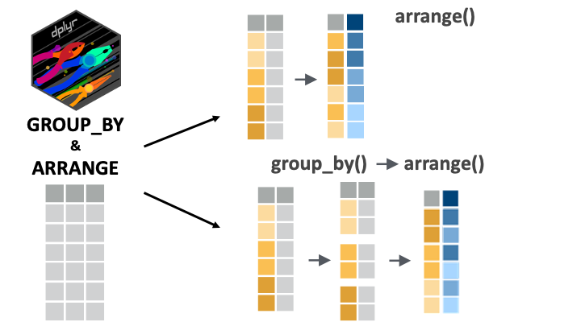
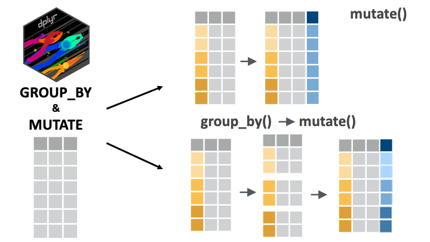
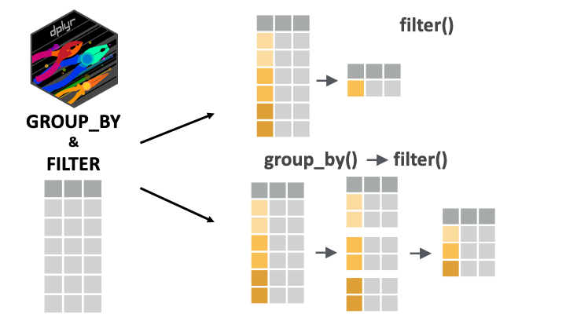

```{r, echo = F, message = F, warning = F}
if(!require(pacman)) install.packages("pacman")
pacman::p_load(knitr, 
               here, 
               janitor,
               tidyverse)

## functions
source(here::here("global/functions/misc_functions.R"))

## default render
registerS3method("reactable_5_rows", "data.frame", reactable_5_rows)
knitr::opts_chunk$set(class.source = "tgc-code-block", render = reactable_5_rows)

## autograders
# suppressMessages(source(here::here("ch04_data_wrangling/lessons/ls06_group_by_other_verbs_autograder.R")))
```

## Learning objectives

1.  You can use `group_by()` with `arrange()`, `filter()`, and `mutate()` to conduct grouped operations on a data frame.

## Packages

This lesson will require the {tidyverse} suite of packages and the {here} package:

```{r}
if(!require(pacman)) install.packages("pacman")
pacman::p_load(tidyverse, here)
```

## Datasets

The COVID-19 serological survey conducted in Yaounde, Cameroon !

```{r, message = F}
yao <- 
  read_csv(here::here('ch04_data_wrangling/data/yaounde_data.csv'))  %>% 
  select(sex, age, age_category, weight_kg, occupation, igg_result, igm_result) %>%
  rename(age_years = age)

yao

yao_sex_weight <- 
  yao %>% 
  select(sex, weight_kg)

yao_sex_weight
```

------------------------------------------------------------------------

For practice questions: the sarcopenia data set.

```{r, message = F}
sarcopenia <- read_csv(here::here('ch04_data_wrangling/data/sarcopenia_elderly.csv'))

sarcopenia
```

## Arranging by group

-   Reminder: `arrange()` orders the rows of a data frame by the values of selected columns.

-   Sensitive to groupings IF `.by_group` is set to `TRUE`

```{r}
yao_sex_weight
```

We can arrange this data frame **by weight** like so:

```{r}
yao_sex_weight %>% 
  arrange(weight_kg)
```

As expected, **lower weights** have been brought to **the top of the data frame**.

If we first group the data, we could expect a different output:

```{r}
yao_sex_weight %>% 
  group_by(sex) %>%
  arrange(weight_kg)
  
```

But as you see, the **arrangement is still the same**.

Only when we set the `.by_group` argument to `TRUE` do we get something different:

```{r}
yao_sex_weight %>% 
  group_by(sex) %>%
  arrange(weight_kg, .by_group = TRUE)
 
```

The data is *first* sorted by sex (all women first), and then by weight.

### `arrange()` can group automatically

-   We do not need `group_by()` to arrange by group!

-   We can simply put multiple variables in the `arrange()` function.

```{r}
yao_sex_weight %>% 
  arrange(sex, weight_kg)
```

The code `arrange(sex, weight_kg)` tells R to arrange the rows *first* by sex, and then by weight.

It is equivalent to the more complex `group_by()`, `arrange()` statement used before:

```{r eval = F}
yao_sex_weight %>% 
  group_by(sex) %>% 
  arrange(weight_kg, .by_group = TRUE)
```

Obviously, the syntax, with no `group_by()` is simpler, so let's stick to that !

::: Reminder
`desc()` **for descending order**

To arrange *in descending order*, we can wrap the target variable in `desc()`.

To sort by sex and weight, with the heaviest people on top, we can write:

```{r}
yao_sex_weight %>% 
  arrange(sex, desc(weight_kg))
```
:::

::: practice
With an `arrange()` call, sort the `sarcopenia` data first by sex and then by grip strength. (If done correctly, the first row should be of a woman with a grip strength of 1.3 kg)

```{r eval = FALSE}
# Complete the code with your answer:
Q_grip_strength_arranged <- 
  sarcopenia %>% 
  select(______________________________) %>%
  arrange(______________________________)
```

```{r include = FALSE}
# Check your answer
#.CHECK_Q_grip_strength_arranged()
#.HINT_Q_grip_strength_arranged()
```
:::

::: practice
The `sarcopenia` dataset contains a column, `age_group`, which stores age groups as a string (the age groups are "Sixties", "Seventies" and "Eighties"). Convert this variable to a factor with the levels in the right order (ascending order of age). (Hint: Look back on the `case_when()` lesson if you do not see how to relevel a factor.)

Then, with a nested `arrange()` call, arrange the data first by `age_group` (younger individuals first) and then by `height_meters` (shorter individuals first).

```{r eval = FALSE}
# Complete the code with your answer:
Q_age_group_height <- 
  sarcopenia %>% 
  mutate(age_group = factor(________________________________)) %>%
  arrange(______________________________)
```

```{r include = FALSE}
# Check your answer
#.CHECK_Q_age_group_height()
#.HINT_Q_age_group_height()
```
:::

## Filtering by group

-   Reminder: `filter()` keeps or drops rows based on a condition.

-   If `filter()` is applied to grouped data, the filtering operation is carried out separately for each group.

If we want to filter the data for the heaviest person, we could run:

```{r}
yao_sex_weight %>% 
  filter(weight_kg == max(weight_kg))
```

-   What if we want the heaviest man *and* the heaviest woman?

-   We want the maximal weight per gender group !

```{r}
yao_sex_weight %>% 
  group_by(sex) %>%
  filter(weight_kg == max(weight_kg))
```

The code above can be read as "For each sex group, keep the row with the maximum `weight_kg` value".

### Filtering with nested groupings

For example, if we want to see the heaviest man and heaviest woman *per age group* :

```{r render = reactable_10_rows}
yao %>% 
  group_by(sex, age_category) %>% 
  filter(weight_kg == max(weight_kg))
```

(Why do we have 10 rows in the output? Well, 2 sex groups x 5 groups age groups = 10 unique groupings.)

The output is a bit scattered: let's use `arrange()` to rearrange by sex and age group.

```{r render = reactable_10_rows}
yao %>% 
  group_by(sex, age_category) %>% 
  filter(weight_kg == max(weight_kg)) %>% 
  arrange(sex, age_category)
```

-   But we see notice a weird arrangement of the age groups!

-   Those aged 5 to 14 should come *first* in the arrangement.

-   Of course, we've learned how to fix this:

```{r render = reactable_10_rows}
yao %>%
  mutate(age_category = factor(age_category, levels = c("5 - 14",
                                                        "15 - 29",
                                                        "30 - 44",
                                                        "45 - 64",
                                                        "65 +"))
  ) %>%
  group_by(sex, age_category) %>%
  filter(weight_kg == max(weight_kg)) %>%
  arrange(sex, age_category)
```

Now we have a nice and well-arranged output!

::: practice
Group the `sarcopenia` data frame by age group and sex, then filter for the highest skeletal muscle index in each (nested) group.

```{r eval = FALSE}
# Complete the code with your answer:
Q_max_skeletal_muscle_index <- 
  sarcopenia %>% 
  group_by(______________________________) %>%
  filter(______________________________)
```

```{r include = FALSE}
# Check your answer
#.CHECK_Q_max_skeletal_muscle_index()
#.HINT_Q_max_skeletal_muscle_index()
```
:::

## Mutating by group

-   Reminder: `mutate()` is used to modify columns or to create new ones.

-   With grouped data, `mutate()` operates over each group independently.

Let's first consider a regular `mutate()` call. Imagine that you wanted to add a column that ranks respondents by weight:

```{r}
yao_sex_weight %>% 
  mutate(rank_weight = rank(weight_kg))
```

The output shows that the first row is the 901st lightest individual.

But it would be more intuitive to rank in descending order with the heaviest person first:

```{r}
yao_sex_weight %>% 
  mutate(rank_weight = rank(desc(weight_kg)))
```

The output shows that the person in the first row is the 71st heaviest individual.

------------------------------------------------------------------------

-   Now, let's try to write a grouped `mutate()` call.

-   We want to add this weight rank column *per sex group* in the data frame.

-   We want to know each person's weight rank in their sex category.

```{r}
yao_sex_weight %>% 
  group_by(sex) %>%
  mutate(rank_weight = rank(desc(weight_kg)))
  
```

Now we see that the person in the first row is the 53rd heaviest *woman*. (The .5 indicates that this rank is a tie with someone else in the data.)

We could also arrange for clarity:

```{r}
yao_sex_weight %>% 
  group_by(sex) %>% 
  mutate(weight_rank = rank(desc(weight_kg))) %>% 
  arrange(sex)
```

### Mutating with nested groupings

```{r}
yao %>% 
  # let's group by sex and age category now !
  group_by(sex, age_category) %>% 
  mutate(weight_rank = rank(desc(weight_kg)))
```

The output shows that the person in the first row is 20th heaviest *woman in the 45 to 64 age group*.

::: practice
With the `sarcopenia` data, group by `age_group`, then in a new variable called `grip_strength_rank`, compute the per-age-group rank of each individual's grip strength.

```{r eval = FALSE}
# Complete the code with your answer:
Q_rank_grip_strength <- 
  sarcopenia %>% 
  group_by(______________________________) %>%
  mutate(______________________________)
```

```{r include = FALSE}
# Check your answer
#.CHECK_Q_rank_grip_strength()
#.HINT_Q_rank_grip_strength()
```
:::

::: watch-out
**Remember to ungroup data before further analysis**

-   It is SUPER important ungroup your data before doing further analysis.

Let's start off from the previous example:

```{r}
yao_modified <- yao %>% 
  group_by(sex, age_category) %>% 
  mutate(weight_rank = rank(desc(weight_kg)))
```

And now, you want to **filter** to get **the oldest person** in the data:

```{r}
yao_modified %>% 
  filter(age_years == max(age_years))
  
```

-   You might be confused by the output! Why are there 55 rows of "oldest people"?

-   Because there is one oldest person by subgroup defined by sex and age categories combinations !

-   Because we forgot to ungroup !

Let's do this properly now:

```{r}
yao_modified <- 
  yao %>% 
  group_by(sex, age_category) %>% 
  mutate(weight_rank = rank(desc(weight_kg))) %>% 
  ungroup()
  
```

Now we can correctly obtain the oldest person/people in the data set:

```{r}
yao_modified %>% 
  filter(age_years == max(age_years))
  
```
:::

## Wrap up

`group_by()` is a marvelous tool for arranging, mutating, filtering based on the groups within a single or multiple variables.

{alt="Fig: arrange() and its use combined with group_by()." width="400"} {alt="Fig: mutate() and its use combined with group_by()." width="400"}

{alt="Fig: filter() and its use combined with group_by()." width="400"}

There are numerous ways of combining these verbs to manipulate your data. We invite you to take some time and to try these verbs out in different combinations!

See you next time!

## Contributors {.unlisted .unnumbered}

The following team members contributed to this lesson:

`r tgc_contributors_list(ids = c("lolovanco", "kendavidn"))`

## References {.unlisted .unnumbered}

Some material in this lesson was adapted from the following sources:

-   Horst, A. (2022). *Dplyr-learnr*. <https://github.com/allisonhorst/dplyr-learnr> (Original work published 2020)

-   *Create, modify, and delete columns --- Mutate*. (n.d.). Retrieved 21 February 2022, from <https://dplyr.tidyverse.org/reference/mutate.html>

-   *Apply a function (or functions) across multiple columns --- Across*. (n.d.). Retrieved 21 February 2022, from <https://dplyr.tidyverse.org/reference/across.html>

Artwork was adapted from:

-   Horst, A. (2022). *R & stats illustrations by Allison Horst*. <https://github.com/allisonhorst/stats-illustrations> (Original work published 2018)
