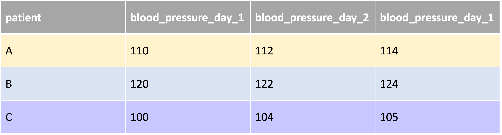
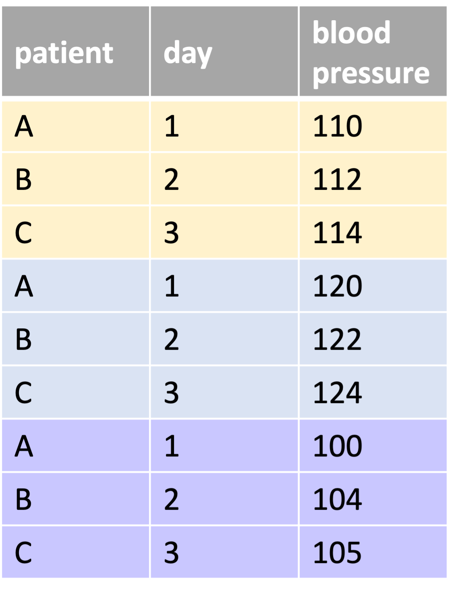

```{r, echo = F, message = F, warning = F}
# Load packages 
if(!require(pacman)) install.packages("pacman")
pacman::p_load(rlang, tidyverse, knitr, here)

## functions
source(here::here("global/functions/misc_functions.R"))

## default render
registerS3method("reactable_5_rows", "data.frame", reactable_5_rows)
knitr::opts_chunk$set(class.source = "tgc-code-block", render = reactable_5_rows)

## autograders
suppressMessages(source(here::here("lessons/ls02_filter_autograder.R")))
```

# Intro

Pivoting: it's a verb from our every day life used to describe the movement of an object or a person. Well datasets can pivot too ! Today we are going to see why pivoting them is tool for efficient and high-level.

# Learning Objectives

-   You will understand what a wide data format is, and what a long data format is

-   You will know how to pivot long data to wide data using `pivot_long()`

-   You will know how to pivot wide data to long data using `pivot_wider()`

-   You have the intuition why the long data format is easier for plotting and wrangling

# Packages

```{r warning = F, message = F, echo = F}
# Load packages 
if(!require(pacman)) install.packages("pacman")
pacman::p_load(tidyverse, outbreaks, janitor, rio, here, knitr)
```

# Datasets

We will see many different ones. So we will introduce them as we go along. But here is a brief overview:

-   Worldwide, number of infant deaths (under 1 years old), per country, per year

-   Worldwide, number of births, per country, per year

-   European-scale, number of births, per country, per year

-   Worldwide, number of malaria cases, per country, per year

-   Worldwide, number of HIV cases, per country, per year

So many datasets! Now let's learn about their formats:

# What do "wide" and "long" mean?

"Wide" data means that each data entry is a unique observation unit. This observation is the subject of further measurements or information collection. A unique observation unit can be a person, a country, a laboratory sample etc.

"Long" data means that each data entry is a data collection event. If the same observation unit had data collected in three ways, then it will have three data entries (3 rows).

Based on this explanation, "wide" and "long" formats are the **same dataset** if **data collection only occurred once for each unique observation unit.**

# Some examples

Let's see an example of "wide" vs "long" data format for the same dataset. Imagine we are handling a timeseries of patients whose blood pressure you have recorded everyday.

You can record the data in a "wide" format like this:

{width="500"}

Each unique observation unit (each patient) has only one row. The events (different measuring days) occupy different columns. You could say that the **focus** is on the unique observations(the patients).

------------------------------------------------------------------------

Or you could record the data in a "long" format as so :

{width="200"}

Here the unique days of recording (3 different events) define the data entries (the rows) of the data set. There are multiple rows per patient (the units of observation). Here the **focus** is on the time points / the events, the days.

------------------------------------------------------------------------

Of course, the different collection ways do not have to be events / time points. They can be localizations (different neighborhoods, different cities) or any other variables which can stratify (divide into subgroups) the main units of observations.

{width="200"}

{width="200"}

------------------------------------------------------------------------

Likewise, the unit of observation does not have to a patient. It can be a country (as presented [here](https://tavareshugo.github.io/r-intro-tidyverse-gapminder/09-reshaping/index.html)), or any other entity.

{width="200"} {width="300"}

------------------------------------------------------------------------

::: practice
Let's load the number of Nipah cases in different regions of malaysia.

```{r}
nipah <- outbreaks::nipah_malaysia %>% as_tibble()
nipah
```

Is this a wide or long data format?

```{r, eval = FALSE}
# Q_nipah_type <- "_____"
#   
```

```{r, include = FALSE}
# .CHECK_Q_nipah_type()
# .HINT_Q_nipah_type()
```

What is your unique observational unit ?

```{r, eval = FALSE}
# Q_nipah_observations <- "_____"
#   
```

```{r, include = FALSE}
# .CHECK_Q_nipah_observations()
# .HINT_Q_nipah_observationse()
```
:::

# When should you use wide vs long data?

The truth is: it really depends on what you want to do ! The wide format is great for *displaying data* because it's easy to visually compare values of unique observations unit this way. Long data is best for a majority of data analysis tasks such as grouping, plotting.

It will be essential for you to know how to switch from one to the other easily.

Switching from the "wide" to the "long" format (or the other way around) is called **pivoting**.

# Pivoting wide to long

Many datasets you'll find in online data hubs and services will come in a wide format. The reason for this is that the wide format is a common way of inputing/entering data into tables during data collection.

Let's have a look at Gapminder's open source data about the **Number of infant deaths (under 1 years old)**. [Check out Gapminder: an awesome resource](https://www.gapminder.org) !

And here is how we went to find this dataset:

{width="600"}

Let's read in the CSV we downloaded from Gapminder. We are going to select the years between 2010 and 2015 to keep it simple.

```{r}
infant_deaths_wide <- 
  read_csv(here("data/gapminder_infant_deaths.csv")) %>%
  select(country, x2010:x2015)

infant_deaths_wide
```

Following our example above, we observe that each row corresponds to a unique observation unit: a country. The different events of data collection per country are different years: they are spread across different columns. Hence this dataset is in a "wide" format.

The numbers in each box of country x year dataset are the counts of infant deaths for that country and for that year. As an example, in 2010, there were 74600 infant deaths recorded for Afghanistan.

If we wanted to convert the data format to "long" format then we can use a convenient function `pivot_longer` :

```{r}
infant_deaths_wide %>% 
  pivot_longer(cols = x2010:x2015)
```

Within `pivot_longer` we define, using the `cols` argument, which columns we want to pivot.

We observe that the "long" format dataset now has each country occupying 5 rows (one per year between 2010 and 2015). The years have been pivoted into a single variable (`names`) instead of each representing their own variable (`x2010:x2015`). All the numbers in the country x years dataset were pivoted into their own variable (`values`). The infant deaths used to be in matrix format (2D: 2 dimensions), now they are in vector format (1D: 1 dimension).

This long dataset will be much more handy for most data analysis functions. Intuitively, manipulating 1D is always easier than manipulating 2D. More on this later !

::: side-note
However, as good data analysts, you might be cringing at the new names of your variables: `names` and `values` are generic and do not represent our data at all ! No worries, you can give custom column names:

```{r}
infant_deaths_wide %>% 
  pivot_longer(cols = x2010:x2015,
               names_to = "year", 
               values_to = "deaths_count")
```

The `cols` argument defining the variables chosen for pivot are the same. However `names_to` allows to define the variable name of the 1-D vector now regrouping your multiple pivoted columns. As you are pivoting years, it makes sense to call their variable `year`. We apply the same reasoning for the number of infant deaths pivoted from a matrix to a sole column: we name the variable embodying this column `deaths_counts`.
:::

::: pro-tip
One could argument that the "long" format is more informative than the "wide" format. Why? Because of these column names. In the "wide" format, unless the CSV is named `count_infant_deaths` (or something alike) or unless someone tells you "these are the counts of infant deaths per country and per year", you have no idea what those numbers represent.
:::

You may be a bit frustrated by the weird `x` in front of your years. Here is how you would remove it using `parse_number()` function:

```{r}
infant_deaths_wide %>% 
  pivot_longer(cols = x2010:x2015,
               names_to = "year", 
               values_to = "deaths_count") %>% 
  mutate(year = parse_number(year))
```

We will see more on this function in the lessons dedicated to strings. But as a brief explanation: it extracts numbers from strings.

For later, let's store this "long" format dataset of the count of infant deaths per country and per year:

```{r}
infant_deaths_long <- 
  infant_deaths_wide %>% 
  pivot_longer(cols = x2010:x2015,
               names_to = "year", 
               values_to = "deaths_count")
```

::: practice
For this practice question, we will use the `euro_births_wide` dataset from [Eurostat](https://ec.europa.eu/eurostat/databrowser/view/tps00204/default/table). It contains data on births in 50 European countries: the crude birth rate per thousand people, collected on an annual basis.

```{r}
euro_births_wide <- 
  read_csv(here("data/euro_births_wide.csv"))
euro_births_wide
```

What is the unique observational unit? Your answer should be a string giving the name of the variable.

```{r, eval = FALSE}
# Q_euro_births_unique_observational_unit <- "_____"
#   
```

```{r, include = FALSE}
# .CHECK_Q_euro_births_unique_observational_unit()
# .HINT_Q_euro_births_unique_observational_unit()
```

What variable defines the data collection in multiple ways (i.e. the potential stratification variable) ? Your answer should be a string giving the name of the variable.

```{r, eval = FALSE}
# Q_euro_births_multiple_ways <- "_____"
#   
```

```{r, include = FALSE}
# .CHECK_Q_euro_births_multiple_ways()
# .HINT_Q_euro_births_multiple_ways()
```

The data is in a "wide" format. Convert it to a "long" format.

```{r, eval = FALSE}
# Q_euro_births_long_format <- 
#   euro_births_wide %>%
#   pivot_longer(___________)
  
```

```{r, include = FALSE}
# .CHECK_Q_euro_births_long_format()
# .HINT_Q_euro_births_long_format()
```
:::

# Pivoting long to wide

Wide data often comes from external sources as we have seen above. Long data, on the other hand, is likely to be created by *you* in the course of your data wrangling. Let's see an example:

We will use yet another dataset: patient records from an Ebola outbreak in Sierra Leone in 2014.

```{r}
ebola <- outbreaks::ebola_sierraleone_2014 %>% as_tibble()
ebola
```

Here each row corresponds to a unique unit of observation: one ebola patients. The data is in a "wide" format.

You may want to count how many cases there were in each year across districts. For this, you would apply the `summary()` functions on your datasets:

```{r}
ebola_summary <- 
  ebola %>% 
  summary()

ebola_summary
```

A summary is considered a long format because it no longer has the structure one row = one observation unit.

Let's see an example where you keep a wide format, but you can the unique observation unit. This occurs when we count the number of patients in each district.

```{r}
ebola_district_counts <- 
  ebola %>% 
  count(district)

ebola_district_counts
```

Now, one row = one observation, so we are still in a wide format, but the unique observation units are now the districts and not the patients themselves.

Let's now explore another, somewhat similar, data wrangling manipulation which will change your data format from "wide" to "long": grouping by multiple variables then counting number of recorded patients within groups.

```{r}
ebola_yearly_counts <- 
  ebola %>% 
  mutate(year = lubridate::year(date_of_onset)) %>% 
  group_by(district, year) %>% 
  count()

ebola_yearly_counts
```

Here we start with extracting the year information (year of the date) from the variable `date_of_onset`. For this we use a useful function `year()` from the package {lubridate}, which you will see in more details in further lessons. We then group by `district` and `year` to count the number of patients recorded per district and per year.

Because of this nested grouping, we are generating a long format dataset: we do not have one row = one unique observation. Both districts and years take up multiple rows. Each district takes up 2 rows (because their count is calculated for 2 years: 14 x 2 = 28) and each year takes up 14 rows (because their count is calculated over 14 districts: 2 x 14 = 28).

This is a perfect illustration of how one data wrangling manipulation will preserve a wide format, while another will generate a long format.

What if we wanted to switch `ebola_yearly_counts` back to a wide format ? There is an easy function for this: `pivot_wider()` (similar to `pivot_longer()`).

Let's switch our data back to a wide format:

```{r}
ebola_yearly_counts %>% 
  pivot_wider(values_from = n, 
              names_from = year)
```

`pivot_wider()` has two important arguments: `values_from` and `names_from`. `values_from` defines which values will become the core of the wide data format (in other words: which 1D vector will become a 2D matrix). `names_from` identifies which variable to use to define column names in the wide format.

To explain with our dataset `ebola_yearly_counts`. We define our observation unit as the districts. So to have a wide format, we need the variable `years` to become two columns: `2014` and `2015`, the unique values of the variable. We define this in `pivot_wider()` with `names_from`. This would then create a dataframe in the format districts x years, in other words, a matrix. You need to fill the matrix with values, hence the argument `values_from`, which indicates we want to fill the matrix with count values.

Now, imagine we wanted to see the years as our unique observation unit. We would do exactly the same, but our 2nd dimension to the wide format would be the `districts`:

```{r}
ebola_yearly_counts %>% 
  pivot_wider(values_from = n, 
              names_from = district)
```

Here our unique observation units (our rows) are now the years (2014, 2015). Our 2nd dimension (our columns) are the districts. Our matrix input are the count values organized in the format years x districts.

That's it! We'll see more complex examples in the next lesson...

::: practice
Above, using Gapminder's data on the number of infant deaths, we transformed the wide format dataset `infant_deaths_wide` into the long format dataset `infant_deaths_long`. Now, using `pivot_wider()`, let's switch it back to its wide format again. We want the unique observation unit to be the countries and to have a countries x years matrix, filled with the death counts.

```{r, eval = FALSE}
# Q_infant_death_wide_countries <- 
#   infant_death_long %>%
#   pivot_wider(___________)
```

```{r, include = FALSE}
# .CHECK_Q_infant_death_wide_countries()
# .HINT_Q_infant_death_wide_countries()
```

Using again `pivot_wider()` and again `infant_death_long`, let's switch it back to its wide format but this time we want the unique observation unit to be the years and to have a years x countries matrix, filled with the death counts.

```{r, eval = FALSE}
# Q_infant_death_wide_years <- 
#   infant_death_long %>%
#   pivot_wider(___________)
```

```{r, include = FALSE}
# .CHECK_Q_infant_death_wide_years()
# .HINT_Q_infant_death_wide_years()
```
:::

------------------------------------------------------------------------

# Why is long data better for analysis?

Above we mentioned that long data is best for a majority of data analysis tasks. Now we can justify why.

## Filtering grouped data

First, let's talk about filtering grouped data. Some filter operations are difficult to do on wide data.

Here is an example taking the infant deaths dataset. We want to answer the following question: **For each country, which year had the highest number of child deaths?**

This is how we would do so with the long format of the data :

```{r}
infant_deaths_long %>% 
  group_by(country) %>% 
  filter(deaths_count == max(deaths_count))
```

Easy right? We can easily see that Afghanistan had its maximal infant death count in 2010.

------------------------------------------------------------------------

If you wanted to do the same thing with wide data, you would need some weird functions like `rowwise()`:

```{r}
infant_deaths_wide %>% 
  rowwise() %>% 
  mutate(max_count = max(x2010, x2011, x2012, x2013, x2014, x2015))
```

Okay it works, but we still don't know which year is attached to that value in `max_count`. We would have to take that value and index it back to its respective year column... what a hassle! There are solutions to find this but all are very painful. Why make your life complicated when you can just pivot to long format and use the beauty of `group_by()` and `filter()`?

Here we use a special {dplyr} function: `rowwise()`. `rowwise()` is a function which allows further operations to be applied on the rows rather than on the columns. As you can see, here `mutate()` creating a maximum value column, takes the maximum of each row (not the maximum of each column.

::: side-note
Without `rowwise()` you would get this :

```{r}
infant_deaths_wide %>% 
  mutate(max_count = max(x2010, x2011, x2012, x2013, x2014, x2015))
```

The max count over all columns.
:::

::: practice
Using the Eurostat dataset, `euro_births_wide`, wrangle to have the maximal birth count over all years, per country. (like above, you should think of pivoting, then using `group_by()` and `filter()`)

```{r, eval = FALSE}
# Q_euro_births_max <- "_____"
#   
```

```{r, include = FALSE}
# .CHECK_Q_euro_births_max()
# .HINT_Q_euro_births_max()
```
:::

## Summarizing grouped data

Like filtering, most summarizing operations will be difficult to do on wide data. If we pause and think why it is so hard to filter or summarize on wide data, we realize that it is because the wide data prevents us from grouping our data. A data format where each row is a unique observation unit is a data format where each group is a unique observation unit. A long format allows to group data.

For example, if you want to ask: **For each country, between 2015 and 2021, what was the mean number of infant deaths and the standard deviation (variation) in deaths ?**

With long data it is simple:

```{r}
infant_deaths_long %>% 
  group_by(country) %>% 
  summarize(mean_deaths = mean(deaths_count), 
            sd_deaths = sd(deaths_count))
```

With wide data, on the other hand, finding the mean is doable...

```{r}
infant_deaths_wide %>% 
  rowwise() %>% 
  mutate(mean_deaths = sum(x2010, x2011, x2012, 
                           x2013, x2014, x2015, na.rm = T)/6) 
```

But standard deviation would be more difficult.

::: practice
Using the Eurostat dataset, `euro_births_wide`, wrangle to have the mean number and variation (standard deviation) of birth over all years, per country. (like above, you should think of pivoting, then using `group_by()` and `summarize()`)

```{r, eval = FALSE}
# Q_euro_births_mean_sd <- "_____"
#   
```

```{r, include = FALSE}
# .CHECK_Q_euro_births_mean_sd()
# .HINT_Q_euro_births_mean_sd()
```
:::

## Joining datasets

Joining related datasets is often easier with long data.

To illustrate this, let us load another dataset: the number of children born each year (also another jewel dataset from Gapminder!).

```{r}
infant_births_wide <- 
    read_csv(here("data/gapminder_new_births.csv"))

infant_births_wide
```

The dataset looks very similar to the one about infant deaths, only this time, we are viewing the counts of births.

You may want to join this information on births with the number of deaths. With this joint dataset, we could calculate the infant mortality rate for each year

With long data these operations are easy. First pivot new data to long:

```{r}
infant_births_long <- 
  infant_births_wide %>% 
  pivot_longer(cols = x2010:x2015, 
               values_to = "births_count", 
               names_to = "year")

infant_births_long
```

Then join using `left_join()`:

```{r}
infant_deaths_long %>% 
  left_join(infant_births_long)
```

The mortality rate is the number of deaths on the number of births. You can easily calculate the mortality rate for each year using `mutate()`.

```{r}
infant_deaths_long %>% 
  left_join(infant_births_long) %>% 
  mutate(infant_mortality_rate = deaths_count/births_count, 
         infant_mortality_rate_per_cent = infant_mortality_rate * 100)
```

::: practice
Continuing the use of Gapminder, we will load in 2 more datasets that you will then join together.

The first is a count of HIV cases per year and per country.

```{r}
hiv_counts <- 
    read_csv(here("data/gapminder_hiv.csv"))

hiv_counts
```

The second is a count of malaria cases per year and per country.

```{r}
malaria_counts <- 
    read_csv(here("data/gapminder_malaria.csv"))

malaria_counts
```

We are going to join these two datasets together after pivoting them into long format.

```{r, eval = FALSE}
# Q_malaria_hiv_comparison <- 
#   hiv_counts_long %>%
#   left_join(malaria_counts_long)
```

```{r, include = FALSE}
# .CHECK_Q_malaria_hiv_comparison()
# .HINT_Q_malaria_hiv_comparison()
```

After joinging them, filter for the country of Vietnam and for the year 2000. In 2000, did Vietnam have more cases of malaria or HIV ? Your answer should be a string (either "malaria" or "HIV").

```{r, eval = FALSE}
# Q_Vietnam_2000 <- "_______"
```

```{r, include = FALSE}
# .CHECK_Q_Vietnam_2000()
# .HINT_Q_Vietnam_2000()
```
:::

## Plotting

Finally, one of the data analysis tasks that is MOST hindered by wide formats is plotting. You may not yet have any prior knowledge of {ggplot} and how to plot so we will see the figures without going in depth with the code. What you need to remember is: many plots with with ggplot are also only possible with long-format data

Consider again the infant_deaths data `infant_deaths_long`. We will plot the number of deaths for Belgium per year:

```{r render = knit_print}
infant_deaths_long %>% 
  filter(country == "Belgium") %>% 
  ggplot() + 
  geom_col(aes(x = year, y = deaths_count))
```

The plotting works because we can give the variable `year` for the x-axis. In the long format, `year` is a variable variable of its own. In the wide format, each year is a column and your counts are a matrix, not a vector. Plots need vectors of data!

------------------------------------------------------------------------

Another plot that would not be possible without a long format:

```{r render = knit_print}
infant_deaths_long %>% 
  head(30) %>% 
  ggplot(aes(x = year, y = deaths_count, group = country, color = country)) + 
  geom_line() + 
  geom_point()
```

Once again, the reason is the same, we need to tell the plot what to use as an x-axis and a y-axis and it is necessary to have these variables in their own column (as organized in the long format).

# Wrap Up ! {.unnumbered}

You have now explored different datasets and how they are either in a long or wide format. In the end, it's just about how you present the information. Sometimes one format will be more convenient, and other times another could be best. Now, you are no longer limited by the format of your data: don't like it? change it !

# Contributors {.unlisted .unnumbered}

The following team members contributed to this lesson:

`r tgc_contributors_list(ids = c("kendavidn", "lolovanco"))`

# References {.unlisted .unnumbered}

{alt="https://tavareshugo.github.io/r-intro-tidyverse-gapminder/09-reshaping/index.html"}
