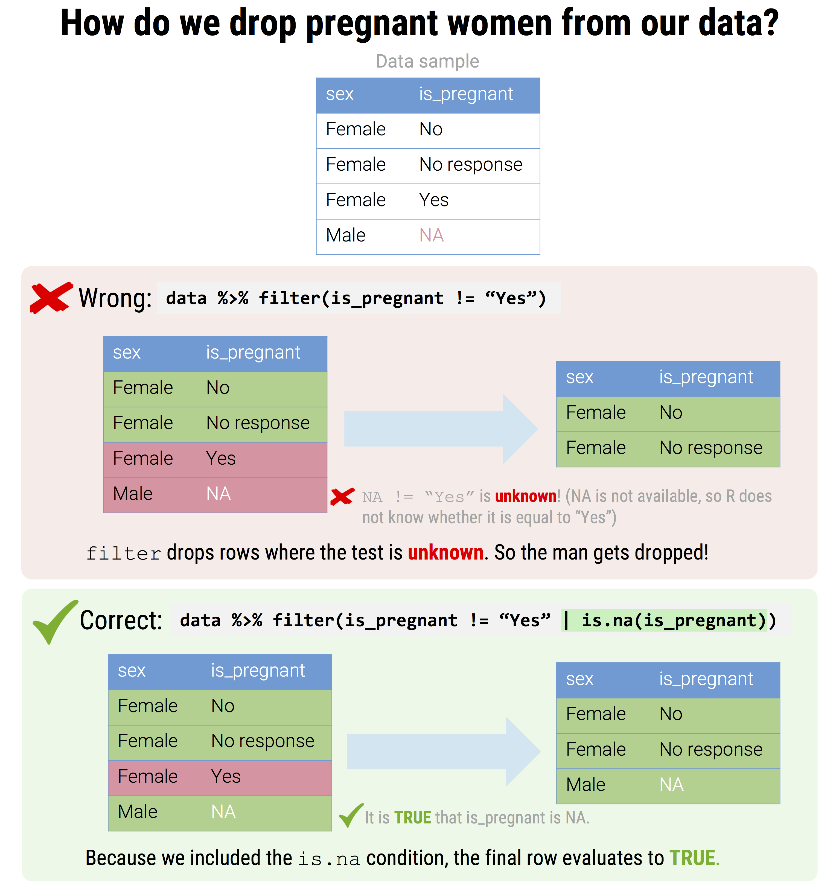

```{r, echo = F, message = F, warning = F}
# Load packages 
if(!require(pacman)) install.packages("pacman")
pacman::p_load(rlang, tidyverse, knitr, here)

## functions
source(here::here("global/functions/misc_functions.R"))

## default render
registerS3method("reactable_5_rows", "data.frame", reactable_5_rows)
knitr::opts_chunk$set(class.source = "tgc-code-block", render = reactable_5_rows)

```

## The Yaounde COVID-19 dataset

In this lesson, we will again use the data from the COVID-19 serological survey conducted in Yaounde, Cameroon.

```{r, message = F}
yaounde <- read_csv(here::here('ch04_data_wrangling/data/yaounde_data.csv'))
## a smaller subset of variables
yao <- yaounde %>% 
  select(age, sex, weight_kg, highest_education, neighborhood, 
         occupation, is_smoker, is_pregnant, 
         igg_result, igm_result)
yao
```

Let's make a data subset to illustrate this.

```{r}
yao_mini <- yao %>% 
  select(sex, is_pregnant) %>% 
  slice(1,11,50,2) ## custom row order

yao_mini
```

### A common error with `NA`

Handling `NA`s improperly is often a source of error. Imagine, for example, that we we wanted to drop pregnant women from the dataset.

We might write `filter(is_pregnant != "Yes")` (to be read as "keep respondents who are not pregnant"), but this would be wrong!

```{r}
## keep rows where `is_pregnant` is not "Yes"
yao_mini %>% filter(is_pregnant != "Yes") ## bad
```

Do you see what went wrong? We wanted to drop the pregnant woman, but we dropped the man too!

This is because `filter()` drops all rows where the test evaluates to `NA`. And the test `NA != "Yes"` evaluates to `NA`, because R does not not whether `NA` is equal to or not equal to "Yes".

```{r render = normal_print}
NA != "Yes" ## R does not know whether `NA` is equal to or not equal to "Yes"
```

In order to correctly filter on a column that contains `NA`s, we often need to include an `is.na()` condition. So to drop pregnant women without accidentally dropping the man, we could write:

```{r}
## keep rows where `is_pregnant` is not "Yes"
yao_mini %>% filter(is_pregnant != "Yes" |
                    is.na(is_pregnant)) ## OR `is_pregnant` is NA
```

Alternatively, we could write:

```{r}
## keep rows where `is_pregnant` is `NA`, "No" or "No response"
yao_mini %>% 
  filter(is.na(is_pregnant) | is_pregnant == "No" | is_pregnant == "No response")
```

{alt="A common error with NA"}{width="300",height="1000"}

::: pro-tip 

Remember that dropping some rows is like keeping their opposite.

An example:

-   dropping anyone younger than 45 (in code: `filter(!(age < 45))`)

**is THE SAME as**

-   keeping anyone over 45 (in code: `filter(age >= 45)`)

**Advantage**: less parenthesis and clearer to reread ! You should always go for the simplest code. 

:::


