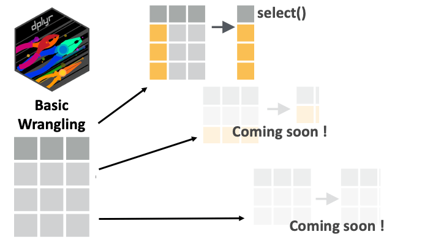

```{r, eval = F, include = F}
Salut étudiant du GRAPH Courses !

Ceci est un document CODE ALONG où vous pouvez taper du code pendant que vous suivez la vidéo de leçon.

Nous vous encourageons à le faire ; taper le code avec l'enseignant est le meilleur moyen d'apprendre la bonne syntaxe.
```

```{r}
# MORCEAU DE CONFIGURATION. N'oubliez pas d'exécuter tout ce morceau avant de continuer la leçon.

# Charger les packages
if(!require(pacman)) install.packages("pacman")
pacman::p_load(rlang, tidyverse, knitr, here)

# Source functions
source(here("global/functions/misc_functions.R"))

# Paramètres knitr
knitr::opts_chunk$set(warning = F, message = F, class.source = "tgc-code-block", error = T)
```

------------------------------------------------------------------------

# Manipulation de données : sélectionner et renommer les colonnes

## Introduction

Aujourd'hui, nous commencerons notre exploration du package {dplyr} ! Notre premier verbe sur la liste est **`select`** qui vous permet de conserver ou de supprimer des variables de votre dataframe. Choisir vos variables est la première étape dans le nettoyage de vos données.

{width="408"}

C'est parti !

## Objectifs d'apprentissage

‣ Vous pouvez conserver ou supprimer des colonnes d'un dataframe en utilisant la fonction **`dplyr::select()`** du package {dplyr}.

‣ Vous pouvez sélectionner une plage ou une combinaison de colonnes en utilisant des opérateurs tels que le deux-points (**`:`**), le point d'exclamation (**`!`**) et la fonction **`c()`**.

‣ Vous pouvez sélectionner des colonnes en fonction de motifs dans leurs noms avec des fonctions d'aide comme **`starts_with()`**, **`ends_with()`**, **`contains()`**, et **`everything()`**.

‣ Vous pouvez utiliser **`rename()`** et **`select()`** pour changer les noms des colonnes.

## L'ensemble de données COVID-19 de Yaoundé

‣ Enquête sérologique COVID-19

‣ Anticorps IgG et IgM

‣ L'ensemble de données complet peut être obtenu depuis [Zenodo](https://zenodo.org/record/5218965){target="_blank"} ([5218965](https://zenodo.org/record/5218965))

::: side-note
Notez que le jeu de donnée COVID-19 Yaoundé est en anglais !

Pour cette leçon, nous utiliserons cette version en anglais. Mais dans d'autres leçons, nous utiliserons une version partialement en français.
:::

{width="450"}

```{r, message = F, render = reactable_5_rows}
yaounde <- read_csv(here::here("data/yaounde_data.csv"))
yaounde  
```

## Introduction à `select()`

**`dplyr::select()`** nous permet de choisir quelles colonnes (variables) conserver ou supprimer.

{width="408"}

Par nom :

```{r}
yaounde ________________ # Sélectionner l'âge
```

Par position :

```{r}
yaounde _________________ # Sélectionner la 3ème colonne
```

Plusieurs variables :

```{r}
yaounde ____________________________ # Sélectionner l'âge, le sexe et le résultat igg
```

::: practice
**Pratique 1_1**

‣ Sélectionnez les variables poids et taille dans le dataframe `yaounde`.

```{r, eval = F, echo = FALSE}
# Pour cette première question de pratique, nous fournirons la réponse.
Q_weight_height <- yaounde %>% select(weight_kg, height_cm)
```

**Pratique 1_2**

‣ Sélectionnez les colonnes 16 et 22 dans le dataframe `yaounde`.

```{r, eval = F, echo = FALSE}
Q_cols_16_22 <- ________________
```
:::

------------------------------------------------------------------------

Pour la prochaine partie du tutoriel, créons un sous-ensemble plus petit des données, appelé `yao`.

```{r, render = reactable_5_rows}
yao <-
  yaounde %>% select(age,
                     sex,
                     highest_education,
                     occupation,
                     is_smoker,
                     is_pregnant,
                     igg_result,
                     igm_result)
yao
```

### Sélection de plages de colonnes avec `:`

L'opérateur **`:`** sélectionne une **plage de variables consécutives** :

```{r, render = reactable_5_rows}
yao ________________ # Sélectionnez toutes les colonnes de `age` à `occupation`
```

Nous pouvons également spécifier une plage à l'aide des numéros de colonne :

```{r, render = reactable_5_rows}
yao ________________ # Sélectionner les colonnes 1 à 4

```

::: practice
**Pratique 2**

‣ Avec le dataframe **`yaounde`**, sélectionnez les colonnes entre **`symptoms`** et **`sequelae`**, inclusivement. ("Inclusivement" signifie que vous devriez également inclure **`symptoms`** et **`sequelae`** dans la sélection.)

```{r, eval = F, echo = FALSE}
Q_symp_to_sequel <- ________________
```
:::

## Exclure des colonnes avec `!`

Le **point d'exclamation** nie une sélection :

```{r, render = reactable_5_rows}
yao _______________ # Sélectionnez toutes les colonnes sauf age
```

Pour supprimer une plage de colonnes consécutives, nous utilisons, par exemple, **`!age:occupation`** :

```{r, render = reactable_5_rows}
yao _______________ # Supprimez les colonnes de `age` à `occupation`
```

Pour supprimer plusieurs colonnes non consécutives, placez-les à l'intérieur de **`!c()`** :

```{r, render = reactable_5_rows}
yao _______________ # Supprimez les colonnes de `age`, `sex`, et `igg_result
```

::: practice
**Pratique 3**

‣ Du dataframe **`yaounde`**, **retirez** toutes les colonnes entre **`highest_education`** et **`consultation`**, inclusivement.

```{r, eval = F, echo = FALSE}
Q_educ_consult <-
```
:::

# Fonctions auxiliaires pour `select()`

**`dplyr`** possède un certain nombre de fonctions auxiliaires pour faciliter la sélection en utilisant des motifs des noms de colonnes. Jetons un œil à certaines d'entre elles.

## `starts_with()` et `ends_with()`

Ces deux fonctions auxiliaires fonctionnent exactement comme leurs noms l'indiquent !

```{r, render = reactable_5_rows}
yao %>% select(__________________) # Colonnes qui commencent par "is"
yao %>% select(__________________) # Colonnes qui finissent par "result"
```

## `contains()`

**`contains()`** aide à sélectionner les colonnes qui contiennent une certaine chaîne :

```{r, render = reactable_5_rows}
yaounde %>% select(__________________) # Colonnes contenant la chaîne "drug"
```

## `everything()`

Une autre fonction auxiliaire, **`everything()`**, correspond à toutes les variables qui n'ont pas encore été sélectionnées.

```{r, render = reactable_5_rows}
# D'abord, `is_pregnant`, puis toutes les autres colonnes.
yao %>% select(__________________)
```

C'est souvent utile pour établir l'ordre des colonnes.

Disons que nous voulions amener la colonne **`is_pregnant`** au début du dataframe **`yao`**, nous pourrions écrire manuellement tous les noms des colonnes :

```{r, render = reactable_5_rows}
yao %>% select(is_pregnant, 
               age, 
               sex, 
               highest_education, 
               occupation, 
               is_smoker, 
               igg_result, 
               igm_result)
```

Mais ce serait pénible pour des dataframes plus grands, comme notre dataframe original **`yaounde`**. Dans un tel cas, nous pouvons utiliser **`everything()`** :

```{r, render = reactable_5_rows}
# Amenez `is_pregnant` à l'avant du dataframe
yaounde %>% select(__________________)
```

Cette fonction auxiliaire peut être combinée avec beaucoup d'autres.

```{r, render = reactable_5_rows}
# Amenez les colonnes qui se terminent par "result" à l'avant du dataframe
yaounde %>% select(__________________)
```

::: practice
**Pratique 4_1**

‣ Sélectionnez toutes les colonnes dans le dataframe **`yaounde`** qui commencent par "is\_".

```{r, eval = F, echo = FALSE}
Q_starts_with_is <- yaounde %>%  ____________

Q_starts_with_is
```

**Pratique 4_2**

‣ Déplacez les colonnes qui commencent par "is\_" au début du dataframe **`yaounde`**.

```{r, eval = F, echo = FALSE}
Q_rearrange <- ____________

Q_rearrange
```
:::

# Changer les noms de colonnes avec `rename()`

[**`dplyr::rename()`**](https://dplyr.tidyverse.org/reference/rename.html) est utilisée pour changer les noms des colonnes :

```{r, render = reactable_5_rows}
# Renommez `age` et `sex` en `patient_age` et `patient_sex`
yaounde %>% 
  rename(___________________, 
         ___________________)
```

::: watch-out
Le fait que le nouveau nom vienne en premier dans la fonction (**`rename(NEWNAME = OLDNAME)`**) est parfois déroutant. Vous devriez vous y habituer avec le temps.
:::

## Renommer dans `select()`

Vous pouvez également renommer des colonnes tout en les sélectionnant :

```{r, render = reactable_5_rows}
# Sélectionnez `age` et `sex`, et renommez-les en `patient_age` et `patient_sex`
yaounde %>% 
  select(___________________, 
         ___________________)
```

# Conclusion ! {.unnumbered}

J'espère que cette première leçon vous a permis de voir à quel point les verbes {dplyr} sont intuitifs et utiles ! Ceci est la première d'une série de verbes de base pour la manipulation de données : rendez-vous à la prochaine leçon pour en savoir plus.

{width="400"}

# Contributeurs {.unlisted .unnumbered}

Les membres de l'équipe suivants ont contribué à cette leçon :

`r tgc_contributors_list(ids = c("lolovanco", "avallecam", "kendavidn", "sabina"))`

# Références {.unlisted .unnumbered}

Certains matériaux de cette leçon ont été adaptés des sources suivantes :

-   Horst, A. (2021). *Dplyr-learnr*. <https://github.com/allisonhorst/dplyr-learnr> (Œuvre originale publiée en 2020)

-   *Sélectionner des colonnes en utilisant leurs noms et types\-\--Select*. (n.d.). Récupéré le 31 décembre 2021, de <https://dplyr.tidyverse.org/reference/select.html>

L'artwork a été adapté de :

-   Horst, A. (2021). *Illustrations R & stats par Allison Horst*. <https://github.com/allisonhorst/stats-illustrations> (Œuvre originale publiée en 2018)

# Solutions des exercices pratiques

*Solution exercice pratique 1_2*

```{r eval = F}
yaounde %>% select(16, 22)
```

*Solution exercice pratique 2*

```{r eval = F}
yaounde %>% select(symptoms:sequelae)
```

*Solution exercice pratique 3*

```{r eval = F}
yaounde %>% select(!c(highest_education:consultation))
```

*Solution exercice pratique 4_1*

```{r eval = F}
yaounde %>% select(starts_with("is"))
```

*Solution exercice pratique 4_2*

```{r}
yaounde %>% select(starts_with("is_"), everything())
```
