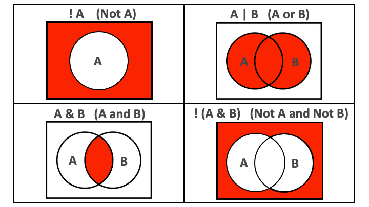

```{r, eval = F, include = F}
Salut étudiant du GRAPH Courses!

Ceci est un document CODE ALONG où vous pouvez taper du code en suivant la vidéo de la leçon.

Nous vous encourageons à faire cela ; taper du code avec le professeur est le meilleur moyen d'apprendre la bonne syntaxe.
```

```{r, echo = F, message = F, warning = F}
# CHUNK DE CONFIGURATION. N'oubliez pas d'exécuter ce bloc complet avant de continuer avec la leçon.

# Charger les packages
if(!require(pacman)) install.packages("pacman")
pacman::p_load(rlang, tidyverse, knitr, here)

# Charger les fonctions
source(here("global/functions/misc_functions.R"))

# Paramètres knitr
knitr::opts_chunk$set(warning = F, message = F, class.source = "tgc-code-block", error = T)

# Solutions are provided at the bottom of the document
```

# Manipulation de données : filtrer des lignes

------------------------------------------------------------------------

## Objectifs d'apprentissage

1.  Vous utiliserez `dplyr::filter()` pour garder ou éliminer des lignes d'un dataframe.

2.  Vous filtrerez des lignes en spécifiant des conditions sur des nombres ou des chaînes de caractères en utilisant des opérateurs relationnels tels que supérieur à (`>`), inférieur à (`<`), égal à (`==`), et différent de (`!=`).

3.  Vous filtrerez des lignes en combinant des conditions en utilisant des opérateurs logiques comme l'esperluette (`&`) et la barre verticale (`|`).

4.  Vous filtrerez des lignes en niant des conditions en utilisant l'opérateur logique point d'exclamation (`!`).

5.  Vous filtrerez des lignes avec des valeurs manquantes en utilisant la fonction `is.na()`.

------------------------------------------------------------------------

## Le jeu de données COVID-19 de Yaoundé

Nous continuons d'utiliser les données de l'enquête sérologique COVID-19 de Yaoundé.

```{r, message = F}
yaounde <- read_csv(here::here('data/yaounde_data.csv'))
# un sous-ensemble plus petit de variables
yao <- yaounde %>% 
  select(age, sex, weight_kg, highest_education, neighborhood, 
         occupation, is_smoker, is_pregnant, 
         igg_result, igm_result)
yao
```

::: side-note
Notez que le jeu de donnée COVID-19 Yaoundé est en anglais !

Pour cette leçon, nous utiliserons cette version en anglais. Mais dans d'autres leçons, nous utiliserons une version partialement en français.
:::

## Introduction à `filter()`

Nous utilisons `filter()` pour garder les lignes qui satisfont un ensemble de conditions.

Regardons un exemple simple.

Si nous voulons garder uniquement les enregistrements masculins, nous exécutons :

```{r}
yao ____________________ # Filtrer pour le sexe égal à "Male"
```

Notez l'utilisation du double signe égal `==` plutôt que du signe égal simple `=`.

Le signe `==` teste l'égalité, comme le montre l'exemple ci-dessous :

```{r, render = normal_print}
# créer l'objet `sex_vector` avec trois éléments
sex_vector <- c("Male", "Female", "Female")
# tester quels éléments sont égaux à "Male"
sex_vector == "Male"
```

Nous pouvons enchaîner `filter()` avec `nrow()` pour obtenir le nombre de lignes qui remplissent une condition.

```{r, render = normal_print}
# combien de répondants étaient des hommes ?
yao %>% 
  _______________________ %>% 
  _________________
```

::: key-point
Le double signe égal, `==`, teste l'égalité,

tandis que le signe égal simple, `=`, est utilisé pour spécifier des valeurs aux arguments à l'intérieur des fonctions.
:::

::: practice
Filtrez le dataframe `yao` pour les répondants qui étaient enceintes pendant l'enquête.

```{r, eval = F, echo = FALSE}
Q_is_pregnant <- "VOTRE RÉPONSE"
```

*Note : Les solutions pour toutes les questions de pratique se trouvent à la fin de ce document.*

Combien de répondants étaient des femmes ? (Utilisez `filter()` et `nrow()`)

```{r, eval = F, echo = FALSE}
Q_female_nrow <- "VOTRE RÉPONSE"
```
:::

## Opérateurs relationnels

L'opérateur `==` introduit ci-dessus est un exemple d'opérateur "relationnel".

Voici une liste de certains de ces opérateurs.

|               |                                 |
|:--------------|:--------------------------------|
| **Opérateur** | **est VRAI si**                 |
| A \< B        | A est **inférieur à** B         |
| A \<= B       | A est **inférieur ou égal** à B |
| A \> B        | A est **supérieur à** B         |
| A \>= B       | A est **supérieur ou égal à** B |
| A == B        | A est **égal** à B              |
| A != B        | A est **différent** de B        |
| A %in% B      | A **est un élément de** B       |

Prenez le temps de mettre la vidéo en pause et de les examiner.

Vous pouvez également enregistrer la ressource pour y revenir lorsque vous codez.

{width="450"}

Voyons comment utiliser ces opérateurs avec `filter()` :

```{r}
yao %>% filter(____________) # garder les lignes où `sex` n'est pas "Male"
yao %>% filter(____________) # garder les répondants de moins de 6 ans
yao %>% filter(____________) # garder les répondants âgés d'au moins 70 ans

# garder les répondants dont le plus haut niveau d'éducation est "Primary" ou "Secondary"
yao %>% filter(___________________________________)
```

::: practice
De `yao`, ne garder que les répondants qui étaient enfants (moins de 18 ans).

```{r, eval = F, echo = FALSE}
Q_under_18 <- "VOTRE RÉPONSE"
```

Avec `%in%`, ne garder que les répondants qui vivent dans les quartiers "Tsinga" ou "Messa".

```{r, eval = F, echo = FALSE}
Q_tsinga_messa <- "VOTRE RÉPONSE" 
```
:::

## Combinaison de conditions avec `&` et `|`

Une seule déclaration `filter()` peut englober plusieurs conditions.

Les conditions sont séparées par des virgules :

```{r}
# garder les répondants qui sont enceintes et qui sont d'anciens fumeurs
yao %>% filter(_____________________________________) ## seulement une ligne
```

Lorsque plusieurs conditions sont séparées par une virgule, elles sont implicitement combinées avec un **et** (`&`).

Il est de bonne pratique de remplacer la virgule par `&` pour rendre cela plus explicite.

```{r}
# même résultat qu'avant, mais `&` est plus explicite
yao %>% filter(_____________________________________)
```

::: side-note
Ne pas confondre :

-   la virgule "," dans l'énumération de plusieurs conditions dans `filter(A,B)` c'est-à-dire filtrer selon la condition A et (`&`) la condition B

-   la virgule "," dans les listes `c(A,B)` qui énumère différents composants de la liste (et qui n'a rien à voir avec l'opérateur `&`)
:::

Si nous voulons combiner les conditions avec un **ou**, nous utilisons le symbole de barre verticale, `|`.

```{r}
# répondants qui sont enceintes OU qui sont d'anciens fumeurs
yao %>% filter(___________________________________________)
```

::: practice
Filtrer `yao` pour ne garder que les hommes qui ont été testés positifs pour IgG.

```{r, eval = F, echo = FALSE}
Q_male_positive <- "VOTRE RÉPONSE"
```

Filtrer `yao` pour garder

à la fois les enfants (moins de 18 ans) et toute personne ayant comme niveau d'éducation le primaire.

```{r, eval = F, echo = FALSE}
Q_child_primary <- "VOTRE RÉPONSE"
``` 
:::

## Négation des conditions avec `!`

Pour nier des conditions, nous les entourons de `!()`.

Ci-dessous, nous excluons les répondants :

-   qui sont des enfants (moins de 18 ans)

OU

-   qui pèsent moins de 30kg :

```{r}
# exclure les répondants < 18 ans OU < 30 kg
yao %>% filter(_________________________)
```

Si vous combinez `!` avec `%in%`, c'est comme si vous écriviez l'opérateur **NOT in** :

```{r}
# exclure les répondants dont le niveau d'éducation le plus élevé n'est PAS "Primaire" ou "Secondaire"
yao %>% filter(!(highest_education %in% c("Primary", "Secondary")))

```

::: key-point
Il est plus facile de lire les instructions `filter()` comme des déclarations **garder**,

pour éviter la confusion entre filtrer **in** ou filtrer **out** !

Ainsi, le code ci-dessous se lirait : "**garder** les répondants qui ont moins de 18 ans ou qui pèsent moins de 30kg".

```{r, eval = F}
yao %>% filter(age < 18 | weight_kg < 30)
```

Et quand nous entourons les conditions de `!()`, nous pouvons alors lire les instructions `filter()` comme des déclarations **exclure**.

Ainsi, le code ci-dessous se lirait : "**exclure** les répondants qui ont moins de 18 ans ou qui pèsent moins de 30kg".

```{r, eval = F}
yao %>% filter(!(age < 18 | weight_kg < 30))
```
:::

::: practice
À partir de `yao`, excluez les répondants qui vivent dans les quartiers de Tsinga ou Messa.

```{r, eval = F, echo = FALSE}
Q_not_tsinga_messa <- "VOTRE RÉPONSE"
```
:::

## Valeurs `NA`

Les opérateurs relationnels introduits jusqu'ici ne fonctionnent pas avec `NA`.

Faisons un sous-ensemble de données pour illustrer cela.

```{r}
yao_mini <- yao %>% 
  select(sex, is_pregnant) %>% 
  slice(1,11,50,2) # ordre personnalisé des lignes

yao_mini
```

Dans `yao_mini`, le dernier répondant a un `NA` pour la colonne `is_pregnant`, parce qu'il est de sexe masculin.

Essayer de sélectionner cette ligne en utilisant `== NA` ne fonctionnera pas.

```{r}
yao_mini %>% filter(is_pregnant == NA) # ne fonctionne pas
yao_mini %>% filter(is_pregnant == "NA") # ne fonctionne pas
```

`NA` est une valeur non existante.

Donc R ne peut pas évaluer si elle est "égale à" ou "différente de" quoi que ce soit.

La fonction spéciale `is.na()` est donc nécessaire :

```{r}
# garder les lignes où `is_pregnant` est NA
yao_mini %>% filter(____________________) 
```

Cette fonction peut être niée avec `!` :

```{r}
# exclure les lignes où `is_pregnant` est NA
yao_mini %>% filter(____________________)
```

Ceci est extrêmement utile pour supprimer toutes les valeurs `NA` de vos variables. Nous en apprendrons plus à ce sujet à l'avenir.

::: side-note
Pour les tibbles, RStudio mettra en évidence les valeurs `NA` en rouge vif pour les distinguer des autres valeurs :

{width="200"}
:::

::: side-note
Les valeurs `NA` peuvent être identifiées, mais tout autre codage tel que `"NA"` ou `"NaN"`, qui sont codés comme des chaînes, seront imperceptibles aux fonctions (ce sont des chaînes, comme les autres).
:::

::: practice
Dans l'ensemble de données `yao`, conservez tous les répondants qui avaient des dossiers manquants concernant le signalement de leur statut de fumeur.

```{r, eval = F, echo = FALSE}
Q_na_smoker <- "VOTRE RÉPONSE"
```
:::

::: practice
Pour certains répondants, la fréquence respiratoire, en respirations par minute, a été enregistrée dans la colonne `respiration_frequency`.

Dans `yaounde`, éliminez ceux ayant une fréquence respiratoire inférieure à 20. Pensez aux NAs lors de cette opération ! Vous devriez également éviter de supprimer les valeurs NA.

```{r, eval = F, echo = FALSE}
Q_drop_resp_under_20 <- "VOTRE RÉPONSE"
```
:::

## Solutions {.unlisted .unnumbered}

**Question 1 :** Filtrez le dataframe `yao` pour les répondants qui étaient enceintes pendant l'enquête.

```{r, eval = F}
Q_is_pregnant <- yao %>% filter(is_pregnant == "Yes")
```

**Question 2 :** Combien de répondants étaient des femmes ? (Utilisez `filter()` et `nrow()`)

```{r, eval = F}
Q_female_nrow <- yao %>%
  filter(sex == "Female") %>%
  nrow()
```

**Question 3 :** De `yao`, ne garder que les répondants qui étaient enfants (moins de 18 ans).

```{r, eval = F}
Q_under_18 <- yao %>% filter(age < 18)
```

**Question 4 :** Avec `%in%`, ne garder que les répondants qui vivent dans les quartiers "Tsinga" ou "Messa".

```{r, eval = F}
Q_tsinga_messa <- yao %>%
  filter(neighborhood %in% c("Tsinga", "Messa"))
```

**Question 5 :** Filtrer `yao` pour ne garder que les hommes qui ont été testés positifs pour IgG.

```{r, eval = F}
Q_male_positive <- yao %>%
  filter(sex == "Male" & igg_result == "Positive")
```

**Question 6 :** Filtrer `yao` pour garder à la fois les enfants (moins de 18 ans) et toute personne ayant comme niveau d'éducation le primaire.

```{r, eval = F}
Q_child_primary <- yao %>% filter(age < 18 | highest_education == "Primary")
```

**Question 7 :** À partir de `yao`, excluez les répondants qui vivent dans les quartiers de Tsinga ou Messa.

```{r, eval = F}
Q_not_tsinga_messa <- yao %>%
  filter(!(neighborhood %in% c("Tsinga", "Messa")))
```

**Question 8 :** Dans l'ensemble de données `yao`, conservez tous les répondants qui avaient des dossiers manquants concernant le signalement de leur statut de fumeur.

```{r, eval = F}
Q_na_smoker <- yao %>% filter(is.na(is_smoker))
```

**Question 9 :** Dans `yaounde`, éliminez ceux ayant une fréquence respiratoire inférieure à 20. Pensez aux NAs lors de cette opération ! Vous devriez également éviter de supprimer les valeurs NA.

```{r, eval = F}
Q_drop_resp_under_20 <- yaounde %>% filter(respiration_frequency >= 20 | is.na(respiration_frequency))
```

## Contributeurs {.unlisted .unnumbered}

Les membres suivants de l'équipe ont contribué à cette leçon :

`r tgc_contributors_list(ids = c("lolovanco", "avallecam", "kendavidn", "sabina"))`

## Références {.unlisted .unnumbered}

Une partie du matériel de cette leçon a été adaptée des sources suivantes :

-   Horst, A. (2021). *Dplyr-learnr*. <https://github.com/allisonhorst/dplyr-learnr> (Travail original publié en 2020)

-   *Sélectionner des lignes en utilisant les valeurs des colonnes---Filter*. (s.d.). Récupéré le 12 janvier 2022, de <https://dplyr.tidyverse.org/reference/filter.html>

Les œuvres d'art ont été adaptées de :

-   Horst, A. (2021). *Illustrations R & stats par Allison Horst*. <https://github.com/allisonhorst/stats-illustrations> (Travail original publié en 2018)
