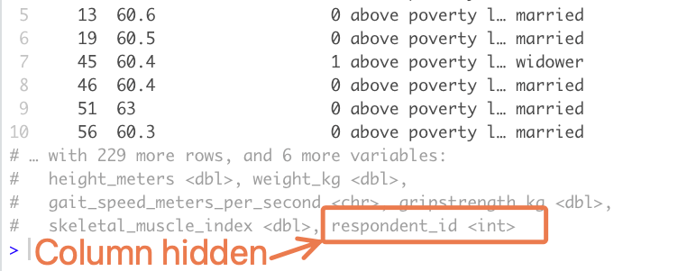

```{r, eval = F, include = F}
Salut étudiant du GRAPH Courses !
  
Ceci est un document CODE ALONG dans lequel vous pouvez taper du code en suivant la vidéo de la leçon. 

Nous vous encourageons à le faire ; taper du code avec le professeur est la meilleure façon d'apprendre la bonne syntaxe. 
```

```{r, echo = F, message = F, warning = F}
if(!require(pacman)) install.packages("pacman")
pacman::p_load(knitr, 
               here, 
               janitor,
               tidyverse)

# fonctions
source(here::here("global/functions/misc_functions.R"))

# rendu par défaut
registerS3method("reactable_10_rows", "data.frame", reactable_10_rows)
knitr::opts_chunk$set(class.source = "tgc-code-block", render = reactable_5_rows)


```

# Manipulation des données : modification des colonnes

## Introduction

‣ Aujourd'hui vous allez apprendre à modifier des variables existantes ou en créer de nouvelles avec `mutate()` de {dplyr}. Cela est essentiel dans la plupart des projets d'analyse de données.

{width="400"}

# Objectifs d'apprentissage

‣ Utiliser `mutate()` pour créer ou modifier des variables.

‣ Créer des variables numériques, de caractères, de facteurs et booléennes.

## Paquets

‣ Chargement des paquets nécessaires pour la leçon.

```{r}
if(!require(pacman)) install.packages("pacman")
pacman::p_load(here, 
               janitor,
               tidyverse)
```

------------------------------------------------------------------------

## Jeux de données

‣ Utilisation de deux ensembles de données : **l'enquête sérologique COVID-19** à **Yaoundé**, Cameroun et une étude sur la **sarcopénie** au Karnataka, **Inde**.

‣ La **sarcopénie** : perte musculaire chez les personnes âgées.

::: side-note
Notez que le jeu de donnée COVID-19 Yaoundé et sarcopénie sont en anglais !

Pour cette leçon, nous utiliserons ces versions en anglais. Mais dans d'autres leçons, nous utiliserons des versions partialement en français.
:::

------------------------------------------------------------------------

```{r}
yaounde <- read_csv(here::here('data/yaounde_data.csv'))

# un sous-ensemble plus petit de variables
yao <- 
  yaounde %>% 
  select(date_surveyed, 
         age, 
         weight_kg, 
         height_cm, 
         symptoms, 
         is_smoker) %>% 
  rename(age_years = age)

yao
```

```{r}
sarcopenia <- read_csv(here::here('data/sarcopenia_elderly.csv'))

sarcopenia
```

------------------------------------------------------------------------

## Introduction à `mutate()`

{width="336"}

------------------------------------------------------------------------

‣ Nous utilisons `dplyr::mutate()` : pour créer ou modifier des variables.

‣ Syntaxe **intuitive** :

`df %>% mutate(nouveau_nom_de_colonne = contenu_de_cette_colonne)`.

‣ Voyons un exemple avec `height_cm` du jeu de données `yaounde`.

------------------------------------------------------------------------

Créons un dataframe, `yao_height`, pour illustration.

```{r}
yao_height <- yaounde %>% select(_____________)
yao_height
```

------------------------------------------------------------------------

‣ Et si nous créons une nouvelle variable `height_meters` pour les tailles en mètres avec `mutate()`?

‣ Nous pouvons utiliser `mutate()` pour cela

‣ En utilisant l'argument `height_meters = height_cm/100`

------------------------------------------------------------------------

```{r}
yao_height %>% 
  mutate(___________________)
```

------------------------------------------------------------------------

Essayons un nouveau exemple !

‣ Imaginons que il y'a une correction d'une erreur de **mesure dans la taille de répondants**

‣ Toutes les tailles sont trop petites.

‣ Ajouter 5 cm aux tailles.

‣ Plutôt de créer une nouvelle variable, comme avant, nous pouvons **modifier la variable existante**.

------------------------------------------------------------------------

```{r}
yao_height %>% 
  mutate(___________________)
```

------------------------------------------------------------------------

**PRATIQUEZ !**

::: practice
La dataframe `sarcopenia` a une variable `weight_kg`, qui contient le poids des répondants en kilogrammes. Créez une nouvelle colonne, appelée `weight_grams`, avec le poids des répondants en grammes. Stockez votre réponse dans l'objet `Q_weight_to_g`. (1 kg équivant à 1000 grammes.)

```{r, eval = FALSE}
# Complétez le code avec votre réponse :
Q_weight_to_g <- 
  sarcopenia %>% 
  _____________________
```

```{r, include = FALSE}
# Les solutions pour toutes les questions se trouvent à la fin de ce document.
```
:::

------------------------------------------------------------------------

‣ Nous avons vu que `mutate` est facile à utiliser.

‣ On pourrait penser que la leçon est finie...

‣ Mais le diable se cache souvent dans les détails.

------------------------------------------------------------------------

## Création d'une variable à partir de zéro (indice de ligne)

‣ Souvent, vous allez créer des variables qui **référencent des variables existantes** (par exemple, la variable `height_meters` créée ci-dessus fait référence à la variable `height_cm`).

‣ Parfois, vous créez des variables **"à partir de zéro"** sans faire référence à d'autres.

‣ Un exemple : la création d'un indice de ligne avec `mutate()` et `1:n()` pour générer une séquence d'indices de lignes.

‣ Le `n()` dans dplyr retourne le nombre de lignes du dataframe.

```{r}
yao_height %>% 
  mutate(_______________________)
```

------------------------------------------------------------------------

**PRATIQUEZ !**

::: practice
Ajoutez une variable `respondent_id` à `sarcopenia` pour contenir le numéro de ligne.

```{r, eval = FALSE}
# Complétez le code :
Q_sarcopenia_resp_id <- 
  sarcopenia %>% 
  mutate(________________________)
```

Note : La base de données `sarcopenia` comporte 10 colonnes, qui ne tiendront probablement pas toutes dans votre console lorsque vous imprimerez cette base de données. Votre nouvelle colonne, `respondent_id` sera probablement cachée.

{width="301"}

Ainsi, pour voir réellement la nouvelle colonne, vous pouvez utiliser `View()` pour visualiser l'ensemble du cadre de données ou `select()` pour sélectionner les colonnes concernées.


:::

------------------------------------------------------------------------

## Créer une variable booléenne

‣ Utilisez `mutate()` pour créer une variable booléenne pour catégoriser votre population.

‣ Création de `is_child`

‣ Soit `TRUE` si le sujet est un enfant, soit `FALSE` si c'est un adulte

‣ Utilisation d'une condition : `age <= 18` qui évalue si chaque âge est inférieur ou égal à 18.

‣ Les âges ≤ 18 ans sont `TRUE`, les autres `FALSE`.

```{r}
yao %>%
  select(____________________) %>% 
  mutate(____________________)
```

‣ Cette variable est utile pour, par exemple, compter le nombre d'enfants dans le jeu de données.

‣ Comptons les enfants après les avoir définis avec `mutate()`

‣ Utilisons la fonction `janitor::tabyl()`

```{r}
yao %>%
  mutate(is_child = age <= 18) %>% 
  tabyl(____________________)
```

‣ Nous pouvons observer que 31.8% (0.318) des répondants sont des enfants.

------------------------------------------------------------------------

‣ Prenons un autre exemple, car le concept de variables booléennes peut être un peu déroutant.

‣ La variable `symptoms` rapporte les symptômes respiratoires du patient

‣ Vous pourriez créer une variable booléenne, `has_no_symptoms`

‣ `TRUE` si aucun symptôme n'est rapporté

```{r}
yao %>% 
  select(____________________) %>% 
  mutate(____________________)
```

------------------------------------------------------------------------

**PRATIQUEZ !**

::: practice
Les femmes ayant une force de préhension inférieure à 20 kg sont considérées comme ayant une faible force de préhension. 

Avec un sous-ensemble féminin du dataframe `sarcopenia`, ajoutez une variable appelée `low_grip_strength` qui est `TRUE` pour les femmes avec une force de préhension \< 20 kg et FALSE pour les autres femmes.

```{r, eval = FALSE}
# Complétez le code avec votre réponse :
Q_women_low_grip_strength <- 
  sarcopenia %>%
  filter(sex_male_1_female_0 == 0) %>%  # d'abord, nous filtrons l'ensemble de données pour seulement les femmes
  mutate(________________________) # code mutate ici
```


Quel pourcentage de femmes interrogées ont une faible force de préhension selon la définition ci-dessus? Entrez votre réponse sous forme de nombre sans guillemets (par exemple, 43.3 ou 12.2), à une décimale près.

```{r, eval = FALSE}
Q_prop_women_low_grip_strength <- "VOTRE RÉPONSE"
```


:::

------------------------------------------------------------------------

## Création d'une variable numérique basée sur une formule

‣ Examinons un exemple de **création d'une variable numérique** :

‣ L'**indice de masse corporelle (IMC)**, un indicateur de santé **couramment utilisé**.

‣ La formule de l'indice de masse corporelle est :

$$
IMC = \frac{poids (kilogrammes)}{taille (mètres)^2}
$$

------------------------------------------------------------------------

‣ Nous pouvons utiliser `mutate()` pour calculer l'IMC dans le jeu de données `yao` comme suit :

```{r}
yao %>%
  __________________________ %>% 
  
  # d'abord obtenir la taille en mètres  
 __________________________ %>% 
  
  # puis utilisez la formule de l'IMC
  __________________________
```

------------------------------------------------------------------------

‣ Sauvegardons le jeu de données avec les IMC pour plus tard. Nous l'utiliserons dans la section suivante.

```{r}
yao_bmi <- 
yao %>%
  select(weight_kg,  height_cm) %>% 
  # d'abord obtenir la taille en mètres  
  mutate(height_meters = height_cm/100) %>% 
  # puis utilisez la formule de l'IMC
  mutate(bmi = weight_kg / (height_meters)^2)

yao_bmi
```

```{r COMPLETE_CODE}
# yao_bmi <- 
#   yao %>%
#   select(weight_kg,  height_cm) %>% 
#   # first obtain the height in meters  
#   mutate(height_meters = height_cm/100) %>% 
#   # then use the BMI formula
#   mutate(bmi = weight_kg / (height_meters)^2)

```

------------------------------------------------------------------------

**PRATIQUEZ !**

::: practice
La **masse musculaire appendiculaire (MMA)**, un **indicateur de santé utile**.

C'est la **somme de la masse musculaire dans les 4 membres**. Elle peut être prédite avec la formule suivante, appelée équation de Lee :

$$ASM(kg)= (0.244 \times poids(kg)) + (7.8 \times taille(mètres)) + (6.6 \times sexe) - (0.098 \times âge en années) - 4.5$$

La variable `sex` dans la formule suppose que les hommes sont codés comme 1 et les femmes comme 0 (ce qui est déjà le cas pour notre jeu de données `sarcopenia`).

Le `- 4.5` à la fin est une constante utilisée pour les populations asiatiques.

Calculez la valeur de MMA pour tous les individus dans le jeu de données `sarcopenia`.

```{r, eval = FALSE}
# Complétez le code avec votre réponse:
Q_asm_calculation <- 
  sarcopenia %>% 
  mutate(asm = _______________________________________________)
```


:::

------------------------------------------------------------------------

## Changer le type d'une variable

‣ Souvent, vous devez redéfinir les *types* de variables dans votre analyse de données.

‣ Nous pouvons utiliser des fonctions telles que `as.integer()`, `as.factor()`, `as.character()`, `as.Date()`.

‣ Ces fonctions peuvent être incorporées dans `mutate()`.

‣ Exemple avec `as.integer()` pour convertir des valeurs numériques en entiers :

```{r}
yao_bmi %>% 
  mutate(___________________________)
```

‣ Notez que cela *tronque* les nombres, au lieu de les arrondir.

‣ Par exemple, l'IMC 22,8 de la troisième ligne est tronqué à 22.

‣ Pour l'arrondissement, utilisez la fonction `round` de R :

```{r}
yao_bmi %>% 
  mutate(bmi_integer = as.integer(bmi), 
         ___________________________)
```

------------------------------------------------------------------------

**PRATIQUEZ !**

::: practice
Utilisez `as_integer()` pour convertir les âges des personnes interrogées dans le jeu de données `sarcopenia` en entiers (en les tronquant au passage, nous ne nous soucions pas qu'ils soient arrondis correctement).

Ce chiffre doit être placé dans une nouvelle colonne appelée `age_integer`.

```{r, eval = FALSE}
# Complétez le code avec votre réponse :
Q_age_integer <- 
  sarcopenia %>% 
  mutate(age_integer =  ________________________)
```


:::

# En Résumé !

‣ Transformer des données est crucial dans l'analyse.

‣ Nettoyage et préparation des données pour les analyses statistiques ou graphiques.

‣ La fonction `mutate()` de dplyr simplifie ces transformations.

‣ Certaines transformations sont plus complexes que d'autres.

Félicitations pour votre progression.

Mais il reste encore des techniques à apprendre pour manipuler les données !

Rendez-vous dans la prochaine leçon pour les résumés de données et les groupes de dataframe.

{width="400"}

# Contributeurs {.unlisted .unnumbered}

Les membres de l'équipe suivants ont contribué à cette leçon :

`r tgc_contributors_list(ids = c("lolovanco", "avallecam", "kendavidn", "sabina"))`

# Solutions {.unlisted .unnumbered}

Voici les solutions aux questions pratiques de cette leçon :

## Solution 1: Conversion de poids en grammes

```{r, eval = FALSE}
Q_weight_to_g <- 
  sarcopenia %>% 
  mutate(weight_grams = weight_kg * 1000)
```

## Solution 2: Ajout d'un ID de répondant

```{r, eval = FALSE}
Q_sarcopenia_resp_id <- 
  sarcopenia %>% 
  mutate(respondent_id = 1:n())
```

## Solution 3: Variable booléenne pour la faible force de préhension

```{r, eval = FALSE}
Q_women_low_grip_strength <- 
  sarcopenia %>%
  filter(sex_male_1_female_0 == 0) %>%
  mutate(low_grip_strength = grip_strength_kg < 20)
```

## Solution 4: Pourcentage de femmes avec faible force de préhension

```{r, eval = FALSE}
Q_prop_women_low_grip_strength <- 82.6

# Pour calculer ce pourcentage :
sarcopenia %>% 
  filter(sex_male_1_female_0 == 0) %>% 
  mutate(low_grip_strength = grip_strength_kg < 20) %>% 
  tabyl(low_grip_strength)
```

## Solution 5: Calcul de la masse musculaire appendiculaire (ASM)

```{r, eval = FALSE}
Q_asm_calculation <-
  sarcopenia %>%
  mutate(asm = 0.244 * weight_kg + 7.8 * height_meters + 6.6 * sex_male_1_female_0 - 0.098 * age - 4.5)
```

## Solution 6: Conversion de l'âge en entier

```{r, eval = FALSE}
Q_age_integer <-
  sarcopenia %>%
  mutate(age_integer = as.integer(age))
```

# Références {.unlisted .unnumbered}

Certains matériaux de cette leçon ont été adaptés des sources suivantes :

-   Horst, A. (2022). *Dplyr-learnr*. <https://github.com/allisonhorst/dplyr-learnr> (Travail original publié en 2020)

-   *Créer, modifier, et supprimer des colonnes --- Mutate*. (n.d.). Consulté le 21 février 2022, à partir de <https://dplyr.tidyverse.org/reference/mutate.html>

-   *Appliquer une fonction (ou des fonctions) sur plusieurs colonnes --- Across*. (n.d.). Consulté le 21 février 2022, à partir de <https://dplyr.tidyverse.org/reference/across.html>

Les illustrations ont été adaptées de :

-   Horst, A. (2022). *Illustrations R & stats par Allison Horst*. <https://github.com/allisonhorst/stats-illustrations> (Travail original publié en 2018)

Autres références :

-   Lee, Robert C, ZiMian Wang, Moonseong Heo, Robert Ross, Ian Janssen, et Steven B Heymsfield. "Total-Body Skeletal Muscle Mass: Development and Cross-Validation of Anthropometric Prediction Models." *The American Journal of Clinical Nutrition* 72, no. 3 (2000): 796--803. <https://doi.org/10.1093/ajcn/72.3.796.>
