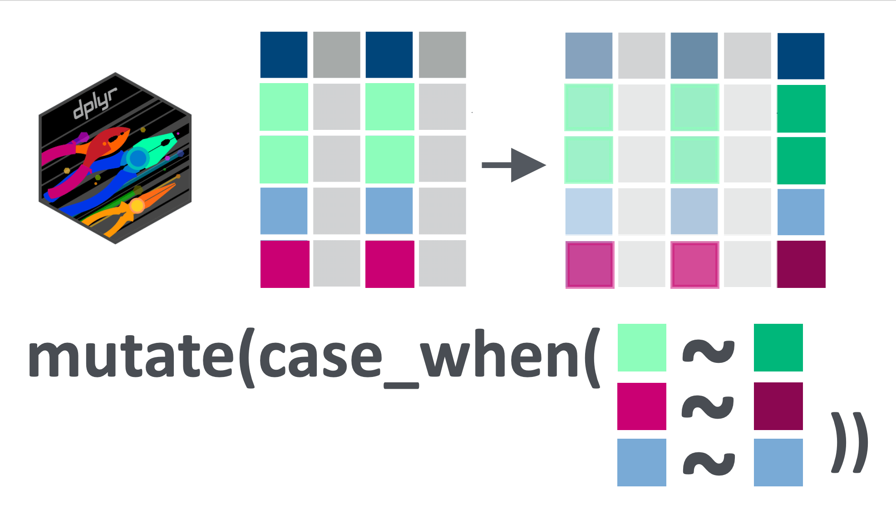
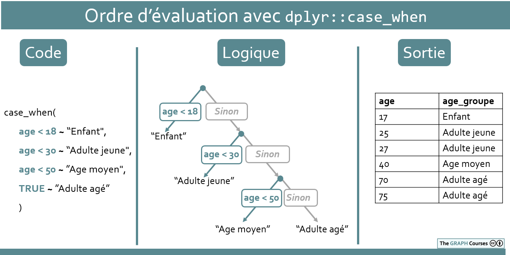
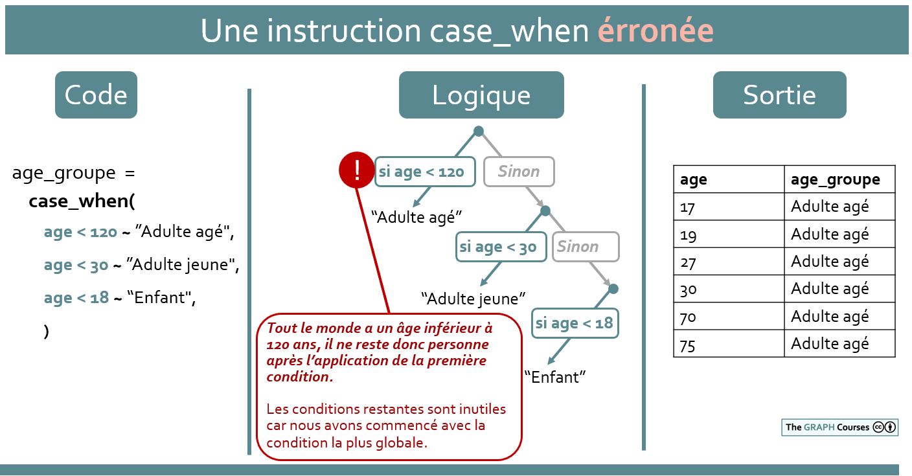
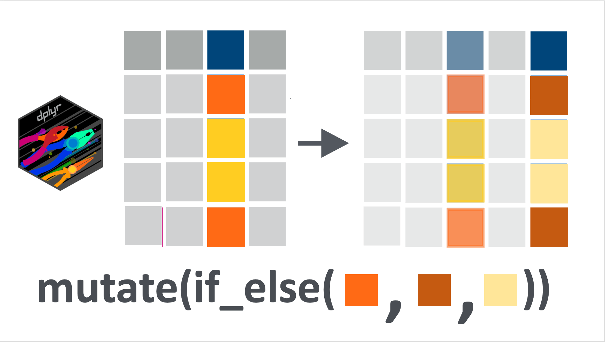

```{r, eval = F, include = F}
Bonjour étudiant du GRAPH Courses!

Ceci est un document CODE ALONG où vous pouvez taper du code en suivant la vidéo de la leçon.

Nous vous encourageons à faire cela ; taper du code avec le professeur est le meilleur moyen d'apprendre la bonne syntaxe.
```

```{r, echo = F, message = F, warning = F}
if(!require(pacman)) install.packages("pacman")
pacman::p_load(knitr, 
               here, 
               janitor,
               tidyverse)

## fonctions
source(here::here("global/functions/misc_functions.R"))

## rendu par défaut
registerS3method("reactable_10_rows", "data.frame", reactable_10_rows)
knitr::opts_chunk$set(class.source = "tgc-code-block", render = reactable_10_rows)


```

## Introduction

‣ Dans la dernière leçon, vous avez appris les bases de la transformation des données en utilisant la fonction `mutate()` de {dplyr}.

‣ Dans cette leçon, nous avons principalement examiné les transformations *globales* ; c'est-à-dire, des transformations qui font la même chose à une variable entière. 

‣ Dans la leçon d'aujourd'hui, nous allons voir comment manipuler *conditionnellement* certaines lignes en fonction de si elles répondent ou non à des critères définis.

‣ Pour cela, nous utiliserons principalement la fonction `case_when()`, que vous considérerez probablement comme l'une des fonctions les plus importantes de {dplyr} pour les tâches de préparation des données.

{width="400"}

## Objectifs d'apprentissage

‣ Transformer ou créer de nouvelles variables en fonction de conditions avec `dplyr::case_when()`

‣ Utiliser la condition `TRUE` dans `case_when()` pour faire correspondre des cas non appariés.

‣ Gérer les valeurs `NA` dans les transformations `case_when()`.

‣ Comprendre comment conserver les valeurs par défaut d'une variable dans une formule `case_when()`.

‣ Rédiger des conditions `case_when()` impliquant plusieurs comparateurs et plusieurs variables.

‣ Comprendre l'ordre de priorité des conditions `case_when()`.

‣ Utiliser `dplyr::if_else()` pour l'attribution conditionnelle binaire.

------------------------------------------------------------------------

## Paquets

‣ Cette leçon nécessitera la suite de paquets tidyverse :

```{r}
if(!require(pacman)) install.packages("pacman")
pacman::p_load(tidyverse)
```

## Jeux de données

‣ Enquête sérologique COVID-19 de Yaoundé, Cameroun.

‣ **Liste de cas d'épidémie** de **136 cas de grippe A H7N9** lors d'une [épidémie en 2013](https://en.wikipedia.org/wiki/Influenza_A_virus_subtype_H7N9#Reported_cases_in_2013) en **Chine**.

------------------------------------------------------------------------

‣ Nous avons légèrement modifié la colonne d'âge, introduisant artificiellement des valeurs manquantes, et supprimé la colonne `cat_age`.

```{r, message = F, render = reactable_10_rows}
# Importer et visualiser le jeu de données
yaounde <- read_csv(here::here('data/fr_yaounde_data.csv')) %>%   
  ## rendre manquant chaque 5ème âge  
  mutate(age = case_when(row_number() %in% seq(5, 900, by = 5) ~ NA_real_,
                         TRUE ~ age)) %>%   
  ## renommer la variable âge   
  rename(age_annees = age) %>%  
  # supprimer la colonne de catégorie d'âge
  select(-cat_age) 
yaounde
```

```{r, message = F, render = reactable_10_rows}
# Importer et afficher l'ensemble de données
liste_influ <- read_csv(here::here('data/fr_flu_h7n9_china_2013.csv'))
liste_influ
```

------------------------------------------------------------------------

## Rappel : opérateurs relationnels (comparateurs) en R

‣ Ils testent la relation entre deux valeurs

‣ Ils renvoient `TRUE`, `FALSE` ou `NA`.

------------------------------------------------------------------------

Une liste des opérateurs les plus courants est donnée ci-dessous :

|               |                                 |
|:--------------|:--------------------------------|
| **Opérateur** | **est VRAI si**                 |
| A \< B        | A est **inférieur à** B         |
| A \<= B       | A est **inférieur ou égal à** B |
| A \> B        | A est **supérieur à** B         |
| A \>= B       | A est **supérieur ou égal à** B |
| A == B        | A est **égal à** B              |
| A != B        | A est **différent de** B        |
| A %in% B      | A **fait partie de** B          |

------------------------------------------------------------------------

## Introduction à `case_when()`

‣ Commençons par une simple transformation conditionnelle

‣ Nous utiliserons `case_when()`, pour créer une nouvelle colonne appelée `age_groupe`

------------------------------------------------------------------------

```{r}
yaounde_age <- 
  yaounde %>% 
  # sélectionnons juste age_annees pour voir ce que nous faisons
  select(age_annees)

yaounde_age
```

```{r}
yaounde_age %>%  
  # définissons un groupe adulte et un groupe enfant
  mutate(age_groupe = case_when(______________________________))
```

------------------------------------------------------------------------

‣ La syntaxe de `case_when()` peut sembler étrangère, mais elle est simple

‣ Le signe `~` s'appelle un "tilde"

‣ Du **côté gauche (LHS)** du `~`, vous avez les **conditions**

‣ Du **côté droit (RHS)**, vous avez une **valeur** à insérer **si la condition est vraie**

‣ `case_when(age_annees < 18 ~ "Enfant", age_annees >= 18 ~ "Adulte")`

‣ "si `age_annees` est inférieur à 18 ans, saisir 'Enfant', sinon si `age_annees` est supérieur ou égal à 18 ans, saisir 'Adulte'".

------------------------------------------------------------------------

‣ Après avoir créé une nouvelle variable avec `case_when()`, il est bon de **l'inspecter**

------------------------------------------------------------------------

```{r eval = FALSE}
yaounde_age %>%  
  mutate(age_groupe = ______________________________) %>% 
  View()
```

‣ `View()` nous permet de **la voir** sous forme de feuille de calcul dans un nouvel onglet de Rstudio

```{r}
yaounde_age %>%  
  mutate(age_groupe = ______________________________) %>% 
  tabyl(age_groupe)
```

‣ Utilisez la fonction `tabyl()` pour vous assurer que les proportions "ont du sens"

------------------------------------------------------------------------

**PRATIQUEZ !**

::: practice
Avec les données `flu_linelist`, créez une nouvelle colonne appelée `age_groupe`, qui aura la valeur "Below 50" pour les personnes de moins de 50 ans et "50 and above" pour les personnes âgées de 50 ans et plus. Utilisez la fonction `case_when()`.

*(Les solutions pour tous les exercices pratiques se trouvent à la fin de ce document.)*

```{r eval = FALSE}
# Complétez le code avec votre réponse :

Q_age_groupe <- liste_influ %>% 
  mutate(age_groupe = ___________________)
```

Quel pourcentage d'individus dans le jeu de données sont âgés de moins de 60 ans ? (Vous pouvez utiliser la fonction `tabyl()` pour calculer cela.)

```{r eval = FALSE}
# Entrez votre réponse sous forme d'un nombre ENTIER sans guillemets :

Q_age_groupe_pourcentage(____________________________________)
```


:::

------------------------------------------------------------------------

## L'argument par défaut `TRUE`

‣ `case_when()` a une condition littérale `TRUE`

‣ Pour **correspondre à toutes les lignes non encore appariées**

‣ Comme une valeur `default`.

------------------------------------------------------------------------

```{r render = reactable_10_rows}
yaounde_age %>%  
  # définissons uniquement les enfants et tous les autres comme "Pas enfants"
  mutate(age_groupe = case_when(______________________________))
```

------------------------------------------------------------------------

‣ Il peut être lu comme : "si l'âge est inférieur à 18 ans, entrez 'Enfant', et *pour tous les autres non encore appariés*, entrez 'Pas enfant'".

------------------------------------------------------------------------

::: watch-out
‣ `TRUE` doit être la condition *finale* dans `case_when()`.

‣ Si c'est la première condition, elle prendra le pas sur toutes les autres

```{r}
yaounde_age %>%
  mutate(age_groupe = case_when(TRUE ~ "Pas enfant",
                               age_annees < 18 ~ "Enfant"))
```

‣ Tous les individus sont maintenant codés avec "Non enfant"

‣ Parce que la condition `TRUE` a été placée en premier.

‣ Plus sur la question de la précédence ci-dessous.
:::

------------------------------------------------------------------------

## Apparier les NA avec `is.na()`

‣ Apparions les âges `NA` avec `is.na()` et définissons leur groupe d'âge sur "Âge manquant"

------------------------------------------------------------------------

```{r render = reactable_10_rows}
yaounde_age %>%  
  mutate(age_groupe = case_when(______________________________, 
                               # nous ajoutons une condition pour les valeurs NA :
                               ______________________________))
```

------------------------------------------------------------------------

**PRATIQUEZ !**

::: practice
Comme précédemment, en utilisant les données `flu_linelist`, créez une nouvelle colonne appelée `age_group`, ayant la valeur "Moins de 60 ans" pour les personnes de moins de 60 ans et "60 ans et plus" pour les personnes âgées de 60 ans et plus.

**Mais cette fois-ci, définissez également ceux dont l'âge est manquant à "Âge manquant".**

```{r eval = FALSE}
# Complétez le code avec votre réponse :

Q_age_groupe_nas <- 
  liste_influ %>% ____________________
```


:::

::: practice
La colonne `sexe` de l'ensemble de données `liste_influ` contient les valeurs "f", "m" et `NA` :

```{r}
liste_influ %>% 
  tabyl(sexe)
```

Recodez "f", "m" et `NA` respectivement en "Femme", "Homme" et "Sexe manquant". Vous devez modifier la colonne `sexe` existante, pas créer une nouvelle colonne.

```{r eval = FALSE}
# Complétez le code avec votre réponse :
Q_sexe_recoder <- 
  liste_influ %>% 
  mutate(sexe = ___________________________________)
```


:::

------------------------------------------------------------------------

## Conserver les valeurs par défaut d'une variable

‣ Le côté droit (**RHS**) d'une formule `case_when()` peut être une **variable**.

‣ **Pour changer** **seulement quelques valeurs** dans une colonne.

‣ Voyons un exemple avec `edu_haute`:

------------------------------------------------------------------------

```{r}
yaounde_educ <- 
  yaounde %>% 
  # sélectionnons uniquement la variable highest_education
  select(_______________)

yaounde_educ
```

```{r render = reactable_10_rows}
yaounde_educ %>%
  # créons maintenant highest_educ_recode 
  # en recodant "University" et "Doctorate" en "Post-secondaire"
  mutate(edu_haute_recode = 
           case_when(_______________) ~ _______________))
```

------------------------------------------------------------------------

‣ Cela a fonctionné

‣ MAIS maintenant nous avons des `NA` pour toutes les autres lignes.

‣ Conservons maintenant ces **autres lignes** à leurs **valeurs par défaut**

------------------------------------------------------------------------

```{r}
yaounde_educ %>%
  # ajoutons la condition TRUE ~ highest_education
  mutate(edu_haute_recode = 
           case_when(_________________,
                     __________________))
```

‣ Maintenant, cela se lit comme suit :

‣ 'Si le plus haut niveau d'éducation est "University" ou "Doctorate", entrez "Post-secondary"'.

‣ Pour tous les autres, entrez la valeur par défaut de`edu_haute`.

------------------------------------------------------------------------

‣ Ci-dessus, nous avons placé les valeurs recodées dans une colonne séparée, `edu_haute_recode`

‣ Mais il est plus courant de simplement écraser la colonne existante :

``` {r}
yaounde_educ %>%
  mutate(edu_haute = 
           case_when(
             edu_haute %in% c("University", "Doctorate") ~ "Post-secondary",
             TRUE ~ edu_haute
             ))
```

‣ Maintenant, cela se lit comme suit :

‣ 'Si l'éducation la plus élevée est "University" ou "Doctorate", changez la valeur en "Post-secondary". Pour tout le monde, *laissez la valeur de* edu_haute'.

------------------------------------------------------------------------

**PRATIQUEZ !**

::: practice
En utilisant les données `liste_influ`, modifiez la colonne existante `devenir` en remplaçant la valeur "Recover" par "Recovery".

```{r eval = FALSE}
# Complétez le code avec votre réponse :

Q_recoder_recovery <- 
  liste_influ %>% 
  mutate(devenir = ______________________________)
```


:::

------------------------------------------------------------------------

## Conditions multiples sur une seule variable

‣ Les conditions **LHS** dans les formules `case_when()` peuvent avoir plusieurs parties.

‣ Voyons un exemple avec la variable `BMI` (Indice de Masse Corporelle)

------------------------------------------------------------------------

```{r}
yaounde_IMC <-
  yaounde %>%
  # convertissons notre taille en mètres et définissons l'IMC
  mutate(______________________________) %>%
  # sélectionnons uniquement l'IMC
  select(______________________________)

yaounde_IMC
```

‣ L'**IMC est un indicateur de santé**, pour évaluer l'obésité :

```         
    ‣ Un IMC sain est défini entre 18,5 et 25 : la personne a un poids normal.

    ‣ Si l'IMC est inférieur à 18,5, la personne est considérée comme trop maigre.

    ‣ Si l'IMC est entre 25 et 30, alors la personne est considérée en surpoids.

    ‣ Si l'IMC est supérieur à 30, alors la personne est considérée comme obèse.
```

‣ La condition `IMC >= 18.5 & IMC < 25` pour définir Poids normal est une condition composée car elle a *deux* comparateurs : `>=` et `<`.

```{r}
yaounde_IMC <-  yaounde_IMC %>%  
  mutate(classification_IMC = case_when(IMC < 18.5 ~'Sous-poids',                                        
                                        IMC >= 18.5 & IMC < 25 ~ 'Poids normal',                                        
                                        IMC >= 25 & IMC < 30 ~ 'Surpoids',                                        
                                        IMC >= 30 ~ 'Obèse'))
yaounde_IMC
```

‣ Utilisons `tabyl()` pour jeter un coup d'œil à nos données :

```{r eval = FALSE}
yaounde_IMC %>%  
  tabyl(classification_IMC)
```

‣ Mais vous pouvez voir que les niveaux d'IMC sont définis par ordre alphabétique de Obèse à Surpoids, au lieu de aller du plus léger (Sous-poids) au plus lourd (Obèse).

‣ Rappelez-vous que si vous voulez avoir un certain ordre, vous pouvez faire de `classification_IMC` un facteur en utilisant `mutate()` et définir ses niveaux.

```{r eval = FALSE}
yaounde_IMC %>%  
  mutate(classification_IMC = factor(classification_IMC, levels=c("Obèse", 
                                                                  "Surpoids",
                                                                  "Poids normal",
                                                                  "Sous-poids"))) %>%  
  tabyl(classification_IMC)
```

::: watch-out
Avec les conditions composées, il faut se rappeler d'entrer le nom de la variable *à chaque fois* qu'il y a un comparateur. Les apprenants R oublient souvent cela et essaieront d'exécuter du code qui ressemble à ceci :

```{r eval = FALSE}
yaounde_IMC %>%
  mutate(classification_IMC = case_when(IMC < 18.5 ~'Sous-poids',
                                        IMC >= 18.5 & < 25 ~ 'Poids normal',
                                        IMC >= 25 & < 30 ~ 'Surpoids',
                                        IMC >= 30 ~ 'Obèse'))
```

Les définitions pour les catégories "Poids normal" et "Surpoids" sont erronées. Voyez-vous le problème ? Essayez d'exécuter le code pour repérer l'erreur.
:::

**PRATIQUEZ !**

::: practice
Avec les données `liste_influ`, créez une nouvelle colonne, appelée `adolescent`, qui a la valeur "Oui" pour les personnes âgées de 10 à 19 ans (au moins 10 ans et moins de 20 ans), et "Non" pour tous les autres.

```{r eval = FALSE}
# Complétez le code avec votre réponse :
Q_adolescent_grouping <- 
  liste_influ %>% ___________________
```


:::

------------------------------------------------------------------------

## Conditions multiples sur plusieurs variables

‣ Jusqu'à présent, les **conditions ont porté sur une seule variable à la fois**.

‣ Mais les conditions LHS se réfèrent souvent à plusieurs variables à la fois.

‣ Voyons un exemple simple avec `age_annees` et `sex` pour le recrutement des participants.

------------------------------------------------------------------------

```{r}
yaounde_age_sex <- 
  yaounde %>% 
  # sélectionnons nos variables d'intérêt
  select(age_annees, sex)

yaounde_age_sex
```

------------------------------------------------------------------------

‣ Maintenant, imaginons que nous voulons recruter **des femmes et des hommes** dans la tranche d'âge **20-29 ans** pour **deux études**.

‣ Pour cela, nous aimerions créer une colonne, appelée `recruit`, avec le schéma suivant :

```         
    ‣ Les femmes âgées de 20 à 29 ans devraient avoir la valeur "Recrutement pour l'étude féminine"

    ‣ Les hommes âgés de 20 à 29 ans devraient avoir la valeur "Recrutement pour l'étude masculine"

    ‣ Tous les autres devraient avoir la valeur "Ne pas recruter"
```

------------------------------------------------------------------------

```{r}
yaounde_age_sexe %>%
  mutate(______________________________))
```

------------------------------------------------------------------------

**PRATIQUEZ !**

::: practice
Avec les données `liste_influ`, créez une nouvelle colonne, appelée `recruit` avec le schéma suivant :

‣ Les personnes âgées de 30 à 59 ans (au moins 30 ans, moins de 60 ans) de la province du Jiangsu devraient avoir la valeur "Recruter pour l'étude Jiangsu"
‣ Les personnes âgées de 30 à 59 ans de la province du Zhejiang devraient avoir la valeur "Recruter pour l'étude Zhejiang"
‣ Tous les autres devraient avoir la valeur "Ne pas recruter"

```{r eval = FALSE}
# Complétez le code avec votre réponse :
Q_age_province_grouping <- 
  liste_influ %>%
  mutate(recruter = ______________________________)
```


:::

------------------------------------------------------------------------

## Ordre de priorité des conditions dans `case_when()`

‣ **L'ordre des conditions est important**

‣ Les conditions énumérées **en haut** de votre déclaration `case_when()` **ont la priorité**.

‣ Commençons par comprendre cela ensemble

------------------------------------------------------------------------

```{r render = reactable_10_rows}
yaounde_age_sex %>% 
  mutate(age_groupe = case_when(______________________________))
```

‣ Cela ressemble initialement à une déclaration `case_when()` incorrecte

‣ Parce que **les conditions d'âge se chevauchent**.

‣ Ici, ***n'importe qui*** **entre 0 et 120 ans** (même un bébé d'1 an !), serait **codé comme "Adulte plus âgé".**

‣ Mais le code fonctionne en réalité correctement ! Les personnes de moins de 18 ans sont toujours codées comme "Enfant".

------------------------------------------------------------------------

‣ Que se passe-t-il ?

‣ `case_when()` est **une série d'étapes logiques de branchement**

{width="2000"}

------------------------------------------------------------------------

```{r render = reactable_10_rows}
yaounde_age %>% 
  mutate(age_groupe = case_when(______________________________))
```

{width="2000"}

------------------------------------------------------------------------

‣ Une autre solution :

------------------------------------------------------------------------

```{r render = reactable_10_rows}
# commençons par la condition "Enfant"
yaounde_age %>% 
  # écrivons des conditions de bornes fermées sur l'âge
  mutate(age_groupe = case_when(______________________________))
```

‣ Rendez les conditions **indépendantes de leur ordre**

‣ Au lieu de laisser les groupes d'âge **sans limite** : `age_annees < 120 ~ "Adulte plus âgé"`

‣ Utilisez des **bornes fermées** : `age_annees >= 30 & age_annees < 120 ~ "Adulte plus âgé"`

------------------------------------------------------------------------

‣ Pourquoi expliquer tout cela ?

‣ **Une raison :** met en évidence l'importance de placer la condition `TRUE` en dernier

‣ **Autre raison :** il existe certains cas où vous ***pouvez*** **vouloir utiliser des conditions chevauchantes sans limite**.

‣ En voici un exemple avec l'identification des symptômes ressemblant à la COVID-19 !

------------------------------------------------------------------------

### Conditions superposées dans `case_when()`

‣ Les colonnes des symptômes représentent les symptômes ressentis par les répondants sur une période de 6 mois.

‣ Permet de déterminer **si une personne a pu contracter la COVID,** en suivant les directives recommandées par l'[OMS](https://apps.who.int/iris/handle/10665/333752).

```         
    ‣ toux = "**cas possible** de COVID"

    ‣ anosmie/agueusie (perte de l'odorat ou du goût) = "**cas probable** de COVID".

    ‣ Expliqué informellement : **Probable \> Possible (plus probable)**

    ‣ c'est-à-dire **Anosmie/agueusie \> Toux (plus significatif)**
```
------------------------------------------------------------------------

‣ **Osma**, notre répondante, a **à la fois une toux ET une anosmie/agueusie**.

‣ Elle **remplit les critères** pour "cas possible de COVID"

‣ Elle remplit ***aussi*** les critères pour "cas probable de COVID"

‣ Comment devrions-nous classer Osma ?

‣ **Elle devrait être classée comme "cas probable de COVID".**

‣ Pour Osma, le critère "cas probable de COVID" a une **plus haute *priorité*** que le critère "cas possible de COVID".

------------------------------------------------------------------------

```{r}
yaounde_symptomes_slice <- 
  yaounde %>% 
  select(symp_toux, symp_anosmie_agueusie) %>% 
  # tranche de lignes spécifiques utiles pour la démonstration : 32, 711, 625, 651  
  # Une fois que vous aurez trouvé le bon code, vous retirerez cette tranche
  slice(32,711,625, 651)

yaounde_symptomes_slice
```

------------------------------------------------------------------------

```{r}
yaounde_symptomes_slice %>%
  # la condition sur symp_anosmia_or_ageusia vient 
  # avant la condition sur symp_cough 
  mutate(statut_covid = case_when(
    symp_anosmie_agueusie == "Yes" ~ "COVID-19 Probable", 
    symp_toux == "Yes"  ~ "COVID-19 Possible"))
```

------------------------------------------------------------------------

‣ Maintenant, regardons le tableau de données en sortie

‣ L'individu dans la ligne 2 = "COVID-19 Possible" car il a la toux

‣ L'individu dans la ligne 3 = "COVID-19 Probable" car il a l'anosmie/agueusie

‣ L'individu dans la ligne 4 est Osma : elle est codée correctement comme "cas probable de COVID". Super !

------------------------------------------------------------------------

```{r}
yaounde_symptomes_slice %>% 
  # en inversant les conditions, Osma serait mal classée
  mutate(statut_covid = case_when(
    symp_toux == "Yes"  ~ "COVID-19 Possible",
    symp_anosmie_agueusie == "Yes" ~ "COVID-19 Probable"))
```

------------------------------------------------------------------------

::: challenge
‣ Il y a un moyen de garantir que l'ordre des conditions n'a plus d'importance

```{r}
yaounde_symptomes_slice %>% 
  # nous allons ajouter une condition pour le cas possible de COVID
  mutate(statut_covid = case_when(
    symp_toux == "Yes" & symp_anosmie_agueusie != "Yes" ~ "COVID-19 Possible",
    symp_anosmie_agueusie == "Yes" ~ "COVID-19 Probable"))
```
:::

------------------------------------------------------------------------

**PRATIQUEZ !**

::: pratice
Avec le jeu de données `liste_influ`, créez une nouvelle colonne appelée `priorite_de_suivi` qui implémente le schéma suivant :

‣ Les femmes doivent être considérées comme "Haute priorité"
‣ Tous les enfants (de moins de 18 ans) de n'importe quel sexe doivent être considérés comme "Priorité la plus élevée".\
‣ Tous les autres doivent avoir la valeur "Pas de priorité"

```{r eval = FALSE}
# Complétez le code avec votre réponse :
CHECK_Q_priorite_groupes <- 
  liste_influ %>%
  mutate(priorite_de_suivi = ________________)
```


:::

------------------------------------------------------------------------

## Conditions binaires : `dplyr::if_else()`

{width="400"}

‣`if_else()`: **si la condition est vraie**, alors une opération est appliquée, **sinon**, l'alternative est appliquée.

‣ Réécrivons un exemple précédent sur le **recodage** de la variable `highest_education`

------------------------------------------------------------------------

Voici la version que nous avons déjà explorée :

```{r}
yaounde_educ %>%
  mutate(edu_haute = 
           case_when(
             edu_haute %in% c("University", "Doctorate") ~ "Post-secondary",
             TRUE ~ edu_haute
             ))
```

------------------------------------------------------------------------

Et voici comment nous le rédigerions en utilisant `if_else()` :

```{r}
yaounde_educ %>%  
  mutate(edu_haute = 
           if_else(
             edu_haute %in% c("University", "Doctorate"),
             # si TRUE alors on recodifie
             "Post-secondary",
             # si FALSE alors on garde la valeur par défaut  
             edu_haute
             ))
```

Comme vous pouvez le voir, nous obtenons la même sortie, que nous utilisions `if_else()` ou `case_when()`.

------------------------------------------------------------------------

**PRATIQUEZ !**

::: pratice
Avec les données `liste_influ`, créez une nouvelle colonne, appelée `age_groupe`, qui a la valeur "Moins de 50" pour les personnes de moins de 50 ans et "50 ans et plus" pour les personnes âgées de 50 ans et plus. Utilisez la fonction `if_else()`.

C'est exactement la même question que votre première question de pratique, mais cette fois vous devez utiliser `if_else()`.

```{r eval = FALSE}
# Complétez le code avec votre réponse :

Q_age_groupe_if_else <- 
  liste_influ %>%  
  mutate(age_groupe = if_else(______________________________))  

```


:::

------------------------------------------------------------------------

## Solutions des exercices pratiques

### Solution Q_age_groupe

```{r eval = FALSE}
Q_age_groupe <- liste_influ %>% 
  mutate(age_groupe = case_when(age < 50 ~ "Moins de 50", 
                                age >= 50 ~ "50 et plus"))
```

### Solution Q_age_groupe_pourcentage

```{r eval = FALSE}
Q_age_groupe_pourcentage <- 
  liste_influ %>% 
  mutate(age_group_percentage = case_when(age < 60 ~ "Moins de 60", 
                                          age >= 60 ~ "60 et plus")) %>% 
  tabyl(age_group_percentage) %>% 
  filter(age_group_percentage == "Moins de 60") %>% 
  pull(percent) * 100
```

### Solution Q_age_groupe_nas

```{r eval = FALSE}
Q_age_groupe_nas <- 
  liste_influ %>% 
  mutate(age_groupe = case_when(age < 60 ~ "Moins de 60", 
                               age >= 60 ~ "60 et plus", 
                               is.na(age) ~ "Age manquant"))
```

### Solution Q_sexe_recoder

```{r eval = FALSE}
Q_sexe_recoder <- 
  liste_influ %>%  
  mutate(sexe = case_when(sexe == "f" ~ "Femme",
                          sexe == "m" ~ "Homme",
                          is.na(sexe) ~ "Sexe manquant"))
```

### Solution Q_recoder_recovery

```{r eval = FALSE}
Q_recoder_recovery <- 
  liste_influ %>% 
  mutate(devenir = case_when(devenir == "Recover" ~ "Recovery", 
                             TRUE ~ devenir))
```

### Solution Q_adolescent_grouping

```{r eval = FALSE}
Q_adolescent_grouping <- 
  liste_influ %>% 
  mutate(adolescent = case_when(
    age >= 10 & age < 20 ~ "Oui",
    TRUE ~ "Non"))
```

### Solution Q_age_province_grouping

```{r eval = FALSE}
Q_age_province_grouping <- 
  liste_influ %>% 
  mutate(recruter = case_when(
    province == "Jiangsu" & (age >= 30 & age < 60) ~ "Recruter pour l'étude Jiangsu",
    province == "Zhejiang" & (age >= 30 & age < 60) ~ "Recruter pour l'étude Zhejiang",
    TRUE ~ "Ne pas recruter"))
```

### Solution Q_priorite_groupes

```{r eval = FALSE}
Q_priorite_groupes <- 
  liste_influ %>% 
  mutate(priorite_de_suivi = case_when(
    age < 18 ~ "Priorité la plus élevée", 
    sexe == "f" ~ "Haute priorité", 
    TRUE ~ "Pas de priorité"))
```

### Solution Q_age_groupe_if_else

```{r eval = FALSE}
Q_age_groupe_if_else <- 
  liste_influ %>% 
  mutate(age_groupe = if_else(age < 50, "Moins de 50", "50 et plus"))
```
