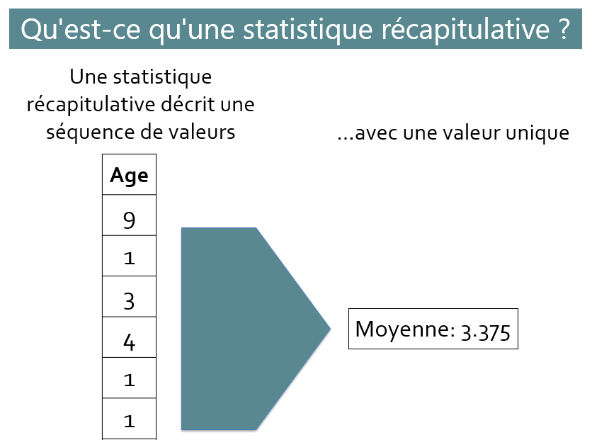
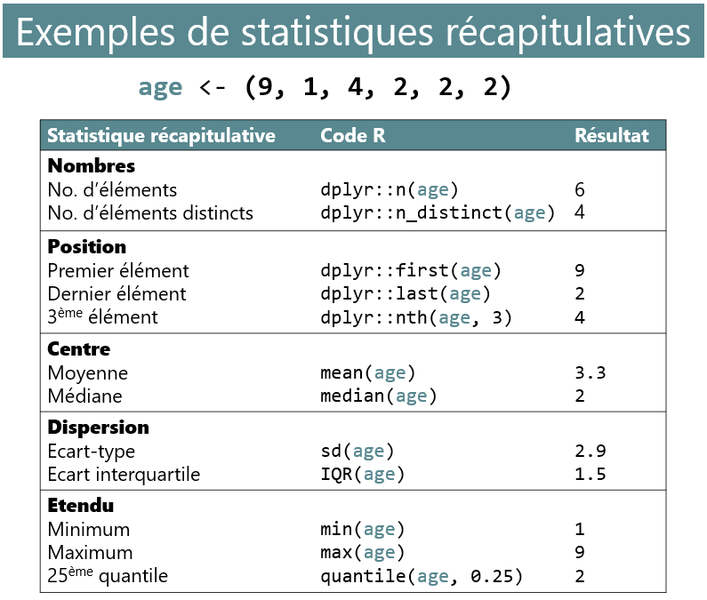
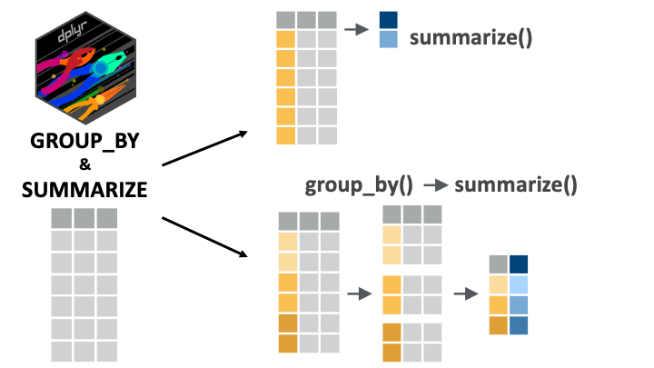

```{r, echo = F, message = F, warning = F}
library(tidyverse)
library(knitr)

## fonctions
source(here::here("global/functions/misc_functions.R"))

## rendu par défaut
knitr::opts_chunk$set(class.source = "tgc-code-block", render = normal_print)

```

# Introduction

Vous savez déjà comment conserver les jeux données qui vous intéressent, comment garder les variables pertinentes et comment les modifier ou en créer de nouvelles.

Maintenant, nous allons aller un peu plus loin dans la manipulation de vos données en comprenant comment extraire facilement des statistiques récapitulatives, grâce au verbe `summarize()`, comme le calcul de la moyenne d'une variable.

De plus, nous commencerons à explorer un verbe crucial, `group_by()`, capable de regrouper vos variables ensemble pour effectuer des opérations groupées sur votre jeu de données.

Allons-y !

------------------------------------------------------------------------

# Objectifs d'apprentissage

1.  Vous pouvez utiliser `dplyr::summarize()` pour extraire des statistiques récapitulatives des jeux de données.

2.  Vous pouvez utiliser `dplyr::group_by()` pour regrouper les données par une ou plusieurs variables avant d'effectuer des opérations sur elles.

3.  Vous comprenez pourquoi et comment dégrouper les jeux de données groupés.

4.  Vous pouvez utiliser `dplyr::n()` avec `group_by()`-`summarize()` pour compter les lignes par groupe.

5.  Vous pouvez utiliser `sum()` avec `group_by()`-`summarize()` pour compter les lignes qui répondent à une condition.

6.  Vous pouvez utiliser `dplyr::count()` comme une fonction pratique pour compter les lignes par groupe.

------------------------------------------------------------------------

# Le jeu de données COVID-19 de Yaoundé

Dans cette leçon, nous allons à nouveau utiliser les données de l'enquête sérologique COVID-19 menée à Yaoundé, au Cameroun.

```{r, message = F}
yaounde <- read_csv(here::here('data/fr_yaounde_data.csv'))

# Un sous-ensemble plus petit de variables
yao <- yaounde %>% select(
  age, cat_age_3, sexe, poids_kg, taille_cm,
  quartier, fumeur, enceinte, occupation,
  combinaisons_traitement, symptomes, jours_absence_travail, jours_alite,
  edu_haute, resultat_igg)

yao
```

Consultez la première leçon de ce chapitre pour plus d'informations sur ce jeu de données.

# Qu'est-ce qu'une statistique récapitulative ?

Une statistique récapitulative est une valeur unique (telle qu'une moyenne ou une médiane) qui décrit une séquence de valeurs (généralement une colonne dans votre jeu de données).

{width="363"}

Les statistiques récapitulatives peuvent décrire le centre, la dispersion ou l'étendu d'une variable, ou les nombres et les positions des valeurs au sein de cette variable. Certaines statistiques récapitulatives courantes sont présentées dans le diagramme ci-dessous :

{width="495"}

Le calcul des statistiques récapitulatives est une opération très courante dans la plupart des processus d'analyse de données, il sera donc important de devenir compétent pour les extraire de vos jeux de données. Et pour cette tâche, il n'y a pas de meilleur outil que la fonction `summarize()` de {dplyr} ! Alors voyons comment utiliser cette puissante fonction.

# Introduction à `dplyr::summarize()`

Pour commencer, il est préférable de voir d'abord comment obtenir des statistiques récapitulatives simples *sans* utiliser `summarize()`, puis nous verrons pourquoi vous devriez *réellement* utiliser `summarize()`.

Imaginez que l'on vous demande de trouver l'âge moyen des répondants dans le jeu de données `yao`. Comment pourriez-vous le faire en R de base ?

Tout d'abord, rappelons que la fonction du signe dollar, `$`, vous permet d'extraire une colonne d'un jeu de données vers un vecteur :

```{r eval = F}
yao$age # extraire la colonne `age` de `yao`
```

Pour obtenir la moyenne, vous passez simplement ce vecteur `yao$age` dans la fonction `mean()` :

```{r}
mean(yao$age)
```

Et c'est tout ! Vous avez maintenant une statistique récapitulative simple. Extrêmement facile, n'est-ce pas ?

Alors, pourquoi avons-nous besoin de `summarize()` pour obtenir des statistiques récapitulatives si le processus est déjà si simple sans lui ? Nous reviendrons sur la question du *pourquoi* bientôt. D'abord, voyons *comment* obtenir des statistiques récapitulatives avec `summarize()`.

En revenant à l'exemple précédent, la syntaxe correcte pour obtenir l'âge moyen avec `summarize()` serait :

```{r}
yao %>% 
  summarize(mean_age = mean(age))
```

L'anatomie de cette syntaxe est présentée ci-dessous. Vous devez simplement entrer le nom de la nouvelle colonne (par exemple `mean_age`), la fonction récapitulative (par exemple `mean()`), et la colonne à résumer (par exemple `age`).


------------------------------------------------------------------------

Vous pouvez également calculer plusieurs statistiques récapitulatives dans une seule commande `summarize()`. Par exemple, si vous vouliez à la fois l'âge moyen et l'âge médian, vous pourriez exécuter :

```{r}
yao %>% 
  summarize(mean_age = mean(age), 
            median_age = median(age))
```

Sympa !

------------------------------------------------------------------------

Maintenant, vous devriez vous demander pourquoi `summarize()` place les statistiques récapitulatives dans un jeu de données, avec chaque statistique dans une colonne différente.

Le principal avantage de cette structure de jeu de données est de faciliter la production de résumés *groupés* (et la création de tels résumés groupés sera le principal avantage de l'utilisation de `summarize()`).

Nous examinerons ces résumés groupés dans la section suivante. Pour l'instant, essayez de répondre aux questions de pratique ci-dessous.

::: practice
**Pratique 1**

Utilisez `summarize()` et les fonctions récapitulatives pertinentes pour obtenir la moyenne, la médiane et l'écart type des poids des répondants à partir de la variable `poids_kg` du jeu de données `yao`.

Votre sortie doit être un jeu de données avec trois colonnes nommées comme indiqué ci-dessous :

| mean_poids_kg | median_poids_kg | sd_poids_kg |
|---------------|-----------------|-------------|
|               |                 |             |

*Note : Les solutions de tous les exercices pratiques se trouvent à la fin de ce document.*

```{r, eval = FALSE}

  yao %>%
  ____________________________
```
:::

::: practice
**Pratique 2**

Utilisez `summarize()` et les fonctions récapitulatives pertinentes pour obtenir les tailles minimale et maximale des répondants à partir de la variable `taille_cm` du jeu de données `yao`.

Votre sortie doit être un jeu de données avec deux colonnes nommées comme indiqué ci-dessous :

| min_taille_cm | max_taille_cm |
|---------------|---------------|
|               |               |

```{r, eval = FALSE}

  yao %>% 
  ____________________________
```
:::

# Résumés groupés avec `dplyr::group_by()`

Comme son nom l'indique, `dplyr::group_by()` vous permet de regrouper un jeu de données par les valeurs d'une variable (par exemple le sexe masculin vs féminin). Vous pouvez ensuite effectuer des opérations qui sont divisées selon ces groupes.

Quel effet `group_by()` a-t-il sur un jeu de données ? Essayons de regrouper le jeu de données `yao` par sexe et observons l'effet :

```{r}
yao %>% 
  group_by(sexe)
```

Hmm. Apparemment, rien ne s'est passé. La seule chose que vous *pourriez* remarquer est une nouvelle section dans l'en-tête qui vous indique la variable groupée---sex---et le nombre de groupes---2 :

```         
    # A tibble: 971 × 10
  👉# Groups:   sexe [2]👈
```

Mis à part cet en-tête, cependant, le jeu de données semble inchangé.

Mais voyez ce qui se passe lorsque nous chaînons le `group_by()` avec l'appel `summarize()` que nous avons utilisé dans la section précédente :

```{r}
yao %>% 
  group_by(sexe) %>% 
  summarize(mean_age = mean(age))
```

Vous obtenez une statistique récapitulative différente pour chaque groupe ! Les statistiques pour les femmes sont dans une ligne et celles pour les hommes sont dans une autre. (À partir de ce jeu de données de sortie, vous pouvez dire par exemple que, l'âge moyen pour les répondantes est de 29.5, tandis que pour les répondants masculins, il est de 28.4)

Comme mentionné précédemment, ce type de résumé groupé est la raison principale pour laquelle la fonction `summarize()` est si utile !

------------------------------------------------------------------------

Voyons un autre exemple d'une opération simple `group_by()` + `summarize()`.

Supposons que l'on vous ait demandé d'obtenir les poids maximum et minimum pour les individus dans différents quartiers dans le jeu de données `yao`. D'abord, vous feriez un `group_by()` sur la variable `neighbourhood`, puis vous appeleriez les fonctions `max()` et `min()` à l'intérieur de `summarize()` :

```{r}
yao %>% 
  group_by(quartier) %>% 
  summarize(max_poids = max(poids_kg), 
            min_poids = min(poids_kg))
```

Super ! Avec seulement quelques lignes de code, vous êtes capable d'extraire beaucoup d'informations.

------------------------------------------------------------------------

Voyons encore un exemple pour faire bonne mesure. La variable `jours_absence_travail` nous indique le nombre de jours où les répondants ont été absents au travail en raison de symptômes similaires à ceux du COVID. Les individus qui n'ont signalé aucun symptôme semblable à celui du COVID ont un `NA` pour cette variable :

```{r}
yao %>% 
  select(jours_absence_travail)
```

Pour compter le nombre total de jours de travail manqués pour chaque groupe de sexe, vous pourriez essayer d'exécuter la fonction `sum()` sur la variable `jours_absence_travail` :

```{r}
yao %>% 
  group_by(sexe) %>% 
  summarise(total_jours_absence = sum(jours_absence_travail))
```

Hmmm. Cela vous donne des résultats `NA` car certaines lignes dans la colonne `jours_absence_travail` ont des `NA` en elles, et R ne peut pas trouver la somme de valeurs contenant un `NA`. Pour résoudre ce problème, l'argument `na.rm = TRUE` est nécessaire :

```{r}
yao %>% 
  group_by(sexe) %>% 
  summarise(total_jours_absence = sum(jours_absence_travail, na.rm = TRUE))
```

La sortie nous dit qu'au total, parmi toutes les femmes de l'échantillon, 256 jours de travail ont été manqués en raison de symptômes similaires à ceux du COVID, et parmi tous les hommes, 272 jours.

------------------------------------------------------------------------

J'espère que vous voyez maintenant pourquoi `summarize()` est si puissant. En combinaison avec `group_by()`, il vous permet d'obtenir des résumés de vos jeux de données groupés très informatifs avec très peu de lignes de code.

Produire de tels résumés est une partie très importante de la plupart des processus d'analyse de données, cette compétence sera donc probablement utile très prochainement !

::: vocab
**`summarize()` produit des "Tableaux croisés dynamiques"**

Les jeux de données récapitulatifs créés par `summarize()` sont souvent appelés des tableaux croisés dynamiques dans le contexte des logiciels de tableur comme Microsoft Excel.
:::

::: practice
**Pratique 3**

Utilisez `group_by()` et `summarize()` pour obtenir le poids moyen (kg) en fonction du statut de fumeur dans le jeu de données `yao`. Nommez la colonne de poids moyen `poids_moyen`

Le jeu de données de sortie doit ressembler à ceci :

| fumeur     | poids_moyen |
|------------|-------------|
| Ex-fumeur  |             |
| Non-fumeur |             |
| Fumeur     |             |
| NA         |             |

```{r eval = FALSE}
 
  yao %>% 
  ________________________
  ________________________
```
:::

::: practice
**Pratique 4**

Utilisez `group_by()`, `summarize()` et les fonctions de statistiques récapitulatives pertinentes pour obtenir les tailles minimum et maximum pour chaque sexe dans le jeu de données `yao`.

Votre sortie doit être un jeu de données avec trois colonnes nommées comme indiqué ci-dessous :

| sexe   | taille_min_cm | taille_max_cm |
|--------|---------------|---------------|
| Female |               |               |
| male   |               |               |

```{r eval = FALSE}

  yao %>% 
  ________________________
  ________________________
```
:::

::: practice
**Pratique 5**

Utilisez `group_by()`, `summarize()`, et la fonction `sum()` pour calculer le nombre total de jours alités (de la variable `jours_alite`) rapportés par les répondants de chaque sexe.

Votre sortie doit être un jeu de données avec deux colonnes nommées comme indiqué ci-dessous :

| sexe   | total_jours_alités |
|--------|--------------------|
| Female |                    |
| Male   |                    |

```{r eval = FALSE}

  yao %>% 
  ________________________
  ________________________
```
:::

# Regroupement par plusieurs variables (groupement imbriqué)

Il est possible de regrouper un jeu de données par plus d'une variable. Ceci est parfois appelé "groupement imbriqué".

Prenons un exemple. Supposons que vous voulez connaître l'âge moyen des hommes et des femmes *dans chaque quartier* (plutôt que l'âge moyen de *toutes* les femmes), vous pourriez mettre à la fois `sexe` et `quartier` dans l'instruction `group_by()` :

```{r}
yao %>% 
  group_by(sexe, quartier) %>% 
  summarize(age_moyen = mean(age))
```

À partir de ce jeu de données de sortie, vous pouvez voir que, par exemple, les femmes de Briqueterie ont un âge moyen de 31,6 ans, tandis que les hommes de Briqueterie ont un âge moyen de 33,7 ans.

L'ordre des colonnes listées dans `group_by()` est interchangeable. Donc, si vous exécutez `group_by(quartier, sexe)` au lieu de `group_by(sexe, quartier)`, vous obtiendrez le même résultat, bien qu'il soit ordonné différemment :

```{r}
yao %>% 
  group_by(quartier, sexe) %>% 
  summarize(age_moyen = mean(age))
```

Maintenant, l'ordre des colonnes est différent : `quartier` est la première colonne, et `sexe`est la deuxième. Et l'ordre des lignes est également différent : les lignes sont d'abord ordonnées par `quartier`, puis ordonnées par `sexe` à l'intérieur de chaque quartier.

Mais les statistiques de résumé sont les mêmes. Par exemple, vous pouvez à nouveau voir que les femmes de Briqueterie ont un âge moyen de 31,6 ans, tandis que les hommes de Briqueterie ont un âge moyen de 33,7 ans.

::: practice
**Pratique 6**

En utilisant le jeu de données `yao`, groupez vos données par sexe (`sexe`) et traitements (`combinaisons_de_traitements`) en utilisant `group_by`. Ensuite, en utilisant `summarize()` et la fonction de statistique récapitulative appropriée, calculez le poids moyen (`poids_kg`) pour chaque groupe.

Votre sortie doit être un jeu de données avec trois colonnes nommées comme indiqué ci-dessous :

| sexe | combinaisons_de_traitements | poids_moyen_kg |
|------|-----------------------------|----------------|
|      |                             |                |

```{r, eval = FALSE}

  yao %>%
  ____________________________
```

En utilisant le jeu de données `yao`, groupez vos données par catégorie d'âge (`categorie_d_age_3`), genre (`sexe`), et résultats d'IgG (`resultat_igg`) en utilisant `group_by`. Ensuite, en utilisant `summarize()` et la fonction de statistique récapitulative appropriée, calculez le nombre moyen de jours alités (`n_jours_alités`) pour chaque groupe.

Votre sortie doit être un jeu de données avec quatre colonnes nommées comme indiqué ci-dessous :

| categorie_d_age_3 | sexe | resultat_igg | moyenne_n_jours_alités |
|-------------------|------|--------------|------------------------|
|                   |      |              |                        |

```{r, eval = FALSE}

  yao %>%
  ____________________________
```
:::

# Dégroupement avec `dplyr::ungroup()` (pourquoi et comment)

Quand vous utilisez `group_by()` pour plus d'une variable avant d'utiliser `summarize()`, le jeu de données de sortie reste groupé. Ce regroupement persistant peut avoir des effets indésirables en aval, vous devrez donc parfois utiliser `dplyr::ungroup()` pour dégrouper les données avant de faire une analyse plus poussée.

Pour comprendre *pourquoi* vous devriez utiliser `ungroup()` sur les données, considérez d'abord l'exemple suivant, où nous ne regroupons qu'une seule variable avant de calculer une statistique récapitulative :

```{r}
yao %>% 
  group_by(sexe) %>% 
  summarize(mean_age = mean(age))
```

Les données sont produites comme un jeu de données normal ; il n'est pas groupé. Vous pouvez le voir parce qu'il n'y a pas d'information sur les groupes dans l'en-tête.

Mais considérez maintenant quand vous regroupez par deux variables avant de calculer une statistique récapitulative :

```{r}
yao %>% 
  group_by(sexe, quartier) %>% 
  summarize(mean_age = mean(age))
```

Maintenant, l'en-tête vous indique que les données sont toujours groupées par la première variable dans `group_by()`, ici sexe :

```         
      # A tibble: 18 × 3
    👉# Groups:   sexe [2]👈
```

Quelle est l'implication de ce regroupement persistant dans le jeu de données ? Cela signifie que le jeu de données peut montrer un comportement qui semble étrange lorsque vous essayez d'appliquer certaines fonctions {dplyr} dessus.

Par exemple, si vous essayez de `select()` une seule variable, peut-être la variable `mean_age`, vous devriez normalement pouvoir utiliser `select(mean_age)` :

```{r}
yao %>% 
  group_by(sexe, quartier) %>% 
  summarize(mean_age = mean(age)) %>% 
  select(mean_age) # ne fonctionne pas comme prévu 
```

Mais comme vous pouvez le voir, la variable groupée, `sex`, est *toujours* sélectionnée, même si nous n'avons demandé que `mean_age` dans l'instruction `select()`.

C'est l'un des nombreux exemples de comportements uniques des jeux de données groupés. D'autres verbes dplyr comme `filter()`, `mutate()` et `arrange()` agissent également de manière spéciale sur les données groupées. Nous aborderons cela en détail dans une leçon future.

------------------------------------------------------------------------

Vous savez donc maintenant *pourquoi* vous devriez dégrouper les données lorsque vous n'en avez plus besoin. Voyons maintenant *comment* dégrouper les données. C'est assez simple : il suffit d'ajouter la fonction `ungroup()` à votre chaîne de pipe. Par exemple :

```{r}
yao %>% 
  group_by(sexe, quartier) %>% 
  summarize(mean_age = mean(age)) %>% 
  ungroup()
```

Maintenant que le jeu de données est dégroupé, il se comportera à nouveau comme un jeu de données normal. Par exemple, vous pouvez `select()` n'importe quelle colonne(s) que vous voulez ; vous n'aurez pas certaines colonnes indésirables qui vous suivent :

```{r}
yao %>% 
  group_by(sexe, quartier) %>% 
  summarize(mean_age = mean(age)) %>% 
  ungroup() %>% 
  select(mean_age)
```

# Comptage des lignes

> Vous pouvez faire beaucoup de science des données en *comptant* simplement et occasionnellement en *divisant.* - Hadley Wickham, Scientifique Senior chez RStudio

Une tâche courante de statistique récapitulative des données est de compter combien d'observations (lignes) il y a pour chaque groupe. Vous pouvez y parvenir avec la fonction spéciale `n()` de {dplyr}, qui est spécifiquement conçue pour être utilisée dans `summarise()`.

Par exemple, si vous voulez compter combien d'individus se trouvent dans chaque groupe de quartier, vous exécuteriez :

```{r}
yao %>% 
  group_by(quartier) %>% 
  summarize(nombre = n())
```

Comme vous pouvez le voir, la fonction `n()` ne nécessite aucun argument. Elle "connait son travail" dans le jeu de données !

------------------------------------------------------------------------

Bien sûr, vous pouvez inclure d'autres statistiques récapitulatives dans le même appel `summarize()`. Par exemple, ci-dessous, nous calculons également l'âge moyen par quartier.

```{r}
yao %>% 
  group_by(quartier) %>% 
  summarize(nombre = n(), 
            mean_age = mean(age))
```

::: practice
**Pratique 7**

Groupez votre jeu de données `yao` par l'occupation des répondants (`occupation`) et utilisez `summarize()` pour créer des colonnes qui montrent :

-   combien d'individus il y a avec chaque occupation (pensez à la fonction `n()`)
-   le nombre moyen de jours de travail manqués (`jours_absence_travail`) par ceux ayant cette occupation

Votre sortie doit être un jeu de données avec trois colonnes nommées comme indiqué ci-dessous :

| occupation | count | mean_jours_absence_travail |
|------------|-------|----------------------------|
|            |       |                            |

```{r, eval = FALSE}

  yao %>%
  ____________________________
```
:::

## Compter les lignes qui répondent à une condition

Plutôt que de compter *toutes* les lignes comme ci-dessus, il est parfois plus utile de compter seulement les lignes qui répondent à des conditions spécifiques. Cela peut être fait facilement en plaçant les conditions requises dans la fonction `sum()`.

Par exemple, pour compter le nombre de personnes de moins de 18 ans dans chaque quartier, vous placez la condition `age < 18` à l'intérieur de `sum()` :

```{r}
yao %>% 
  group_by(quartier) %>% 
  summarize(nombre_inferieur_18 = sum(age < 18))
```

------------------------------------------------------------------------

De même, pour compter le nombre de personnes ayant un doctorat dans chaque quartier, vous placez la condition `edu_haute == "Doctorate"` à l'intérieur de `sum()` :

```{r}
yao %>% 
  group_by(quartier) %>% 
  summarize(nombre_avec_doctorates = sum(edu_haute == "Doctorate"))
```

::: challenge
**Sous le capot : compter avec des conditions**

Pourquoi pouvez-vous utiliser `sum()`, qui est censé ajouter des nombres, sur une condition comme `edu_haute == "Doctorate"` ?

Utiliser `sum()` sur une condition fonctionne parce que la condition évalue aux valeurs booléennes `TRUE` et `FALSE`. Et ces valeurs booléennes sont traitées comme des nombres (où `TRUE` est égal à 1 et `FALSE` est égal à 0), et les nombres peuvent, bien sûr, être sommés.

Le code ci-dessous démontre ce qui se passe sous le capot de manière étape par étape. Exécutez-le et voyez si vous pouvez suivre.

```{r}
demo_of_condition_sums <- yao %>% 
  select(edu_haute) %>% 
  mutate(avec_doctorate = edu_haute == "Doctorate") %>% 
  mutate(numerique_avec_doctorate = as.numeric(avec_doctorate))

demo_of_condition_sums
```

Les valeurs numériques peuvent ensuite être ajoutées pour produire un décompte des lignes remplissant la condition `edu_haute == "Doctorate"` :

```{r}
demo_of_condition_sums %>% 
  summarize(nombre_avec_doctorate = sum(numerique_avec_doctorate))
```
:::

------------------------------------------------------------------------

Pour une illustration finale du comptage avec des conditions, considérez la variable `combinaisons_traitement`, qui liste les traitements reçus par les personnes présentant des symptômes similaires à ceux du COVID. Les personnes qui n'ont reçu aucun traitement ont une valeur `NA` :

```{r}
yao %>% 
  select(combinaisons_traitement)
```

Si vous voulez compter le nombre de personnes qui n'ont reçu *aucun traitement*, vous additionneriez celles qui répondent à la condition `is.na(combinaisons_traitement)` :

```{r}
yao %>% 
  group_by(quartier) %>% 
  summarize(traitement_inconnu = sum(is.na(combinaisons_traitement)))
```

Ce sont les personnes ayant des valeurs `NA` pour la colonne `combinaisons_traitement`.

Pour compter les personnes qui *ont* reçu un traitement, vous pouvez simplement nier la fonction `is.na()` avec `!` :

```{r}
yao %>%  group_by(quartier) %>% 
  summarize(traitment_connu = sum(!is.na(combinaisons_traitement)))
```

VEUILLEZ IGNORER LA QUESTION PRATIQUE SUR LA VÉRIFICATION DES SYMPTÔMES CHEZ LES ADULTES. NOUS AVONS DÉCIDÉ DE LA SUPPRIMER.

## dplyr::count()

La fonction `dplyr::count()` regroupe plusieurs choses en une seule ligne de code conviviale pour vous aider à trouver les comptages d'observations par groupe.

Utilisons `dplyr::count()` sur notre variable `occupation` :

```{r}
yao %>%
  count(occupation)
```

Notez que c'est la même sortie que :

```{r}
yao %>%
  group_by(occupation) %>% 
  summarize(n = n())
```

Vous pouvez également appliquer `dplyr::count()` de manière imbriquée :

```{r}
yao %>%
  count(sexe, occupation)
```

::: practice
**Pratique 8**

Le verbe `count()` vous donne des informations clés sur votre ensemble de données de manière très rapide. Regardons nos résultats IgG stratifiés par catégorie d'âge et par sexe en une seule ligne de code.

En utilisant le jeu de données `yao`, comptez les différentes combinaisons de genre (`sex`), de catégories d'âge (`cat_age_3`) et de résultats IgG (`resultat_igg`).

Votre sortie doit être un jeu de données avec quatre colonnes nommées comme indiqué ci-dessous :

| sexe | cat_age_3 | resultat_igg | n   |
|------|-----------|--------------|-----|
|      |           |              |     |

```{r, eval = FALSE}

  yao %>%
  ____________________________
```

En utilisant le jeu de données `yao`, comptez les différentes combinaisons de catégories d'âge (`cat_age_3`) et de nombre de jours alités (`jours_alite`).

Votre sortie doit être un jeu de données avec trois colonnes nommées comme indiqué ci-dessous :

| cat_age_3 | jours_alite | n   |
|-----------|-------------|-----|
|           |             |     |

```{r, eval = FALSE}
Q_count_bedridden_age_categories <- 
  yao %>%
  ____________________________
```
:::

------------------------------------------------------------------------

L'inconvénient de `count()` est qu'il ne peut vous donner qu'une seule statistique récapitulative dans le jeu de données. Lorsque vous utilisez `summarize()` et `n()`, vous pouvez inclure plusieurs statistiques récapitulatives. Par exemple :

```{r}
yao %>% 
  group_by(sexe, quartier) %>% 
  summarize(count = n(), 
            median_age = median(age))
```

Mais `count()` ne peut produire que des comptages :

```{r}
yao %>% 
  group_by(sexe, quartier) %>% 
  count()
```

# Inclure les combinaisons manquantes dans les statistiques récapitulatives

Lorsque vous utilisez `group_by()` et `summarize()` sur plusieurs variables, vous obtenez une statistique récapitulative pour chaque combinaison unique des variables groupées. Par exemple, considérez le code et la sortie ci-dessous, qui comptent le nombre d'individus dans chaque groupe d'âge et de sexe :

```{r}
yao %>% 
  group_by(sexe, cat_age_3) %>% 
  summarise(nombre_d_individus = n()) 
```

Dans le jeu de données de sortie, il y a une ligne pour chaque combinaison de sexe et de groupe d'âge (Femme---Adulte, Femme---Enfant, etc.).

Mais que se passe-t-il si l'une de ces combinaisons n'est pas présente dans les données ?

Créons un exemple artificiel pour observer cela. Avec le code ci-dessous, nous supprimons artificiellement tous les enfants de sexe masculin du jeu de données `yao` :

```{r}
yao_no_male_children <- 
  yao %>% 
  filter(!(sexe == "Male" & cat_age_3 == "Child"))
```

Maintenant, si vous exécutez le même appel `group_by()` et `summarize()` sur `yao_no_male_children`, vous remarquerez la combinaison manquante :

```{r}
yao_no_male_children %>% 
  group_by(sexe, cat_age_3) %>% 
  summarise(number_of_individuals = n())
```

En effet, il n'y a pas de ligne pour les enfants de sexe masculin.

Mais parfois, il est utile d'inclure ces combinaisons manquantes dans le jeu de données de sortie, avec une valeur `NA` ou 0 pour la statistique récapitulative.

Pour ce faire, vous pouvez exécuter le code suivant à la place :

```{r}
yao_no_male_children %>% 
  # convertir les variables en facteurs
  mutate(sexe = as.factor(sexe), 
         cat_age_3 = as.factor(cat_age_3)) %>% 
  # Notez l'argument .drop = FALSE
  group_by(sexe, cat_age_3, .drop = FALSE) %>% 
  summarise(number_of_individuals = n())
```

Que fait ce code ?

-   D'abord, il convertit les variables de regroupement en facteurs avec `as.factor()` (dans un appel à `mutate()`)

-   Ensuite, il utilise l'argument `.drop = FALSE` dans la fonction `group_by()` pour éviter de supprimer les combinaisons manquantes.

Vous avez maintenant un compte clair de `0` pour le nombre d'enfants de sexe masculin !

------------------------------------------------------------------------

Voyons un autre exemple, cette fois sans modifier artificiellement nos données.

Le code ci-dessous calcule l'âge moyen par sexe et par niveau d'éducation :

```{r}
yao %>% 
  group_by(sexe, edu_haute) %>% 
  summarise(mean_age = mean(age))
```

Remarquez que dans le jeu de données de sortie, il y a 7 lignes pour les hommes mais seulement 6 lignes pour les femmes, car aucune femme n'a répondu "Autre" à la question sur le niveau d'éducation le plus élevé.

Si vous voulez néanmoins inclure la ligne "Femme---Autre" dans le jeu de données de sortie, vous exécuteriez :

```{r}
yao %>% 
  mutate(sexe = as.factor(sexe), 
         edu_haute = as.factor(edu_haute)) %>% 
  group_by(sexe, edu_haute, .drop = FALSE) %>% 
  summarise(mean_age = mean(age))
```

::: practice
**Pratique 9**

En utilisant le jeu de données `yao`, calculons l'âge médian en regroupant par quartier, catégorie d'âge et sexe.

Notez que nous voulons toutes les combinaisons possibles de ces trois variables (pas seulement celles présentes dans nos données).

Faites attention à deux impératifs de préparation des données !

-   convertissez vos variables de regroupement en facteurs au préalable en utilisant `mutate()`
-   calculez votre statistique, la médiane, tout en supprimant les valeurs `NA`.

Votre sortie doit être un jeu de données avec quatre colonnes nommées comme indiqué ci-dessous :

| quartier | cat_age_3 | sexe | median_age |
|----------|-----------|------|------------|
|          |           |      |            |

```{r, eval = FALSE}

  yao %>%
  ____________________________
```
:::

::: side-note
**Pourquoi inclure les combinaisons manquantes ?**

Ci-dessus, nous avons mentionné que l'inclusion de combinaisons manquantes est souvent utile dans le processus d'analyse de données. Voyons un cas d'utilisation : la conception des graphiques avec {ggplot}. Si vous n'avez pas encore appris {ggplot}, ce n'est pas grave, concentrez-vous simplement sur les sorties de graphique.

Pour réaliser un diagramme à barres composé avec les comptes d'âge-sexe de `yao_no_male_children`, vous pourriez exécuter :

```{r}
yao_no_male_children %>% 
  group_by(sexe, cat_age_3) %>% 
  summarise(nombre_d_individus = n()) %>% 
  ungroup() %>% 
  
  # transmettre la sortie à ggplot
  ggplot() + 
  geom_col(aes(x = sexe, y = nombre_d_individus, fill = cat_age_3), 
           position = "dodge")
```

Pas très élégant ! Idéalement, il devrait y avoir un espace vide indiquant 0 pour le nombre d'enfants de sexe masculin.

Si vous mettez en œuvre la procédure pour inclure les combinaisons manquantes, vous obtenez un diagramme à barres composé plus naturel, avec un espace vide pour les enfants de sexe masculin :

```{r}
yao_no_male_children %>% 
  mutate(sexe = as.factor(sexe), 
         cat_age_3 = as.factor(cat_age_3)) %>% 
  group_by(sexe, cat_age_3, .drop = FALSE) %>% 
  summarise(nombre_d_individus = n()) %>% 
  ungroup() %>% 
  
  # transmettre la sortie à ggplot
  ggplot() + 
  geom_col(aes(x = sexe, y = nombre_d_individus, fill = cat_age_3), 
           position = "dodge")
```

Beaucoup mieux !

Au fait, cette sortie peut être légèrement améliorée en définissant les niveaux de facteur pour l'âge dans leur ordre croissant correct : d'abord "Enfant", puis "Adulte" puis "Senior" :

```{r}
yao_no_male_children %>% 
  mutate(sexe = as.factor(sexe), 
         cat_age_3 = factor(cat_age_3, 
                                 levels = c("Enfant", 
                                            "Adulte", 
                                            "Senior"))) %>% 
  group_by(sexe, cat_age_3, .drop = FALSE) %>% 
  summarise(nombre_d_individus = n()) %>% 
  ungroup() %>% 
  
  # transmettre la sortie à ggplot
  ggplot() + 
  geom_col(aes(x = sexe, y = nombre_d_individus, fill = cat_age_3), 
           position = "dodge")
```
:::

# Conclusion

Vous avez maintenant vu comment obtenir des statistiques récapitulatives rapides à partir de vos données, soit pour l'exploration de données, soit pour une présentation ou une visualisation de données supplémentaires.

De plus, vous avez découvert l'une des merveilles de {dplyr}, la possibilité de grouper vos données à l'aide de `group_by()`.

`group_by()` combiné avec `summarize()` est l'une des manipulations de regroupement les plus courantes.

{width="400"}

Cependant, vous pouvez également combiner `group_by()` avec de nombreux autres verbes {dplyr} : c'est ce que nous couvrirons dans notre prochaine leçon. À bientôt !

# Contributeurs {.unlisted .unnumbered}

Les membres suivants de l'équipe ont contribué à cette leçon:

`r tgc_contributors_list(ids = c("lolovanco", "avallecam", "kendavidn"))`

Merci à [Alice Osmaston](https://thegraphcourses.org/members/alice){target="_blank"} et [Saifeldin Shehata](https://thegraphcourses.org/members/saif){target="_blank"} pour leurs commentaires et leur revue.

# Références {.unlisted .unnumbered}

Certaines informations de cette leçon ont été adaptées des sources suivantes :

-   Horst, A. (2022). *Dplyr-learnr*. <https://github.com/allisonhorst/dplyr-learnr> (Travail original publié en 2020)

-   *Group by one or more variables*. (s.d.). Consulté le 21 février 2022, sur <https://dplyr.tidyverse.org/reference/group_by.html>

-   *Summarise each group to fewer rows*. (s.d.). Consulté le 21 février 2022, sur <https://dplyr.tidyverse.org/reference/summarize.html>

-   The Carpentries. (s.d.). *Grouped operations using \`dplyr\`*. Grouped operations using \`dplyr\` -- Introduction to R/tidyverse for Exploratory Data Analysis. Consulté le 28 juillet 2022, sur <https://tavareshugo.github.io/r-intro-tidyverse-gapminder/06-grouped_operations_dplyr/index.html>

L'œuvre d'art a été adaptée de :

-   Horst, A. (2022). *R & stats illustrations by Allison Horst*. <https://github.com/allisonhorst/stats-illustrations> (Travail original publié en 2018)

```{r, include = F}
```

# Solutions des exercices pratiques

*Solution exercice pratique 1*

```{r}
yao %>%
  summarize(mean_poids_kg = mean(poids_kg),
            median_poids_kg = median(poids_kg),
            sd_poids_kg = sd(poids_kg))
```

*Solution exercice pratique 2*

```{r}
yao %>%
  summarize(min_taille_cm = min(taille_cm),
            max_taille_cm = max(taille_cm))
```

*Solution exercice pratique 3*

```{r}

yao %>% 
  group_by(fumeur) %>% 
  summarise(poids_mean = mean(poids_kg))
```

*Solution exercice pratique 4*

```{r}

yao %>% 
  group_by(sexe) %>%
  summarise(min_taille_cm = min(taille_cm),
            max_taille_cm = max(taille_cm))
```

*Solution exercice pratique 5*

```{r}
yao %>% 
  group_by(sexe) %>% 
  summarise(total_jours_alite = sum(jours_alite, na.rm = T))
```

*Solution exercice pratique 6_1*

```{r}
yao %>% 
  group_by(sexe, combinaisons_traitement) %>%
  summarise(mean_poids_kg = mean(poids_kg, na.rm = T))
```

*Solution exercice pratique 6_2*

```{r}
yao %>% 
  group_by(cat_age_3, sexe, resultat_igg) %>% 
  summarise(mean_jours_alite = mean(jours_alite, na.rm = T))
```

*Solution exercice pratique 7*

```{r}
yao %>% 
  group_by(occupation) %>%
  summarise(count = n(),
            mean_jours_absence_travail = mean(jours_absence_travail, na.rm=TRUE))
```

*Solution exercice pratique 8_1*

```{r}
yao %>% 
  count(sexe, cat_age_3, resultat_igg)

```

*Solution exercice pratique 8_2*

```{r}
yao %>% 
  count(cat_age_3, jours_alite)

```

*Solution exercice pratique 9*

```{r}
yao %>% 
  mutate(quartier = as.factor(quartier),
         cat_age_3 = as.factor(cat_age_3),
         sexe = as.factor(sexe)) %>%
  group_by(quartier, cat_age_3, sexe, .drop=FALSE) %>%
  summarize(median_age = median(age, na.rm=TRUE))
```
