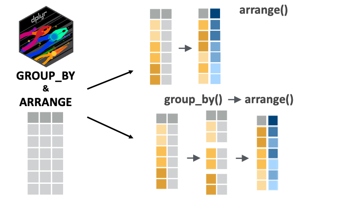
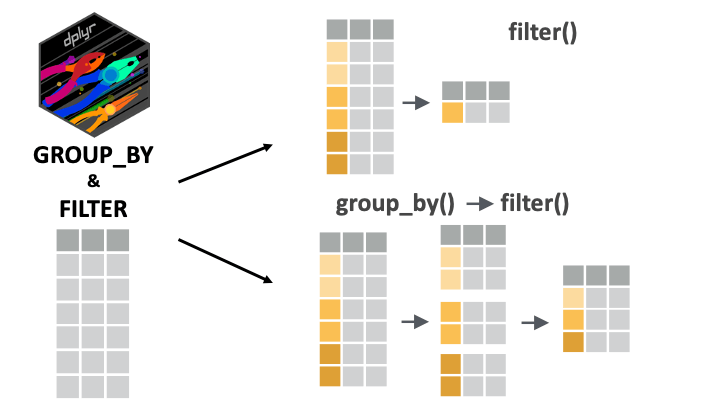

```{r, eval = F, include = F}
Bonjour étudiant du GRAPH Courses!

Ceci est un document CODE ALONG où vous pouvez taper du code en suivant la vidéo de la leçon.

Nous vous encourageons à faire cela ; taper du code avec le professeur est le meilleur moyen d'apprendre la bonne syntaxe.
```

```{r, echo = F, message = F, warning = F}
if(!require(pacman)) install.packages("pacman")
pacman::p_load(knitr, 
               here, 
               janitor,
               tidyverse)

# fonctions
source(here::here("global/functions/misc_functions.R"))

# rendu par défaut
registerS3method("reactable_5_rows", "data.frame", reactable_5_rows)
knitr::opts_chunk$set(class.source = "tgc-code-block", render = reactable_5_rows)
```

## Objectifs d'apprentissage

‣ Vous pouvez utiliser `group_by()` avec `arrange()`, `filter()` et `mutate()` pour effectuer des opérations groupées sur un jeu de données.

## Packages

Cette leçon exigera la suite de packages {tidyverse} et le package {here} :

```{r}
if(!require(pacman)) install.packages("pacman")
pacman::p_load(tidyverse, here)
```

## Jeux de données

L'enquête sérologique COVID-19 menée à Yaoundé, au Cameroun !

```{r, message = F}
yao <- 
  read_csv(here::here('data/fr_yaounde_data.csv'))  %>% 
  select(sexe, age, cat_age, poids_kg, occupation, resultat_igg, resultat_igm)

yao

yao_sexe_poids <- 
  yao %>% 
  select(____________________)

yao_sexe_poids
```

------------------------------------------------------------------------

Pour les questions pratiques : l'ensemble de données sur la sarcopénie.

```{r, message = F}
sarcopenia <- read_csv(here::here('data/fr_sarcopenia_elderly.csv'))

sarcopenia
```

## Organisation par groupe

‣ Rappel : `arrange()` ordonne les lignes d'un cadre de données en fonction des valeurs des colonnes sélectionnées.

‣ Sensible aux regroupements SI `.by_group` est fixé à `TRUE`

```{r}
yao_sexe_poids
```

Nous pouvons organiser ce jeu de données **par poids** de cette façon :

```{r}
yao_sexe_poids %>%
  ____________________
```

Comme prévu, les poids **les plus légers** ont été placés en **haut de la trame de données**.

Si nous regroupons d'abord les données, nous pourrions nous attendre à un résultat différent :

```{r}
yao_sexe_poids %>% 
  ____________________
  ____________________
```

Mais comme vous le voyez, **l'arrangement est toujours le même**.

Ce n'est que lorsque nous mettons l'argument `.by_group` à `TRUE` que nous obtenons quelque chose de différent :

```{r}
yao_sexe_poids %>%
  ____________________
  ____________________
```

Les données sont *d'abord* triées par sexe (toutes les femmes d'abord), puis par poids.

### `arrange()` peut regrouper automatiquement

‣ Nous n'avons pas besoin de `group_by()` pour organiser par groupe !

‣ Nous pouvons simplement placer plusieurs variables dans la fonction `arrange()`.

```{r}
yao_sexe_poids %>%
  ____________________________
```

Le code `arrange(sexe, poids_kg)` dit à R d'organiser les lignes *d'abord* par sexe, puis par poids.

Il est équivalent à l'instruction plus complexe `group_by()`, `arrange()` utilisée auparavant :

```{r eval = F}
yao_sexe_poids %>%
  group_by(sexe) %>%
  arrange(poids_kg, .by_group = TRUE)
```

Évidemment, la syntaxe sans `group_by()` est plus simple, alors restons-en là !

::: Reminder
**Rappel**

`desc()` **pour l'ordre décroissant**

Rappelez-vous que pour classer *en ordre décroissant*, nous pouvons mettre la variable cible dans `desc()`. Donc, par exemple, pour trier par sexe et poids, mais avec les personnes les plus lourdes en haut, nous pouvons exécuter :

```{r}
yao_sexe_poids %>%
  ___________________________
```
:::

::: practice
Avec une commande `arrange()`, triez les données `sarcopenia` d'abord par sexe, puis par force de préhension. (Si c'est fait correctement, la première ligne devrait être celle d'une femme avec une force de préhension de 1,3 kg). Pour rendre l'organisation claire, vous devriez d'abord `select()` les variables de sexe et de force de préhension.

*Les solutions pour tous les exercices pratiques se trouvent à la fin de ce document.*

```{r eval = FALSE}
# Complétez le code avec votre réponse :
Q_force_de_prehension_arrangee <- 
  sarcopenia %>%
  select(______________________________) %>%
  arrange(______________________________)
```
:::

::: practice
Le jeu de données `sarcopenia` contient une colonne `groupe_d_age`, qui stocke les groupes d'âge en chaîne de caractères (les groupes d'âge sont "Sixties", "Seventies" et "Eighties"). Convertissez cette variable en un facteur avec les niveaux dans le bon ordre (d'abord "Sixties", puis "Seventies" et ainsi de suite). (Astuce : Revenez sur la leçon `case_when()` si vous ne voyez pas comment réattribuer un niveau à un facteur).

Ensuite, avec une commande imbriquée à `arrange()`, classez les données d'abord par la variable facteur `groupe_d_age` nouvellement créée (les individus les plus jeunes en premier) puis par `taille_metres`, avec les individus les plus petits en premier.

```{r eval = FALSE}
# Complétez le code avec votre réponse :
Q_groupe_d_age_taille <- 
  sarcopenia %>% 
  "ÉCRIVEZ_VOTRE_RÉPONSE_ICI"
```
:::

## Filtrage par groupe

‣ Rappel : `filter()` conserve ou supprime des lignes en fonction d'une condition.

‣ Si `filter()` est appliqué à des données groupées, l'opération de filtrage est effectuée séparément pour chaque groupe.

Si nous voulons filtrer les données pour la personne la plus lourde, nous pouvons exécuter :

```{r}
yao_sexe_poids %>% 
  __________________________
```

‣ Et si nous voulons l'homme le plus lourd *et* la femme la plus lourde ?

‣ Nous voulons le poids maximal par groupe de sexe !

```{r}
yao_sexe_poids %>% 
  __________________________
  __________________________
```

Le code ci-dessus peut être traduit par "Pour chaque groupe de sexe, conserve la ligne avec la valeur maximale `poids_kg`".

### Filtrage avec des groupements imbriqués

Par exemple, si nous voulons voir l'homme le plus lourd et la femme la plus lourde *par groupe d'âge* :

```{r render = reactable_10_rows}
yao %>% 
  group_by(__________________________) %>% 
  filter(poids_kg == max(poids_kg))
```

(Pourquoi avons-nous 10 lignes dans le résultat ? Eh bien, 2 groupes de sexe x 5 groupes d'âge = 10 groupes uniques).

Le résultat est un peu dispersé : utilisons `arrange()` pour réorganiser par sexe et par groupe d'âge.

```{r render = reactable_10_rows}
yao %>% 
  group_by(sexe, cat_age) %>% 
  filter(poids_kg == max(poids_kg)) %>% 
  arrange(_________________________)
```

‣ Mais nous constatons un arrangement étrange des groupes d'âge !

‣ Les personnes âgées de 5 à 14 ans devraient être placées *en premier* dans l'arrangement.

‣ Bien sûr, nous avons appris à résoudre ce problème :

```{r render = reactable_10_rows}
yao %>%
  mutate(cat_age = __________________________________________) %>%
  group_by(sexe, cat_age) %>%
  filter(poids_kg == max(poids_kg)) %>%
  arrange(sexe, cat_age)
```

Maintenant, nous avons une sortie bien organisée !

::: practice
Groupez le jeu de données `sarcopenia` par groupe d'âge et sexe, puis filtrez pour obtenir l'index de masse musculaire le plus élevé dans chaque groupe (imbriqué).

```{r eval = FALSE}
# Complétez le code avec votre réponse :
Q_index_de_muscle_squelettique_max <- 
  sarcopenia %>% 
  "ÉCRIVEZ_VOTRE_RÉPONSE_ICI"
```
:::

## Modification par groupe

‣ Rappel : `mutate()` est utilisé pour modifier des colonnes ou en créer de nouvelles.

‣ Avec des données groupées, `mutate()` opère sur chaque groupe indépendamment.

Considérons d'abord un appel normal à `mutate()`. Imaginons que vous souhaitiez ajouter une colonne qui classe les personnes interrogées en fonction de leur poids :

```{r}
yao_sexe_poids %>%
  _______________________________
```

La sortie montre que la première ligne est le 901ème individu le plus léger.

Mais il serait plus intuitif de classer dans l'ordre décroissant avec la personne la plus lourde en premier :

```{r}
yao_sexe_poids %>%
  mutate(_______________________________)
```

La sortie montre que la personne de la première ligne est la 71ème personne la plus lourde.

------------------------------------------------------------------------

‣ Essayons maintenant d'écrire un appel groupé à `mutate()`.

‣ Nous voulons ajouter cette colonne de rang de poids *par groupe de sexe* dans le jeu de données.

‣ Nous voulons connaître le rang de poids de chaque personne dans sa catégorie de sexe.

```{r}
yao_sexe_poids %>%
  _______________________
  ______________________________________________
```

Nous voyons maintenant que la personne de la première ligne est la 53ème femme la plus lourde (le 0,5 indique que ce rang est à égalité avec quelqu'un d'autre dans les données).

Nous pouvons également organiser pour rendre les choses plus claires :

```{r}
yao_sexe_poids %>%
  group_by(sexe) %>%
  mutate(poids_ordre = rank(desc(poids_kg))) %>% 
  _______________________
```

### Modification avec des groupes imbriqués

```{r}
yao %>%
  # maintenant, groupons par sexe et par catégorie d'âge !
  group_by(_______________________) %>%
  mutate(poids_ordre = rank(desc(poids_kg)))
```

La sortie montre que la personne de la première ligne est la 20ème femme la plus lourde *dans le groupe d'âge de 45 à 64 ans*.

::: practice
Avec les données `sarcopenia`, groupez par `groupe_d_age`, puis dans une nouvelle variable appelée `classement_force_de_prehension`, calculez le rang de la force de préhension de chaque individu par groupe d'âge. (Pour calculer le rang, utilisez `mutate()` et la fonction `rank()` avec sa méthode par défaut pour les égalités.)

```{r eval = FALSE}
# Complétez le code avec votre réponse :
Q_classement_force_de_prehension <- 
  sarcopenia %>% 
  "ÉCRIVEZ_VOTRE_RÉPONSE_ICI"
```
:::

::: watch-out
**Attention**

**N'oubliez pas de dégrouper les données avant de procéder à une analyse plus approfondie**

‣ Il est SUPER important de dégrouper vos données avant de procéder à une analyse plus poussée.

Reprenons l'exemple précédent :

```{r}
yao_modifie <- 
  yao %>%
  group_by(sexe, cat_age) %>%
  mutate(poids_ordre = rank(desc(poids_kg)))
```

Et maintenant, vous voulez **filtrer** pour obtenir **la personne la plus âgée** dans les données :

```{r}
yao_modifie %>%
  _____________________________
```

‣ Vous pourriez être confus par le résultat ! Pourquoi y a-t-il 55 lignes de "personnes les plus âgées" ?

‣ Parce qu'il y a une personne la plus âgée par sous-groupe défini par les combinaisons de catégories de sexe et d'âge !

‣ Parce que nous avons oublié de dégrouper !

Faisons-le correctement maintenant :

```{r}

yao_modifie <- 
  yao %>%
  group_by(sexe, cat_age) %>%
  mutate(poids_ordre = rank(desc(poids_kg)))%>%
  _______________________
```

Maintenant, nous pouvons obtenir correctement la/les personne(s) la/les plus âgée(s) dans le jeu de données :

```{r}
yao_modifie %>%
  _______________________
```
:::

## Conclusion

`group_by()` est un outil merveilleux pour arranger, modifier, filtrer en fonction des groupes au sein d'une ou plusieurs variables.

{alt="Fig: arrange() et son utilisation combinée avec group_by()." width="400"} {alt="Fig: mutate() et son utilisation combinée avec group_by()." width="400"}

{width="400"}

Il existe de nombreuses façons de combiner ces verbes pour manipuler vos données. Nous vous invitons à prendre un peu de temps pour essayer ces verbes dans différentes combinaisons !

À la prochaine !

## Références

Certains matériaux de cette leçon ont été adaptés des sources suivantes :

‣ Horst, A. (2022). *Dplyr-learnr*. <https://github.com/allisonhorst/dplyr-learnr> (Travail original publié en 2020)

‣ *Grouper par une ou plusieurs variables*. (n.d.). Consulté le 21 Février 2022, sur <https://dplyr.tidyverse.org/reference/group_by.html>

‣ *Créer, modifier et supprimer des colonnes --- Mutate*. (n.d.). Consulté le 21 Février 2022, sur <https://dplyr.tidyverse.org/reference/mutate.html>

‣ *Sélectionner des lignes en utilisant les valeurs des colonnes --- Filter*. (n.d.). Consulté le 21 Février 2022, sur <https://dplyr.tidyverse.org/reference/filter.html>

‣ *Arranger les lignes par valeurs de colonnes --- Arrange*. (n.d.). Consulté le 21 Février 2022, sur <https://dplyr.tidyverse.org/reference/arrange.html>

L'œuvre d'art a été adaptée de :

‣ Horst, A. (2022). *Illustrations R & stats par Allison Horst*. <https://github.com/allisonhorst/stats-illustrations> (Travail original publié en 2018)

## Solutions des exercices pratiques

### Solution 1: Organisation par sexe et force de préhension

```{r eval = FALSE}
Q_force_de_prehension_arrangee <- 
  sarcopenia %>%
  select(sexe_homme_1_femme_0, force_de_prehension_kg) %>%
  arrange(sexe_homme_1_femme_0, force_de_prehension_kg)
```

### Solution 2: Conversion en facteur et organisation par groupe d'âge et taille

```{r eval = FALSE}
Q_groupe_d_age_taille <- 
  sarcopenia %>%
  mutate(groupe_d_age = factor(groupe_d_age, levels = c("Sixties",
                                                        "Seventies",
                                                        "Eighties"))) %>%
  arrange(groupe_d_age, taille_metres)
```

### Solution 3: Index de masse musculaire maximum par groupe

```{r eval = FALSE}
Q_index_de_muscle_squelettique_max <- 
  sarcopenia %>%
  group_by(groupe_d_age, sexe_homme_1_femme_0) %>%
  filter(index_de_muscle_squelettique == max(index_de_muscle_squelettique))
```

### Solution 4: Classement de la force de préhension par groupe d'âge

```{r eval = FALSE}
Q_classement_force_de_prehension <- 
  sarcopenia %>%
  group_by(groupe_d_age) %>%
  mutate(classement_force_de_prehension = rank(force_de_prehension_kg))
```
