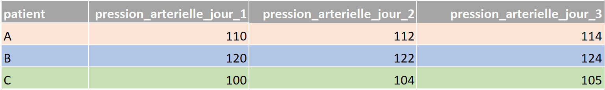
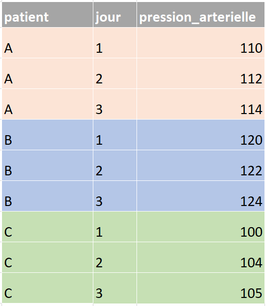
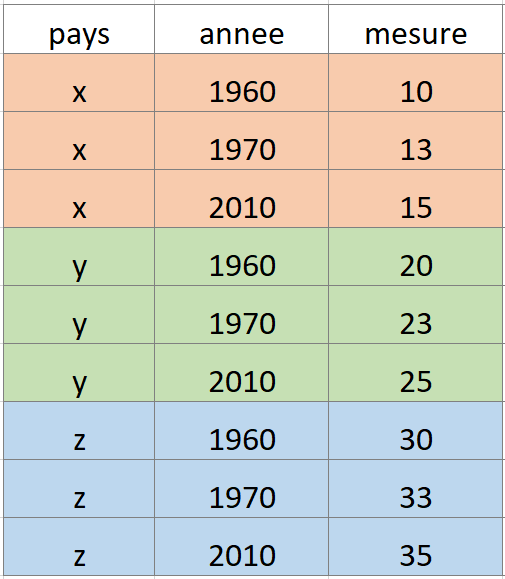
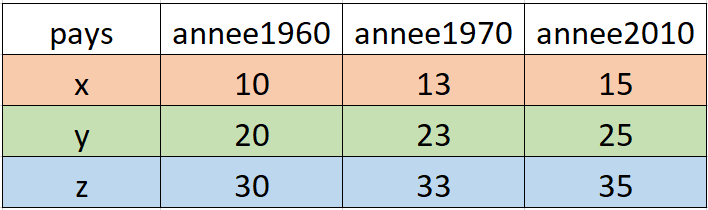
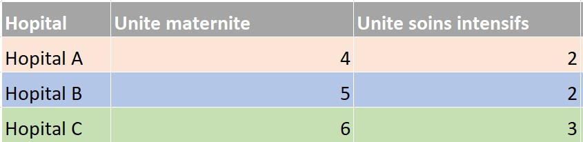
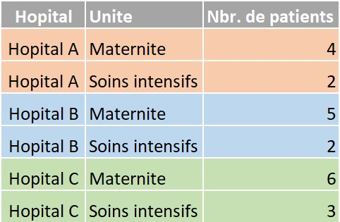

```{r, echo = F, message = F, warning = F}
# Charger les packages
if(!require(pacman)) install.packages("pacman")
pacman::p_load(rlang, tidyverse, knitr, here)

## fonctions
source(here::here("global/functions/misc_functions.R"))

## rendu par défaut
registerS3method("reactable_5_rows", "data.frame", reactable_5_rows)
knitr::opts_chunk$set(class.source = "tgc-code-block", render = reactable_5_rows)

```

# Introduction

Le pivotement ou la mise en forme est une technique de manipulation de données qui consiste à réorienter les lignes et les colonnes d'un ensemble de données. Cela est parfois nécessaire pour faciliter l'analyse des données ou pour rendre les données plus compréhensibles.

Dans cette leçon, nous verrons comment pivoter efficacement les données en utilisant `pivot_longer()` et `pivot_wider()` du package `tidyr`.

# Objectifs d'apprentissage

-   Vous comprendrez ce que sont le format de données large et le format de données long.

-   Vous saurez comment pivoter des données longues en données larges en utilisant `pivot_long()`

-   Vous saurez comment pivoter des données larges en données longues en utilisant `pivot_wider()`

-   Vous comprendrez pourquoi le format de données long est plus facile pour le tracé et la manipulation dans R.

# Packages

```{r warning = F, message = F}
# Charger les packages
if(!require(pacman)) install.packages("pacman")
pacman::p_load(tidyverse, outbreaks, janitor, rio, here, knitr)
```

# Que signifient large et long ?

Les termes large et long sont mieux compris dans le contexte des jeux de données exemples. Examinons-en quelques-uns maintenant.

Imaginez que vous avez trois patients chez qui vous collectez des données de pression artérielle sur trois jours.

Vous pouvez enregistrer les données dans un format large comme celui-ci :

{width="500"}

Ou vous pourriez enregistrer les données dans un format long comme suit :

{width="200"}

Prenez une minute pour étudier les deux ensembles de données pour vous assurer que vous comprenez la relation entre eux.

Dans l'ensemble de données large, chaque unité d'observation (chaque patient) n'occupe qu'une seule ligne. Et chaque mesure (pression artérielle jour 1, pression artérielle jour 2...) se trouve dans une colonne séparée.

Dans l'ensemble de données long, en revanche, chaque unité d'observation (chaque patient) occupe plusieurs lignes, avec une ligne pour chaque mesure.

------------------------------------------------------------------------

Voici un autre exemple avec des données fictives, dans lequel les unités d'observation sont des pays :

{width="200"}

{width="300"}

------------------------------------------------------------------------

Les exemples ci-dessus sont tous deux des ensembles de données de séries temporelles, car les mesures sont répétées dans le temps (jour 1, jour 2 et ainsi de suite). Mais les concepts de long et de large sont pertinents pour d'autres types de données également, pas seulement les données de séries temporelles.

Considérez l'exemple ci-dessous, qui montre le nombre de patients dans différentes unités de trois hôpitaux :





Dans l'ensemble de données au format large, encore une fois, chaque unité d'observation (chaque hôpital) n'occupe qu'uneseule ligne, avec les mesures répétées pour cette unité (nombre de patients dans différentes salles) réparties sur deux colonnes.

Dans l'ensemble de données au format long, chaque unité d'observation est répartie sur plusieurs lignes.

::: vocab
Les "unités d'observation", parfois appelées "unités statistiques" d'un ensemble de données, sont les entités ou les éléments principaux décrits par les colonnes de cet ensemble de données.

Dans le premier exemple, les unités d'observation/statistiques étaient les patients ; dans le deuxième exemple, les pays, et dans le troisième exemple, les hôpitaux.
:::

::: practice
**Pratique 1**

Considérez l'ensemble de données fictif créé ci-dessous :

```{r}
temperatures <- 
  data.frame(
    pays = c("Suède", "Danemark", "Norvège"),
    tempmoy.1994 = 1:3,
    tempmoy.1995 = 3:5,
    tempmoy.1996 = 5:7)
temperatures
```

Ces données sont-elles dans un format large ou long ?

```{r, eval = FALSE}
# Entrez la chaîne "large" ou la chaîne "long"
 "_____"

```
:::

# Quand devez-vous utiliser des données en format large ou long ?

La vérité est que cela dépend vraiment de ce que vous voulez faire ! Le format large est parfait pour *afficher les données* car il est facile de comparer visuellement les valeurs de cette manière. Le format long est idéal pour certaines tâches d'analyse de données, comme le regroupement et la conception des graphiques.

Il sera donc essentiel pour vous de savoir comment passer facilement de l'un à l'autre format. Passer du format large au format long, ou vice versa, est appelé **pivotement**.

# Pivoter de large à long

Pour pratiquer le pivotement d'un format large à un format long, nous allons considérer les données de [Gapminder](https://www.gapminder.org) sur le **nombre de décès d'enfants en bas âge** dans certains pays au fil des ans.

::: side-note
[Gapminder](https://www.gapminder.org) est une bonne source de jeux de données riches et pertinents pour la santé. Nous vous encourageons à explorer leurs collections.
:::

Ci-dessous, nous lisons et visualisons ces données sur les décès d'enfants en bas âge :

```{r message = F}
deces_enfants_large <- read_csv(here("data/fr_gapminder_infant_deaths.csv"))
deces_enfants_large
```

Nous observons que chaque unité d'observation (chaque pays) occupe une seule ligne, les mesures répétées étant réparties sur plusieurs colonnes. Par conséquent, cet ensemble de données est dans un format large.

Pour convertir en format long, nous pouvons utiliser une fonction pratique `pivot_longer`. Dans `pivot_longer`, nous définissons, à l'aide de l'argument `cols`, les colonnes que nous voulons pivoter :

```{r}
deces_enfants_large %>% 
  pivot_longer(cols = x2010:x2015)
```

Très facile !

Nous pouvons observer que l'ensemble de données au format long résultant a chaque pays occupant 5 lignes (une par année entre 2010 et 2015). Les années sont indiquées dans la variable `names`, et toutes les valeurs de décompte de décès occupent une seule variable, `values`.

Une façon utile de penser à cette transformation est que les valeurs des décès d'enfants étaient auparavant en format matriciel (2 dimensions ; 2D), mais qu'elles sont maintenant en format vectoriel (1 dimension ; 1D).

Cet ensemble de données long sera beaucoup plus pratique pour de nombreuses procédures d'analyse de données.

En tant que bon analyste de données, vous pouvez trouver que les noms par défaut des variables, `names` et `values`, ne sont pas satisfaisants ; ils ne décrivent pas adéquatement ce que contiennent les variables. Pas de souci ; vous pouvez donner des noms de colonnes personnalisés, en utilisant les arguments `names_to` et `values_to` :

```{r}
deces_enfants_large %>% 
  pivot_longer(cols= x2010:x2015,
               names_to = "année", 
               values_to = "nombre_deces")
```

::: side-note
Remarquez que le format long est plus informatif que le format large original. Pourquoi ? À cause du nom de colonne informatif "nombre_deces". Dans le format large, à moins que le CSV ne soit nommé quelque chose comme `nombre_deces_enfants`, ou que quelqu'un vous dise "ce sont les comptes de décès d'enfants par pays et par année", vous n'avez aucune idée de ce que représentent les chiffres dans les cellules.
:::

Vous voudrez peut-être aussi supprimer le `x` devant chaque année. Cela peut être réalisé avec la fonction pratique `parse_number()` du package {readr} (partie de tidyverse), qui extrait les chiffres des chaînes :

```{r}
deces_enfants_large %>% 
  pivot_longer(cols = x2010:x2015,
               names_to = "année", 
               values_to = "nombre_deces") %>% 
  mutate(année = parse_number(année))
```

Super ! Nous avons maintenant un ensemble de données au format long et propres.

Pour une utilisation ultérieure, enregistrons maintenant ces données :

```{r}
deces_enfants_long <- 
  deces_enfants_large %>% 
  pivot_longer(cols = x2010:x2015,
               names_to = "annee", 
               values_to = "nombre_deces")
```

::: practice
**Pratique 2**

Pour cette question de pratique, vous utiliserez le jeu de données `euro_births_wide` provenant d'[Eurostat](https://ec.europa.eu/eurostat/databrowser/view/tps00204/default/table). Il montre le nombre annuel de naissances dans 50 pays européens :

```{r message = F}
naissances_euro_large <- 
  read_csv(here("data/fr_euro_births_wide.csv"))
head(naissances_euro_large)
```

Les données sont dans un format large. Convertissez-le en un jeu de données au format long qui a les noms de colonnes suivants : "pays", "annee" et "nombre_de_naissances"

```{r, eval = FALSE}

  naissances_euro_large %>% # complétez le code avec votre réponse
```
:::

# Pivoter de long à large

Maintenant que vous savez comment pivoter de large à long avec `pivot_longer()`. Comment faire l'inverse, de long à large ? Pour cela, vous pouvez utiliser la fonction bien nommée `pivot_wider()`.

Mais avant de considérer comment utiliser cette fonction pour manipuler des données longues, considérons d'abord *où* vous êtes susceptible de rencontrer des données longues.

Alors que les données larges proviennent généralement de sources externes (comme nous l'avons vu ci-dessus), les données longues, en revanche, sont susceptibles d'être créées par *vous* lors de la manipulation des données, notamment lors des manipulations `group_by()`-`summarize()`.

Voyons un exemple maintenant.

Nous utiliserons un jeu de données de dossiers de patients provenant d'une épidémie d'Ebola en Sierra Leone en 2014. Ci-dessous, nous extrayons ces données du package {outbreaks} et effectuons quelques manipulations de simplification.

```{r}
ebola <- 
  outbreaks::ebola_sierraleone_2014 %>% 
  as_tibble() %>% 
  mutate(annee = lubridate::year(date_of_onset)) %>% # extraire l'année de la date
  select(id_patient = id, district, annee_de_debut = annee) # sélectionner et renommer

ebola
```

Chaque ligne correspond à un patient, et nous avons le numéro d'identifiant de chaque patient, leur district et l'année où ils ont contracté Ebola.

Maintenant, considérez la résumé groupé suivant du jeu de données `ebola`, qui compte le nombre de patients enregistrés dans chaque district chaque année :

```{r}
cas_par_district_par_annee <- 
  ebola %>% 
  group_by(district) %>% 
  count(annee_de_debut) %>% 
  ungroup()

cas_par_district_par_annee
```

La sortie de cette opération groupée est un jeu de données typiquement "long" ! Chaque unité d'observation (chaque district) occupe plusieurs lignes (deux lignes par district, pour être exact), avec une ligne pour chaque mesure (chaque année).

Ainsi, comme vous le voyez maintenant, les données longues peuvent souvent arriver comme une sortie de résumés groupés, entre autres manipulations de données.

Maintenant, voyons comment convertir de telles données longues en un format large avec `pivot_wider()`.

Le code est assez simple :

```{r}
cas_par_district_par_annee %>% 
  pivot_wider(values_from = n, 
              names_from = annee_de_debut)
```

Comme vous pouvez le voir, `pivot_wider()` a deux arguments importants : `values_from` et `names_from`. L'argument `values_from` définit quelles valeurs deviendront le cœur du format de données large (en d'autres termes : quel vecteur 1D deviendra une matrice 2D). Dans notre cas, ces valeurs étaient dans la variable `n`. Et `names_from` identifie quelle variable utiliser pour définir les noms de colonnes dans le format large. Dans notre cas, c'était la variable `annee_de_début`.

::: side-note
Vous voudrez peut-être aussi faire des *années* votre unité d'observation/statistique principale, avec chaque année occupant une ligne. Cela peut être réalisé de manière similaire à l'exemple ci-dessus, mais la variable `district` sera fournie en argument à `names_from`, au lieu de `annee_de_debut`.

```{r}
cas_par_district_par_annee %>% 
  pivot_wider(values_from = n, 
              names_from = district)
```

Ici, les unités d'observation uniques (nos lignes) sont maintenant les années (2014, 2015).
:::

::: practice
**Pratique 3**

L'ensemble de données `population` du package `tidyr` montre les populations de 219 pays au fil du temps.

Pivoter ces données en un format large. Votre réponse devrait comprendre 20 colonnes et 219 lignes.

```{r, eval = FALSE}

  tidyr::population %>% 
  
```
:::

------------------------------------------------------------------------

# Pourquoi les données au format long sont-elles meilleures pour l'analyse?

Ci-dessus, nous avons mentionné que les données au format long sont les meilleures pour la majorité des tâches d'analyse de données. Maintenant, nous pouvons justifier pourquoi. Dans les sections ci-dessous, nous passerons en revue quelques opérations courantes que vous devrez effectuer avec des données au format long. Dans chaque cas, vous observerez que les manipulations similaires sur des données larges seraient assez délicates.

## Filtrer les données groupées

Tout d'abord, parlons du filtrage des données groupées, qui est très facile à faire sur des données au format long, mais difficile sur des données au format large.

Voici un exemple avec le jeu de données sur la mortalité infantile. Imaginez que nous voulons répondre à la question suivante : **Pour chaque pays, quelle année a connu le plus grand nombre de décès d'enfants ?**

Voici comment nous le ferions avec le format long des données :

```{r}
deces_enfants_long %>% 
  group_by(pays) %>% 
  filter(nombre_deces == max(nombre_deces))
```

Facile, n'est-ce pas ? Nous pouvons facilement voir, par exemple, que l'Afghanistan a eu son plus haut taux de mortalité infantile en 2010, et les Émirats arabes unis en 2011.

------------------------------------------------------------------------

Si vous vouliez faire la même chose avec des données au format large, ce serait beaucoup plus difficile. Vous pourriez essayer une approche comme celle-ci avec `rowwise()` :

```{r}
deces_enfants_large %>% 
  rowwise() %>% 
  mutate(max_decompte = max(x2010, x2011, x2012, x2013, x2014, x2015))
```

Cela fonctionne presque - nous avons, pour chaque pays, le nombre maximum de décès d'enfants rapportés - mais nous ne savons toujours pas à quelle année est attachée cette valeur dans `max_decompte`. Nous devrions prendre cette valeur et l'indexer à sa colonne d'année respective d'une manière ou d'une autre... quelle corvée ! Il y a des solutions pour trouver cela mais toutes sont très pénibles. Pourquoi rendre votre vie compliquée quand vous pouvez simplement pivoter vers le format long et utiliser la beauté de `group_by()` et `filter()` ?

::: side-note
Ici, nous avons utilisé une fonction spéciale de {dplyr} : `rowwise()`. `rowwise()` permet d'appliquer d'autres opérations *par ligne*. Il est équivalent à la création d'un groupe pour chaque ligne (`group_by(row_number())`).

Sans `rowwise()`, vous obtiendriez ceci :

```{r}
deces_enfants_large %>% 
  mutate(max_decompte = max(x2010, x2011, x2012, x2013, x2014, x2015))
```

... le compte maximum sur TOUTES les lignes de l'ensemble de données.
:::

::: practice
**Pratique 4**

Pour cette question de pratique, vous effectuerez un filtre groupé sur le jeu de données `population` en format long du package `tidyr`. Utilisez `group_by()` et `filter()` pour obtenir un ensemble de données qui montre la population maximale enregistrée pour chaque pays, et l'année où cette population maximale a été enregistrée.

```{r, eval = FALSE}

  population %>% 
```
:::

## Résumer les données regroupées

Les résumés regroupés sont également difficiles à réaliser sur des données au format large. Par exemple, en considérant à nouveau le jeu de données `deces_enfants_long`, si vous voulez demander : **Pour chaque pays, quel était le nombre moyen de décès de nourrissons et l'écart-type (variation) des décès ?**

Avec des données au format long, c'est simple :

```{r}
deces_enfants_long %>% 
  group_by(pays) %>% 
  summarize(moyen_deces = mean(nombre_deces), 
            sd_deces = sd(nombre_deces))
```

Avec des données au format large, par contre, trouver la moyenne est moins intuitif...

```{r}
deces_enfants_large %>% 
  rowwise() %>% 
  mutate(moyen_deces = sum(x2010, x2011, x2012, 
                           x2013, x2014, x2015, na.rm = T)/6) 
```

Et trouver l'écart-type serait très difficile. (Nous ne pouvons penser à aucune façon d'y parvenir, en fait.)

::: practice
**Pratique 5**

Pour cette question de pratique, vous travaillerez à nouveau avec le jeu de données `population` en format long du package `tidyr`.

Utilisez `group_by()` et `summarize()` pour obtenir, pour chaque pays, la population maximale signalée, la population minimale signalée, et la population moyenne signalée sur les années disponibles dans les données. Vos données devraient avoir quatre colonnes, "country", "max_population", "min_population" et "moyen_population".

```{r, eval = FALSE}

  population %>% 
```
:::

## Conception des graphiques

Enfin, l'une des tâches d'analyse de données qui est LE PLUS entravée par les formats larges est la conception de graphiques. Vous n'avez peut-être pas encore de connaissance préalable de {ggplot} et de comment concevoir des graphiques, nous verrons donc les figures sans approfondir le code. Ce que vous devez retenir est : de nombreux graphiques avec ggplot sont également possibles uniquement avec des données au format long.

Considérez à nouveau les données sur les décès de nourrissons `deces_enfants_long`. Nous allons représenter le nombre de décès pour la Belgique par année :

```{r render = knit_print}
deces_enfants_long %>% 
  filter(pays == "Belgium") %>% 
  ggplot() + 
  geom_col(aes(x = annee, y = nombre_deces))
```

La conception du graphique fonctionne parce que nous pouvons donner la variable `annee` pour l'axe des x. Dans le format long, `annee` est une variable à part entière. Dans le format large, il n'y aurait pas une telle variable à passer à l'axe des x.

------------------------------------------------------------------------

Un autre graphique qui ne serait pas possible sans un format long :

```{r render = knit_print}
deces_enfants_long %>% 
  head(30) %>% 
  ggplot(aes(x = annee, y = nombre_deces, group = pays, color = pays)) + 
  geom_line() + 
  geom_point()
```

Encore une fois, la raison est la même, nous devons indiquer au graphique ce qu'il faut utiliser comme axe des x et des y et il est nécessaire d'avoir ces variables dans leurs propres colonnes (comme organisé dans le format long).

# Le pivot peut être difficile

Nous avons principalement examiné ici des exemples très simples de pivot, mais dans la pratique, le pivot peut être très difficile à réaliser avec précision. C'est parce que les données avec lesquelles vous travaillez peuvent ne pas avoir toutes les informations nécessaires pour un pivot réussi, ou les données peuvent contenir des erreurs qui vous empêchent de pivoter correctement.

Lorsque vous rencontrez de tels cas, nous vous recommandons de consulter la [documentation officielle](https://tidyr.tidyverse.org/articles/pivot.html) du pivot de l'équipe `tidyr`, car elle est assez riche en exemples. Vous pourriez également poster vos questions sur le pivot sur des forums comme Stack Overflow.

# Conclusion ! {.unnumbered}

Vous avez maintenant exploré différents jeux de données et comment ils sont soit en format long, soit en format large. En fin de compte, il s'agit simplement de la façon dont vous présentez l'information. Parfois, un format sera plus pratique, et d'autres fois un autre pourrait être le meilleur. Maintenant, vous n'êtes plus limité par le format de vos données : ça ne vous plaît pas ? changez-le !

# Contributeurs {.unlisted .unnumbered}

Les membres de l'équipe suivants ont contribué à cette leçon :

`r tgc_contributors_list(ids = c("kendavidn", "lolovanco", "camille"))`

`r tgc_license()`

# Solutions des exercices pratiques

*Solution exercice pratique 1*

"large"

*Solution exercice pratique 2*

```{r}
naissances_euro_large %>%
  pivot_longer(2:8, 
               names_to = "annee", 
               values_to = "nombre_de_naissances")
```

*Solution exercice pratique 3*

```{r}
tidyr::population %>% 
      pivot_wider(names_from = year,
                   values_from = population)
```

*Solution exercice pratique 4*

```{r}
tidyr::population %>% 
    group_by(country) %>% 
    filter(population == max(population)) %>% 
    ungroup()
```

*Solution exercice pratique 5*

```{r}
population %>% 
  group_by(country) %>% 
  summarise(max_population = max(population), 
            min_population = min(population), 
            moyen_population = mean(population))

```
