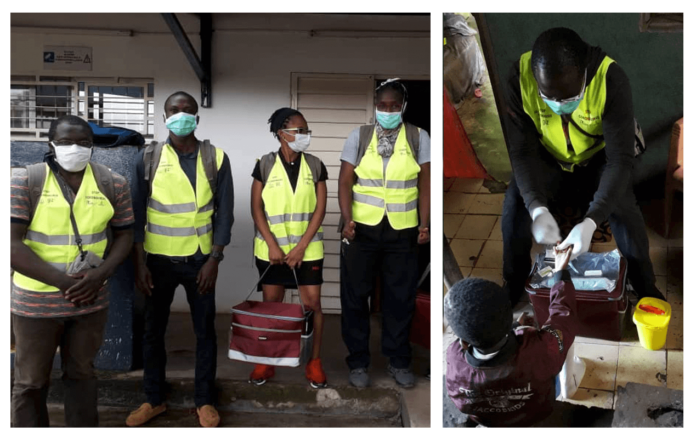

```{r, eval = F, include = F}
Hi GRAPH Courses student! 
  
This is a CODE ALONG document where you can type code as you follow the lesson video. 

We encourage you to do this; typing code with the teacher is the best way to learn the right syntax. 

If you are not sure how to use our code-along documents, please watch this video: https://vimeo.com/767363677
```

```{r, echo = F, message = F, warning = F}
# Load packages 
if(!require(pacman)) install.packages("pacman")
pacman::p_load(rlang, tidyverse, knitr, here)

# Source functions 
source(here("global/functions/misc_functions.R"))

# knitr settings
knitr::opts_chunk$set(warning = F, message = F, class.source = "tgc-code-block", error = T)

# autograders
mute(here("lessons/ls01_select_rename_autograder.R"))
```

------------------------------------------------------------------------

<!-- # Data wrangling: selecting and renaming columns -->

## Introduction

Today we will begin our exploration of the {dplyr} package! Our first verb on the list is `select` which let you keep or drop variables from your dataframe. Choosing your variables is the first step in cleaning your data.

{width="408"}

Let's go !

## Learning objectives

-   You can keep or drop columns from a dataframe using the `dplyr::select()` function from the {dplyr} package.

-   You can select a range or combination of columns using operators like the colon (`:`), the exclamation mark (`!`), and the `c()` function.

-   You can select columns based on patterns in their names with helper functions like `starts_with()`, `ends_with()`, `contains()`, and `everything()`.

-   You can use `rename()` and `select()` to change column names.

## The Yaounde COVID-19 dataset

-   COVID-19 serological survey

-   IgG and IgM antibodies

-   The full dataset can be obtained from [Zenodo](https://zenodo.org/record/5218965){target="_blank"} ([5218965](https://zenodo.org/record/5218965))

{alt="Left: the Yaounde survey team. Right: an antibody test being administered." width="450"}

```{r, message = F, render = reactable_5_rows}
yaounde <- read_csv(here::here("data/yaounde_data.csv"))
yaounde  
```

## Introducing `select()`

`dplyr::select()` lets us pick which columns (variables) to keep or drop.

{width="408"}

By name:

```{r}
yaounde ________________ # Select age
```

By position:

```{r}
yaounde _________________ # Select the 3rd column
```

Multiple variables:

```{r}
yaounde ____________________________ # Select age, sex and igg_result
```

::: practice
-   Select the weight and height variables in the `yaounde` data frame.

```{r, eval = F, echo = FALSE}
# For this first practice question we'll provide the answer:
Q_weight_height <- yaounde %>% select(weight_kg, height_cm)
# Run that line, then run the CHECK and HINT functions below
```


```{r, eval = F, echo = FALSE}
# Check your answer:
.CHECK_Q_weight_height()
.HINT_Q_weight_height()
```

```{r, eval = F, echo = FALSE}
# Now, to obtain the solution, run the line below!
.SOLUTION_Q_weight_height()
# Each question has a solution function similar to this (.SOLUTION_Q_xxx_xxx())
# But you will need to type out the function name on your own.
# (This is to discourage you from looking at the solution before answering the question.)
```

-   Select the 16th and 22nd columns in the `yaounde` data frame.

```{r, eval = F, echo = FALSE}
Q_cols_16_22 <- "YOUR ANSWER HERE"
```

```{r, eval = F, echo = FALSE}
# Check your answer:
.CHECK_Q_cols_16_22()
.HINT_Q_cols_16_22()
```
:::

------------------------------------------------------------------------

For the next part of the tutorial, let's create a smaller subset of the data, called `yao`.

```{r, render = reactable_5_rows}
yao <-
  yaounde %>% select(age,
                     sex,
                     highest_education,
                     occupation,
                     is_smoker,
                     is_pregnant,
                     igg_result,
                     igm_result)
yao
```

### Selecting column ranges with `:`

The `:` operator selects a **range of consecutive variables**:

```{r, render = reactable_5_rows}
yao ________________ # Select all columns from `age` to `occupation`
```

We can also specify a range with column numbers:

```{r, render = reactable_5_rows}
yao _________________ # Select columns 1 to 4
```

::: practice
-   With the `yaounde` data frame, select the columns between `symptoms` and `sequelae`, inclusive. ("Inclusive" means you should also include `symptoms` and `sequelae` in the selection.)

```{r, eval = F, echo = FALSE}
Q_symp_to_sequel <- yaounde ___________
```


```{r, eval = F, echo = FALSE}
# Check your answer:
.CHECK_Q_symp_to_sequel()
.HINT_Q_symp_to_sequel()
```
:::

### Excluding columns with `!`

The **exclamation point** negates a selection:

```{r, render = reactable_5_rows}
yao _______________ # Select all columns except `age`
```

To drop a range of consecutive columns, we use, for example,`!age:occupation`:

```{r, render = reactable_5_rows}
yao ____________________ # Drop columns from `age` to `occupation`
```

To drop several non-consecutive columns, place them inside `!c()`:

```{r, render = reactable_5_rows}
yao ________________________ # Drop `age`, `sex` and `igg_result`
```

::: practice
-   From the `yaounde` data frame, **remove** all columns between `highest_education` and `consultation`, inclusive.

```{r, eval = F, echo = FALSE}
Q_educ_consult <- yaounde %>%  ____________
```


```{r, eval = F, echo = FALSE}
# Check your answer:
.CHECK_Q_educ_consult()
.HINT_Q_educ_consult()
```
:::

## Helper functions for `select()`

`dplyr` has a number of helper functions to make selecting easier by using patterns from the column names. Let's take a look at some of these.

### `starts_with()` and `ends_with()`

These two helpers work exactly as their names suggest!

```{r, render = reactable_5_rows}
yao %>% select(__________________) # Columns that start with "is"
yao %>% select(__________________) # Columns that end with "result"
```

### `contains()`

`contains()` helps select columns that contain a certain string:

```{r, render = reactable_5_rows}
yaounde %>% select(____________________) # Columns that contain the string "drug"
```

### `everything()`

Another helper function, `everything()`, matches all variables that have not yet been selected.

```{r, render = reactable_5_rows}
# First, `is_pregnant`, then every other column.
yao %>% select(____________________)
```

It is often useful for establishing the order of columns.

Say we wanted to bring the `is_pregnant` column to the start of the `yao` data frame, we could type out all the column names manually:

```{r, render = reactable_5_rows}
yao %>% select(is_pregnant, 
               age, 
               sex, 
               highest_education, 
               occupation, 
               is_smoker, 
               igg_result, 
               igm_result)
```

But this would be painful for larger data frames, such as our original `yaounde` data frame. In such a case, we can use `everything()`:

```{r, render = reactable_5_rows}
# Bring `is_pregnant` to the front of the data frame
yaounde %>% select(is_pregnant, everything())
```

This helper can be combined with many others.

```{r, render = reactable_5_rows}
# Bring columns that start with "is" to the front of the data frame
yaounde %>% select(ends_with("result"), everything())
```


::: practice
-   Select all columns in the `yaounde` data frame that start with "is\_".

```{r, eval = F, echo = FALSE}
Q_starts_with_is <-  yaounde %>%  ____________
```


```{r, eval = F, echo = FALSE}
# Check your answer:
.CHECK_Q_starts_with_is()
.HINT_Q_starts_with_is()
```

-   Move the columns that start with "is\_" to the beginning of the `yaounde` data frame.

```{r, eval = F, echo = FALSE}
Q_rearrange <-  yaounde %>%  ____________
```

```{r, eval = F, echo = FALSE}
# Check your answer:
.CHECK_Q_rearrange()
.HINT_Q_rearrange()
```
:::

## Change column names with `rename()`


[`dplyr::rename()`](https://dplyr.tidyverse.org/reference/rename.html) is used to change column names:

```{r, render = reactable_5_rows}
# Rename `age` and `sex` to `patient_age` and `patient_sex`
yaounde %>% 
  rename(___________________,
         ___________________)
```

::: watch-out
The fact that the new name comes first in the function (`rename(NEWNAME = OLDNAME)`) is sometimes confusing. You should get used to this with time.
:::

### Rename within `select()`

You can also rename columns while selecting them:

```{r, render = reactable_5_rows}
# Select `age` and `sex`, and rename them to `patient_age` and `patient_sex`
yaounde %>% 
  select(patient_age = age, 
         patient_sex = sex)
```

## Wrap Up ! {.unnumbered}

I hope this first lesson has allowed you to see how intuitive and useful the {dplyr} verbs are! This is the first of a series of basic data wrangling verbs: see you in the next lesson to learn more.

{width="400"}

## Contributors {.unlisted .unnumbered}

The following team members contributed to this lesson:

`r tgc_contributors_list(ids = c("lolovanco", "avallecam", "kendavidn"))`

## References {.unlisted .unnumbered}

Some material in this lesson was adapted from the following sources:

-   Horst, A. (2021). *Dplyr-learnr*. <https://github.com/allisonhorst/dplyr-learnr> (Original work published 2020)

-   *Subset columns using their names and types---Select*. (n.d.). Retrieved 31 December 2021, from <https://dplyr.tidyverse.org/reference/select.html>

Artwork was adapted from:

-   Horst, A. (2021). *R & stats illustrations by Allison Horst*. <https://github.com/allisonhorst/stats-illustrations> (Original work published 2018)
