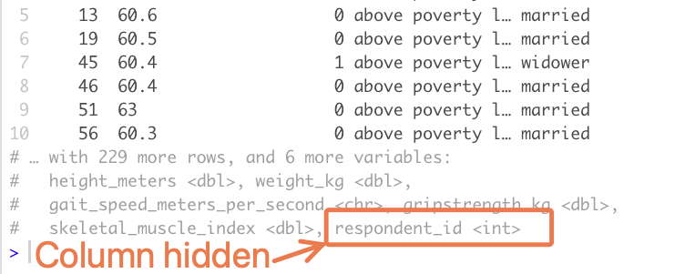

```{r, eval = F, include = F}
Hi GRAPH Courses student!
  
This is a CODE ALONG document where you can type code as you follow the lesson video. 

We encourage you to do this; typing code with the teacher is the best way to learn the right syntax. 

If you are not sure how to use our code-along documents, please watch this video: https://vimeo.com/767363677
```


```{r, echo = F, message = F, warning = F}
# SETUP CHUNK. Remember to run this whole chunk before continuing with the lesson!

if(!require(pacman)) install.packages("pacman")
pacman::p_load(knitr, 
               here, 
               janitor,
               tidyverse)

# Source functions 
source(here("global/functions/misc_functions.R"))

# knitr settings
knitr::opts_chunk$set(warning = F, message = F, class.source = "tgc-code-block", error = T)

## autograders
suppressMessages(source(here::here("autograder/ls03_mutate_autograder.R")))
```

<!-- # Data wrangling: mutating columns -->

## Introduction

You now know how to keep or drop columns and rows from your dataset. Today you will learn how to modify existing variables or create new ones, using the `mutate()` verb from {dplyr}. This is an essential step in most data analysis projects.

Let's go!

{width="400"}

## Learning objectives

1.  You can use the `mutate()` function from the `{dplyr}` package to create new variables or modify existing variables.

2.  You can create new numeric, character, factor, and boolean variables

## Packages

This lesson will require the packages loaded below:

```{r}
if(!require(pacman)) install.packages("pacman")
pacman::p_load(here, 
               janitor,
               tidyverse)
```

------------------------------------------------------------------------

## Datasets

-   In this lesson, we will use two data sets

-   The data from the **COVID-19 serological survey** conducted in **Yaounde**, Cameroon.

-   A dataset from **a cross-sectional study** conducted to determine the prevalence of **sarcopenia** in the **elderly population (\>60 years)** in in Karnataka, **India**.

-   **Sarcopenia** is a condition that is **common in elderly people**

-   It is characterized by **progressive and generalized loss of skeletal muscle mass and strength**.

------------------------------------------------------------------------

```{r, message = F, render = reactable_10_rows}
yaounde <- read_csv(here::here('data/yaounde_data.csv'))

## a smaller subset of variables
yao <- 
  yaounde %>% 
  select(date_surveyed, 
                          age, 
                          weight_kg, height_cm, 
                          symptoms, is_smoker) %>%
  rename(age_years = age)

yao
```

```{r, message = F, render = reactable_10_rows}
sarcopenia <- read_csv(here::here('data/sarcopenia_elderly.csv'))

sarcopenia
```

------------------------------------------------------------------------

## Introducing `mutate()`

{width="336"}

------------------------------------------------------------------------

-   We use `dplyr::mutate()` to create new variables or modify existing variables.

-   The syntax is **intuitive**

-   `df %>% mutate(new_column_name = what_it_contains)`.

-   Let's see a quick example using `height_cm` from the `yaounde` dataset

------------------------------------------------------------------------

Let's create a data frame, `yao_height`, with just this column, for easy illustration:

```{r}
yao_height <- yaounde %>% select(_____________)
yao_height
```

------------------------------------------------------------------------

-   What if you wanted to **create a new variable** called `height_meters` where heights are converted to meters?

-   You can use `mutate()` for this

-   With the argument `height_meters = height_cm/100`

------------------------------------------------------------------------

```{r}
yao_height %>% 
  mutate(___________________)
```

------------------------------------------------------------------------

-   New example !

-   Imagine there was a **small error in the equipment** used to **measure respondent heights**

-   all heights are 5cm too small

-   You want to add 5cm to all heights in the dataset.

-   Rather than creating a new variable as you did before, you can **modify the existing variable**

------------------------------------------------------------------------

```{r}
yao_height %>% 
  mutate(___________________)
```

------------------------------------------------------------------------

**PRACTICE TIME !**

::: practice
The `sarcopenia` data frame has a variable `weight_kg`, which contains respondents' weights in kilograms. Create a new column, called `weight_grams`, with respondents' weights in grams. Store your answer in the `q_weight_to_g` object. (1 kg equals 1000 grams.)

```{r, eval = FALSE}
# Complete the code with your answer:
q_weight_to_g <- 
  sarcopenia %>% 
  _____________________
```

```{r, include = FALSE}
# Check your answer:
.CHECK_Q_weight_to_g()
.HINT_Q_weight_to_g()


# To obtain the solution, run the line below!
.SOLUTION_Q_weight_to_g()
# Each question has a solution function similar to this.
# (Where HINT is replaced with SOLUTION in the function name.)
# But you will need to type out the function name on your own.
# (This is to discourage you from looking at the solution before answering the question.)
```
:::

------------------------------------------------------------------------

-   Hopefully you now see that the mutate function is quite user-friendly.

-   In theory, we could end the lesson here...

-   But the devil will be in the details

------------------------------------------------------------------------

## Creating a variable from scratch (row index)

-   Most new variables you create will **reference existing variables** (for example, the `height_meters` variable created above referenced the `height_cm` variable.)

-   But in a few special cases you'll **create variables "from scratch"**, without referring to any others. One example is with the creation of a row index.

-   To get such an index, you can use `mutate()` and then generate a sequence of row indices with `1:n()`

-   the `n()` function from dplyr returns the number of rows in the data frame

```{r}
yao_height %>% 
  mutate(_______________________)
```

------------------------------------------------------------------------

**PRACTICE TIME !**

::: practice
Add a variable called `respondent_id` to the `sarcopenia` data frame. The `respondent_id` variable should contain the row number for each row in the data frame. Store the result in the `q_sarcopenia_resp_id` object.

```{r, eval = FALSE}
# Complete the code with your answer:
q_sarcopenia_resp_id <- 
  sarcopenia %>% 
  mutate(________________________)
```

Note. The `sarcopenia` data frame has 10 columns, which are unlikely to all fit in your console when you print this data frame. Your new column, `respondent_id` will also probably be hidden.

{width="301"}

So to see actually see the new column, you can use `View()` to view the entire data frame or `select()` to select the relevant columns.

```{r, include = FALSE}
# Check your answer:
.CHECK_Q_sarcopenia_resp_id()
.HINT_Q_sarcopenia_resp_id()
```
:::

------------------------------------------------------------------------

## Creating a Boolean variable

-   You can use `mutate()` to create a Boolean variable to categorize part of your population.

-   We create `is_child`

-   Which is either `TRUE` if the subject is a child or `FALSE` if the subject is an adult

-   We use a condition : `age_years <= 18`, which evaluates whether each age is less than or equal to 18.

-   Ages that match that condition (ages 18 and under) are `TRUE`

-   Ages (above 18) that fail the condition are `FALSE`.

```{r}
yao %>%
  select(____________________) %>% 
  mutate(____________________)
```

------------------------------------------------------------------------

-   Such a variable is useful to, for example, count the number of children in the dataset.

-   Let's count the children after defining them with `mutate()`

-   We use the `janitor::tabyl()` function

```{r}
yao %>%
  mutate(is_child = age_years <= 18) %>% 
  tabyl(_______________)
```

You can observe that 31.8% (0.318...) of respondents in the dataset are children.

------------------------------------------------------------------------

-   Let's see one more example, since the concept of Boolean variables can be a bit confusing.

-   The `symptoms` variable reports any respiratory symptoms experienced by the patient

-   You could create a Boolean variable, called `has_no_symptoms`

-   That is set to `TRUE` if the respondent reported no symptoms

```{r}
yao %>% 
  select(_____________) ___
  ___________________________________________
```

------------------------------------------------------------------------

PRACTICE TIME !

::: practice
Women with a grip strength below 20kg are considered to have low grip strength.

With a female subset of the `sarcopenia` data frame, add a variable called `low_grip_strength` that is `TRUE` for women with a grip strength \< 20 kg and FALSE for other women.

```{r, eval = FALSE}
# Complete the code with your answer:
q_women_low_grip_strength <- 
  sarcopenia %>% 
  filter(sex_male_1_female_0 == 0) %>% # first we filter the dataset to only women
  mutate(________________________)
```

```{r, include = FALSE}
# Check your answer:
.CHECK_Q_women_low_grip_strength()
.HINT_Q_women_low_grip_strength()
```

What percentage of women surveyed have a low grip strength according to the definition above? Enter your answer as a number without quotes (e.g. 43.3 or 12.2).

```{r, eval = FALSE}
q_prop_women_low_grip_strength <- YOUR_ANSWER_HERE
```

```{r, include = FALSE}
# Check your answer:
.CHECK_Q_prop_women_low_grip_strength()
.HINT_Q_prop_women_low_grip_strength()
```
:::

------------------------------------------------------------------------

## Creating a numeric variable based on a formula

-   Now, let's look at an example of **creating a numeric variable**:

-   The **body mass index (BMI)**, which a commonly used **health indicator**.

-   The formula for the body mass index can be written as:

$$
BMI = \frac{weight (kilograms)}{height (meters)^2}
$$

------------------------------------------------------------------------

You can use `mutate()` to calculate BMI in the `yao` dataset as follows:

```{r}
yao %>%
  __________________________
  
  # first obtain the height in meters  
 __________________________
  
  # then use the BMI formula
  __________________________
```

------------------------------------------------------------------------

Let's save the data frame with BMIs for later. We will use it in the next section.

```{r}
yao %>%
  select(weight_kg,  height_cm) %>% 
  # first obtain the height in meters  
  mutate(height_meters = height_cm/100) %>% 
  # then use the BMI formula
  mutate(bmi = weight_kg / (height_meters)^2)
```

```{r COMPLETE_CODE}
# yao_bmi <- 
#   yao %>%
#   select(weight_kg,  height_cm) %>% 
#   # first obtain the height in meters  
#   mutate(height_meters = height_cm/100) %>% 
#   # then use the BMI formula
#   mutate(bmi = weight_kg / (height_meters)^2)

```

------------------------------------------------------------------------

PRACTICE TIME !

::: practice
**Appendicular muscle mass** (ASM), a **useful health indicator**.

It is the **sum of muscle mass in all 4 limbs**. It can predicted with the following formula, called Lee's equation:

$$ASM(kg)= (0.244 \times weight(kg)) + (7.8 \times height(meters)) + (6.6 \times sex) - (0.098 \times age_years) - 4.5$$

The `sex` variable in the formula assumes that men are coded as 1 and women are coded as 0 (which is already the case for our `sarcopenia` dataset.)

The `- 4.5` at the end is a constant used for Asian populations.

Calculate the ASM value for all individuals in the `sarcopenia` dataset.

```{r, eval = FALSE}
# Complete the code with your answer:
q_asm_calculation <- 
  sarcopenia %>% 
  mutate(asm = _______________________________________________)
```

```{r, include = FALSE}
# Check your answer:
.CHECK_Q_asm_calculation()
.HINT_Q_asm_calculation()
```
:::

------------------------------------------------------------------------

## Changing a variable's type

-   In your data analysis workflow, you often need to redefine variable *types*.

-   You can do so with functions like `as.integer()`, `as.factor()`, `as.character()` and `as.Date()`

-   Within your `mutate()` call.

-   Let's see an example with `as.integer()`, which converts any numeric values to integers:

```{r}
yao_bmi %>% 
  mutate(___________________________)
```


-   Note that this *truncates* numbers rather than rounding them up or down

-   For example the BMI 22.8 in the third row is truncated to 22.

-   If you want rounded numbers, you can use the `round` function from base R:

```{r}
yao_bmi %>% 
  mutate(bmi_integer = as.integer(bmi), 
         ________________________________) 
```

PRACTICE TIME !

::: practice
Use `as_integer()` to convert the ages of respondents in the `sarcopenia` dataset to integers (truncating them in the process, we don't care about having them rounded correctly).

This should go in a new column called `age_integer`

```{r, eval = FALSE}
# Complete the code with your answer:
q_age_integer <- 
  sarcopenia %>% 
  mutate(age_integer =  ________________________)
```

```{r, include = FALSE}
# Check your answer:
.CHECK_Q_age_integer()
.HINT_Q_age_integer()
```
:::

