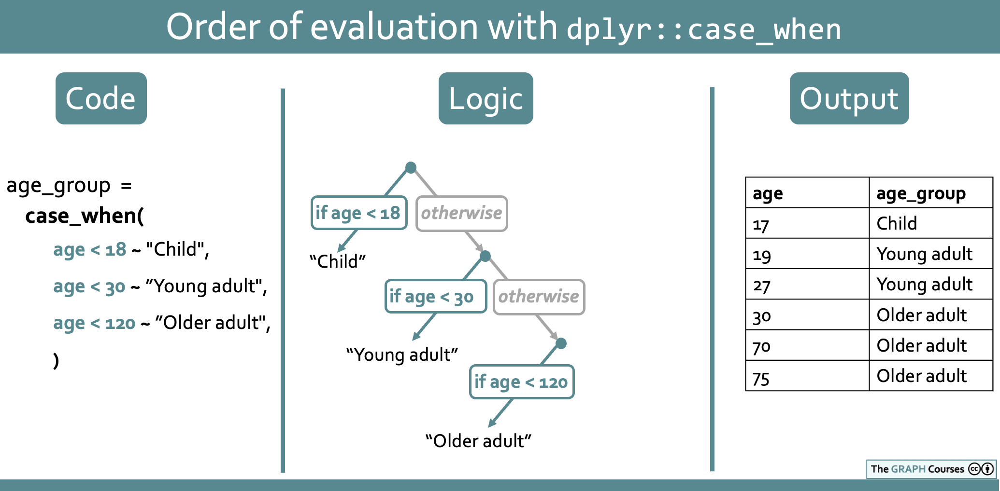
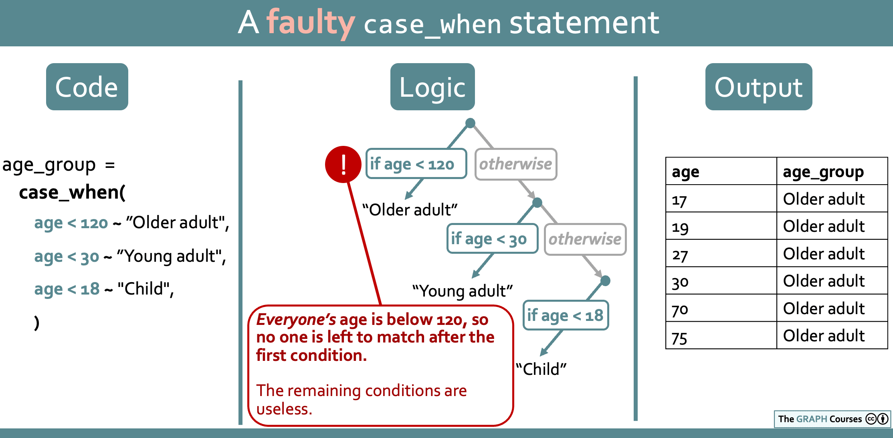

```{r, eval = F, include = F}
Hi GRAPH Courses student!
  
This is a CODE ALONG document where you can type code as you follow the lesson video. 

We encourage you to do this; typing code with the teacher is the best way to learn the right syntax. 

If you are not sure how to use our code-along documents, please watch this video: https://vimeo.com/767363677
```


```{r, echo = F, message = F, warning = F}
# SETUP CHUNK. Remember to run this whole chunk before continuing with the lesson.

if(!require(pacman)) install.packages("pacman")
pacman::p_load(knitr, 
               here, 
               janitor,
               tidyverse)

## functions
source(here::here("global/functions/misc_functions.R"))

## default render
knitr::opts_chunk$set(warning = F, message = F, class.source = "tgc-code-block", error = T)

## autograders
suppressMessages(source(here::here("autograder/ls04_conditional_mutate_autograder.R")))
```

## Learning objectives

1.  You can transform or create new variables based on conditions using `dplyr::case_when()`
2.  You know how to use the `TRUE` condition in `case_when()` to match unmatched cases.
3.  You can handle `NA` values in `case_when()` transformations.
4.  You understand how to keep the default values of a variable in a `case_when()` formula
5.  You can write `case_when()` conditions involving multiple comparators and multiple variables.
6.  You understand `case_when()` condition priority order.
7.  You can use `dplyr::if_else()` for binary conditional assignment.

------------------------------------------------------------------------

## Packages

This lesson will require the tidyverse suite of packages:

```{r}
if(!require(pacman)) install.packages("pacman")
pacman::p_load(tidyverse)
```

## Datasets

-   COVID-19 serological survey from Yaounde, Cameroon.

-   **Outbreak linelist** of **136 cases of influenza A H7N9** from a [2013 outbreak](https://en.wikipedia.org/wiki/Influenza_A_virus_subtype_H7N9#Reported_cases_in_2013) in **China**.

------------------------------------------------------------------------

We slightly modified the age column, artificially introducing some missing values, and dropped the `age_category` column.

```{r, message = F, render = reactable_10_rows}
# Import and view the dataset
yaounde <- 
  read_csv(here::here('data/yaounde_data.csv')) %>% 
  ## make every 5th age missing
  mutate(age = case_when(row_number() %in% seq(5, 900, by = 5) ~ NA_real_,
                         TRUE ~ age)) %>% 
  ## rename the age variable 
  rename(age_years = age) %>%
  # drop the age category column
  select(-age_category)

yaounde
```

```{r, message = F, render = reactable_10_rows}
# Import and view the dataset
flu_linelist <- read_csv(here::here('data/flu_h7n9_china_2013.csv'))
flu_linelist
```

------------------------------------------------------------------------

## Reminder: relational operators (comparators) in R

-   They test the relation between two values

-   They return `TRUE`, `FALSE` or `NA`.

------------------------------------------------------------------------

A list of the most common operators is given below:

|              |                                     |
|:-------------|:------------------------------------|
| **Operator** | **is TRUE if**                      |
| A \< B       | A is **less than** B                |
| A \<= B      | A is **less than or equal** to B    |
| A \> B       | A is **greater than** B             |
| A \>= B      | A is **greater than or equal to** B |
| A == B       | A is **equal** to B                 |
| A != B       | A is **not equal** to B             |
| A %in% B     | A **is an element of** B            |

------------------------------------------------------------------------

## Introduction to `case_when()`

-   Let's begin with a simple conditional transformation

-   We will use `case_when()`, to make a new column called `age_group`


```{r}
yaounde_age <- 
  yaounde %>% 
  # let's select just age_years to see what we are doing
  select(age_years)

yaounde_age
```

```{r}
yaounde_age %>%  
  # let's define an adult group and a child group
  mutate(age_group = ______________________________
                     ______________________________)
```

------------------------------------------------------------------------

-   The `case_when()` syntax may seem foreign, but it is simple.

-   The `~` sign is called a "tilde."

-   On the **left-hand side (LHS)** of the `~` you have the **condition(s)**

-   On the **right-hand side (RHS)**, you have a **value** to put in **if the condition is true**.

-   `case_when(age_years < 18 ~ "Child", age_years >= 18 ~ "Adult")`

-   "if `age` is below 18, input 'Child', else if `age` is greater than or equal to 18, input 'Adult'".

------------------------------------------------------------------------

-   After creating a new variable with `case_when()`, it is a good idea to **inspect it**

```{r eval = FALSE}
yaounde_age %>%  
  mutate(age_group = case_when(age_years < 18 ~ "Child", 
                               age_years >= 18 ~ "Adult")) %>% 
  View()
```

-   `View()` allows us to **view it** in spreadsheet form in a new tab of Rstudio

```{r}
yaounde_age %>%  
  mutate(age_group = case_when(age_years < 18 ~ "Child", 
                               age_years >= 18 ~ "Adult")) %>% 
  tabyl(age_group)
```

-   Use `tabyl()` function to ensure that the proportions "make sense"

------------------------------------------------------------------------

PRACTICE TIME !

::: practice
With the `flu_linelist` data, make a new column, called `age_group`, that has the value "Below 50" for people under 50 and "50 and above" for people aged 50 and up. Use the `case_when()` function.

```{r eval = FALSE}
# Complete the code with your answer:
Q_age_group <- 
  flu_linelist %>% 
  mutate(age_group = ______________________________)
```

```{r include = FALSE}
# Check your answer
.CHECK_Q_age_group()
.HINT_Q_age_group()


# To get the solution, run the line below!
.SOLUTION_Q_age_group()
# Each question has a solution function similar to this.
# (Where HINT is replaced with SOLUTION in the function name.)
# But you will need to type out the function name on your own.
# (This is to discourage you from looking at the solution before answering the question.)
```

Out of the entire sample of individuals in the `flu_linelist` dataset, what percentage are confirmed to be below 60? (Repeat the above procedure but with the `60` cutoff, then call `tabyl()` on the age group variable. Use the `percent` column, not the `valid_percent` column.)


```{r eval = FALSE}
# Enter your answer as a number without quotes:
Q_age_group_percentage <- YOUR_ANSWER_HERE
```

```{r include = FALSE}
# Check your answer
.CHECK_Q_age_group_percentage()
.HINT_Q_age_group_percentage()
```
:::

------------------------------------------------------------------------

## The `TRUE` default argument

-   `case_when()` has a literal `TRUE` condition

-   To **match any rows not yet matched**

-   Like a `default` value.

```{r render = reactable_10_rows}
yaounde_age %>%  
  # let's define only children and all others as "Not children"
  mutate(age_group = ________________________
                     ________________________)
```

-   It can be read as: "if age is below 18, input 'Child', and *for everyone else not yet matched*, input 'Not child'".

------------------------------------------------------------------------

## Matching NA's with `is.na()`

-   Let's match `NA` ages with `is.na()` and set their age group to "Missing age"

------------------------------------------------------------------------

```{r render = reactable_10_rows}
yaounde_age %>%  
  mutate(age_group = case_when(age_years < 18 ~ "Child", 
                               age_years >= 18 ~ "Adult", 
                               # we add a condition for NA values:
                               ______________________________)
```

------------------------------------------------------------------------

PRACTICE TIME !

::: practice

As before, using the `flu_linelist` data, make a new column, called `age_group`, that has the value "Below 60" for people under 60 and "60 and above" for people aged 60 and up. But this time, also set those with missing ages to "Missing age".

```{r eval = FALSE}
# Complete the code with your answer:
Q_age_group_nas <- 
  flu_linelist %>% 
  mutate(age_group = ______________________________)
```

```{r include = FALSE}
# Check your answer
.CHECK_Q_age_group_nas()
.HINT_Q_age_group_nas()
```
:::

::: practice
The `gender` column of the `flu_linelist` dataset contains the values "f", "m" and `NA`:

```{r}
flu_linelist %>% 
  tabyl(gender)
```

Recode "f", "m" and `NA` to "Female", "Male" and "Missing gender" respectively. You should modify the existing `gender` column, not create a new column.

```{r eval = FALSE}
# Complete the code with your answer:
Q_gender_recode <- 
  flu_linelist %>% 
  mutate(gender = ___________________________________)
```

```{r include = FALSE}
# Check your answer
.CHECK_Q_gender_recode()
.HINT_Q_gender_recode()
```
:::

------------------------------------------------------------------------

## Keeping default values of a variable

-   The **right-hand side (RHS)** of a `case_when()` formula can be a **variable**.

-   **To change** **just a few values** in a column.

-   Let's see an example with `highest_education`

------------------------------------------------------------------------

```{r}
yaounde_educ <- 
  yaounde %>% 
  # let's select just the highest_education variable
  select(highest_education)
yaounde_educ
```

```{r render = reactable_10_rows}
yaounde_educ %>%
  # let's create highest_educ_recode 
  # recoding "University" and "Doctorate" to the value "Post-secondary"
  mutate(highest_educ_recode = 
           _________________________________________________________________)
```

------------------------------------------------------------------------

-   It worked

-   BUT now we have `NA`s for all other rows.

-   Let's **keep** these **other rows** at their **default values**


```{r}
yaounde_educ %>%
  # let's add the condition TRUE ~ highest_education
  mutate(highest_educ_recode = 
           _________________________________________________________________)
```

-   Now it reads:

-   'If highest education is "University" or "Doctorate", input "Post-secondary".

-   For everyone else, input the **default** value from `highest_education`'.

------------------------------------------------------------------------

PRACTICE TIME !

::: practice
Using the `flu_linelist` data, modify the existing column `outcome` by replacing the value "Recover" with "Recovery".

```{r eval = FALSE}
# Complete the code with your answer:
Q_recode_recovery <- 
  flu_linelist %>% 
  mutate(age_group = ______________________________)
```

```{r include = FALSE}
# Check your answer
.CHECK_Q_recode_recovery()
.HINT_Q_recode_recovery()
```
:::

------------------------------------------------------------------------

## Multiple conditions on a single variable

-   **LHS conditions** in `case_when()` formulas can have multiple parts.

-   Let's see an example with the `BMI` variable


```{r}
yaounde_BMI <-
  yaounde %>%
  # let's convert our height to meters and define the BMI
  mutate(height_m = _____________________
         ________________________________) %>%
  #let's select only the BMI
  select(BMI)

yaounde_BMI
```

```{r}
yaounde_BMI <-
  yaounde_BMI %>%
  # let's create the BMI classification
  _________________________________
  _________________________________
  _________________________________
  _________________________________

yaounde_BMI
```

-   The **BMI is a health indicator**, to assess obesity:

    -   A healthy BMI is defined between 18,5 and 25: the person has a normal weight.

    -   If the BMI is inferior to 18,5 the person is considered too thin.

    -   If the BMI is between 25 and 30 then the person is considered overweight.

    -   If the BMI is above 30 then the person is considered obese.

-   The condition `BMI >= 18.5 & BMI <= 25` to define `Normal weight` is a **compound condition** because it has ***two*** **comparators**: `>=` and `<=`.

------------------------------------------------------------------------

Let's use `tabyl()` to on `BMI_classification` have a look at our data:

```{r eval = FALSE}
yaounde_BMI %>%
  # let's convert the BMI classification to factors
  tabyl(BMI_classification)
  # let's use tabyl
```

------------------------------------------------------------------------

PRACTICE TIME !

::: practice
With the `flu_linelist` data, make a new column, called `adolescent`, that has the value "Yes" for people in the 10-19 age group, and "No" for everyone else.

```{r eval = FALSE}
# Complete the code with your answer:
Q_adolescent_grouping <- 
  flu_linelist %>% 
  _________________________________________-
```

```{r include = FALSE}
# Check your answer
.CHECK_Q_adolescent_grouping()
.HINT_Q_adolescent_grouping()
```
:::

------------------------------------------------------------------------

## Multiple conditions on multiple variables

-   Up till now, **conditions have involved a single variable at a time**.

-   But LHS conditions often refer to multiple variables at once.

-   Let's see a simple example with `age_years` and `sex` for recruiting participants.


```{r}
yaounde_age_sex <- 
  yaounde %>% 
  # let's select our variables of interest
  _______________________

yaounde_age_sex
```

------------------------------------------------------------------------

-   Now, imagine we want to recruit **women and men** in the **20-29** age group into **two studies**.

-   For this we'd like to create a column, called `recruit`, with the following schema:

    -   Women aged 20-29 should have the value "Recruit to female study"

    -   Men aged 20-29 should have the value "Recruit to male study"

    -   Everyone else should have the value "Do not recruit"

------------------------------------------------------------------------

```{r}
yaounde_age_sex %>%
  mutate(recruit = 
           __________________________________________________________________
           __________________________________________________________________
           __________________________________________________________________)
```

------------------------------------------------------------------------

PRACTICE TIME !

::: practice
With the `flu_linelist` data, make a new column, called `recruit` with the following schema:

-   Individuals aged 30-59 from the Jiangsu province should have the value "Recruit to Jiangsu study"
-   Individuals aged 30-59 from the Zhejiang province should have the value "Recruit to Zhejiang study"
-   Everyone else should have the value "Do not recruit"

```{r eval = FALSE}
# Complete the code with your answer:
Q_age_province_grouping <- 
  flu_linelist %>% 
  mutate(recruit = ______________________________)
```

```{r include = FALSE}
# Check your answer
.CHECK_Q_age_province_grouping()
.HINT_Q_age_province_grouping()
```
:::

------------------------------------------------------------------------

## Order of priority of conditions in `case_when()`

-   **The order of conditions is important**

-   Conditions listed **at the top** of your `case_when()` statement **take priority**.

-   Let's understand this together

------------------------------------------------------------------------

```{r render = reactable_10_rows}
yaounde_age_sex %>% 
  mutate(age_group = case_when(age_years < 18 ~ "Child", 
                               age_years < 30 ~ "Young adult",
                               age_years < 120 ~ "Older adult"))
```

-   This initially looks like a faulty `case_when()` statement

-   Because **the age conditions overlap**.

-   Here ***anyone*** **between ages 0 and 120** (even a 1-year old baby!), would be **coded as "Older adult".**

-   But the code actually works fine! People under 18 are still coded as "Child".

------------------------------------------------------------------------

-   What's going on?

-   `case_when()` is **a series of branching logical steps**

{width="2000"}

------------------------------------------------------------------------

```{r render = reactable_10_rows}
yaounde_age %>% 
  mutate(age_group = case_when(age_years < 120 ~ "Older adult", 
                               age_years < 30 ~ "Young adult", 
                               age_years < 18 ~ "Child"))
```

{width="2000"}

------------------------------------------------------------------------

-   Another solution :

------------------------------------------------------------------------

```{r render = reactable_10_rows}
# start with "Child" condition
yaounde_age %>% 
  # let's write some closed bound conditions on age
  mutate(age_group = ____________________________________________________
                     ____________________________________________________
                     ____________________________________________________)
```

-   Make conditions **independent of their order**

-   Rather than leave the age groups **open-ended**: `age_years < 120 ~ "Older adult"`

-   Use ***closed*** **bounds** : `age_years >= 30 & age_years < 120 ~ "Older adult"`

------------------------------------------------------------------------

-   Why explain all of this ?

-   **One reason:** highlights the important of putting the `TRUE` condition as the last one

-   **Other reason:** there are certain cases where you ***may*** **want to use open-ended overlapping conditions**.

-   Let's see one now with identifying COVID-like symptoms!

------------------------------------------------------------------------

### Overlapping conditions within `case_when()`

-   symptoms columns = symptoms experienced by respondents over a 6-month period

-   Allow to assess **whether a person may have had COVID,** following guidelines recommended by the [WHO](https://apps.who.int/iris/handle/10665/333752).

    -   cough = "**possible** COVID cases"
    -   anosmia/ageusia (loss of smell or loss of taste) = "**probable** COVID cases".
    -   Written informally: **Probable \> Possible (more likely)**
    -   i.e. **Anosmia/ageusia \> Cough (more significant)**

------------------------------------------------------------------------

-   **Osma**, our respondent, **has cough AND anosmia/ageusia**.

-   She **meets the criteria** for "possible COVID"

-   She ***also*** **meets** the criteria for "probable COVID"

-   How should we classify Osma?

-   **She should be classed as a "probable COVID case".**

-   For Osma, the criterion for "probable COVID" has a **higher *precedence*** than the criterion for "possible COVID".

------------------------------------------------------------------------

```{r}
yaounde_symptoms_slice <- 
  yaounde %>% 
  select(_________________________________) %>% 
  # slice of specific rows useful for demo: 32, 711, 625, 651  
  # Once you find the right code, you would remove this slice
  slice(__________________)

yaounde_symptoms_slice
```

------------------------------------------------------------------------

```{r}
yaounde_symptoms_slice %>%
  # the condition on symp_anosmia_or_ageusia comes 
  # before the condition on symp_cough 
  mutate(covid_status = 
           ____________________________________________ 
           ____________________________________________)
```

------------------------------------------------------------------------

-   Now, let's look at the output data frame

-   The individual in row 2 = "Possible COVID" because they have cough

-   The individual in row 3 = "Probable COVID" because they have anosmia/ageusia

-   The individual in row 4 is Osma: she is coded correctly as "probable COVID". Great!

------------------------------------------------------------------------

```{r}
yaounde_symptoms_slice %>% 
  # switching the conditions leads to Osma being misclassified
  mutate(covid_status = case_when(
    symp_cough == "Yes"  ~ "Possible COVID",
    symp_anosmia_or_ageusia == "Yes" ~ "Probable COVID"
    ))
```

------------------------------------------------------------------------

::: challenge
-   There is one way of ensuring that condition order no longer matters.
:::

```{r}
yaounde_symptoms_slice %>% 
  # we will add a condition to possible COVID
  mutate(covid_status = case_when(
    symp_cough == "Yes" & symp_anosmia_or_ageusia !="Yes" ~ "Possible COVID",
    symp_anosmia_or_ageusia == "Yes" ~ "Probable COVID"))
```


PRACTICE TIME !

::: practice
With the `flu_linelist` dataset, create a new column called `follow_up_priority` that implements the following schema:

-   Women should be considered "High priority"
-   All children (under 18 years) of any gender should be considered "Highest priority".
-   Everyone else should have the value "No priority"

```{r eval = FALSE}
# Complete the code with your answer:
Q_priority_groups <- 
  flu_linelist %>% 
  mutate(follow_up_priority = ________________
  ))

```

```{r include = FALSE}
# Check your answer
.CHECK_Q_priority_groups()
.HINT_Q_priority_groups()
```
:::

------------------------------------------------------------------------

## Binary conditions: `dplyr::if_else()`

-   `if_else()`: **if the condition is true**, then one operation is applied, **else**, the alternative is applied.

-   Let's rewrite a previous examples about **recoding** the `highest_education` variable

------------------------------------------------------------------------

Here is the version we already explored:

```{r}
yaounde_educ %>%
  mutate(highest_education = 
           case_when(
             highest_education %in% c("University", "Doctorate") ~ "Post-secondary",
             TRUE ~ highest_education
             ))
```

------------------------------------------------------------------------

And this is how we would write it using `if_else()`:

```{r}
yaounde_educ %>%
  mutate(highest_education = 
           if_else(
             highest_education %in% c("University", "Doctorate"),
             # if TRUE then we recode
             _____________________
             # if FALSE then we keep default value
             _____________________
             ))
```

As you can see, we get the same output, whether we use `if_else()` or `case_when()`.

------------------------------------------------------------------------

PRACTICE TIME !

::: practice
With the `flu_linelist` data, make a new column, called `age_group`, that has the value "Below 50" for people under 50 and "50 and above" for people aged 50 and up. Use the `if_else()` function.

This is exactly the same question as your first practice question, but this time you need to use `if_else()`.

```{r eval = FALSE}
# Complete the code with your answer:
Q_age_group_if_else <- 
  flu_linelist %>% 
  mutate(age_group = if_else(______________________________))
```

```{r include = FALSE}
# Check your answer
.CHECK_Q_age_group()
.HINT_Q_age_group()
```
:::
