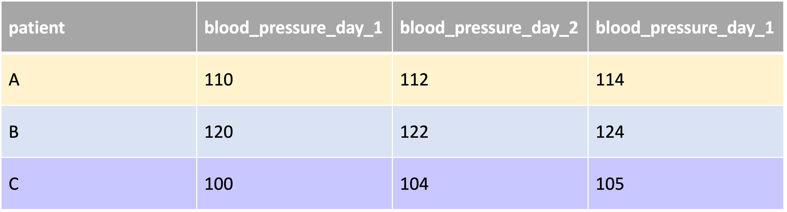
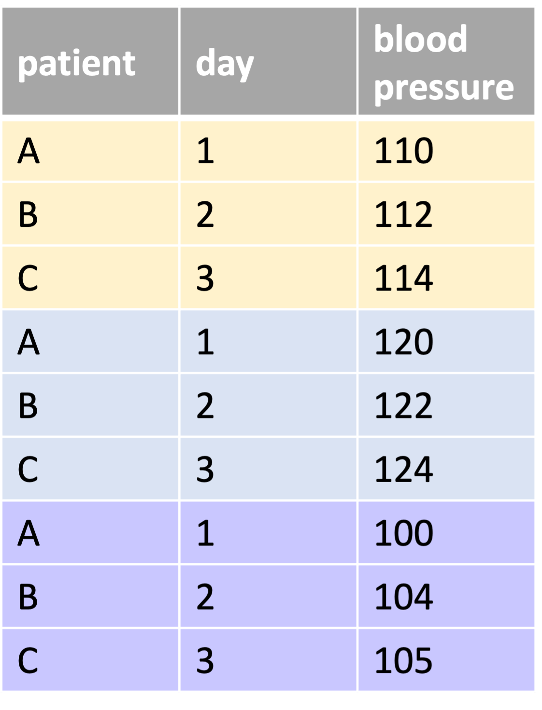

```{r, eval = F, include = F}
Hi GRAPH Courses student!
  
This is a CODE ALONG document where you can type code as you follow the lesson video. 

We encourage you to do this; typing code with the teacher is the best way to learn the right syntax. 

If you are not sure how to use our code-along documents, please watch this video: https://vimeo.com/767363677
```

```{r, echo = F, message = F, warning = F}
# Load packages 
if(!require(pacman)) install.packages("pacman")
pacman::p_load(rlang, tidyverse, knitr, here)

## functions
source(here::here("global/functions/misc_functions.R"))

## default render
knitr::opts_chunk$set(warning = F, message = F, class.source = "tgc-code-block", error = T)

## autograders
suppressMessages(source(here::here("autograder/ls07_pivoting_autograder.R")))
```

# Learning Objectives

-   You will understand what a wide data format is, and what a long data format is

-   You will know how to pivot long data to wide data using `pivot_long()`

-   You will know how to pivot wide data to long data using `pivot_wider()`

-   You have the intuition why the long data format is easier for plotting and wrangling

# Packages

```{r warning = F, message = F, echo = F}
# Load packages 
if(!require(pacman)) install.packages("pacman")
pacman::p_load(tidyverse, outbreaks, janitor, rio, here, knitr)
```

------------------------------------------------------------------------

# What do wide and long mean?

-   Understand by examples

-   Example 1: blood pressure data from three patients on three days.

    WIDE format:

{width="500"}

LONG format:

{width="200"}

------------------------------------------------------------------------

-   Example 2: observational units are countries

LONG format:

{width="200"}

WIDE format:

{width="300"}

------------------------------------------------------------------------

-   Examples above = time-series datasets

-   Example 3: the number of patients in different units of three hospitals

WIDE format:


LONG format:


------------------------------------------------------------------------

::: vocab
"observational units" = "statistical units" = primary entities described by the columns/variables

For example:

-   a patient

-   a country

-   a hospital
:::

------------------------------------------------------------------------

::: practice
Consider the mock dataset created below:

```{r}
temperatures <- 
  data.frame(
    country = c("Sweden", "Denmark", "Norway"),
    avgtemp.1994 = 1:3,
    avgtemp.1995 = 3:5,
    avgtemp.1996 = 5:7)
temperatures
```

Is this data in a wide or long format?

```{r, eval = FALSE}
# Enter the string wide or the string long
# Assign your answer to the object Q_data_type
# Then run the CHECK function below
Q_data_type <- "_____"
```

```{r, include = FALSE}
.CHECK_Q_data_type() # Check your answer by running this function
.HINT_Q_data_type()

# To obtain the solution, run the line below
.SOLUTION_Q_data_type()
# Each question has a solution function similar to this.
# Where HINT is replaced with SOLUTION in the function name.
# But you will need to type out the function name on your own.
# This is to discourage you from looking at the solution before answering the question.
```
:::

------------------------------------------------------------------------

# When should you use wide vs long data?

-   Depends on what you want to do!

-   **wide format** = great for ***displaying** data* = easy to visually compare values

-   **long format** = best for **data analysis** tasks = like grouping & plotting

-   know how to **switch** from one format to the other

-   switching from the wide to the long format = **pivoting**

------------------------------------------------------------------------

# Pivoting wide to long

-   Data from [Gapminder](https://www.gapminder.org) on the **number of infant deaths** in specific countries over several years.

::: side-note
[Gapminder](https://www.gapminder.org) is a good source of **clean, rich health-relevant datasets.**
:::

```{r}
infant_deaths_wide <- read_csv(here("data/gapminder_infant_deaths.csv"))
infant_deaths_wide
```

------------------------------------------------------------------------

-   observational unit = 1 country = 1 row

-   repeated measurements spread out across multiple columns

-   a wide format

------------------------------------------------------------------------

-   convert to a long format = `pivot_longer`.

-   `cols` argument = which columns we want to pivot

```{r}
infant_deaths_wide %>% 
  # we pivot longer the columns x2010 to x2015
  
```

------------------------------------------------------------------------

-   each country = 5 rows = one row per year

-   years are in the variable `names`

-   death count values are in the variable `values`

-   infant deaths values used to be in matrix format (2 dimensions; 2D)

-   now in a vector format (1 dimension; 1D).

------------------------------------------------------------------------

-   default names of the variables, `names` and `values` = unsatisfactory

-   do not describe what the variables contain

-   custom column names with `names_to` & `values_to`

```{r}
infant_deaths_wide %>% 
  # we will set our names to "year" and the values to "death_counts"
  pivot_longer(cols = x2010:x2015,
               names_to = , 
               values_to = )
```

------------------------------------------------------------------------

::: pro-tip
Long format = more informative than the original wide format.

Why?

In the wide format, no idea what the 2D matrix of death counts represents

In the long format, the variable has a name.
:::

------------------------------------------------------------------------

-   Side-note :

-   Remove the `x` in front of each year.

```{r}
infant_deaths_wide %>% 
  pivot_longer(cols = x2010:x2015,
               names_to = "year", 
               values_to = "deaths_count") %>%
  # we use parse_number inside of mutate
  
```

------------------------------------------------------------------------

Let's store the data:

```{r}
infant_deaths_long <- 
  infant_deaths_wide %>% 
  pivot_longer(cols = x2010:x2015,
               names_to = "year", 
               values_to = "deaths_count")
```

------------------------------------------------------------------------

::: practice
For this practice question, you will use the `euro_births_wide` dataset from [Eurostat](https://ec.europa.eu/eurostat/databrowser/view/tps00204/default/table). It shows the annual number of births in 50 European countries:

```{r}
euro_births_wide <- 
  read_csv(here("data/euro_births_wide.csv"))
head(euro_births_wide)
```

The data is in a wide format. Convert it to a long format, with the following column names: "country", "year" and "births_count"

```{r, eval = FALSE}
Q_euro_births_long <- 
  euro_births_wide %>% # complete the code with your answer
```

```{r, include = FALSE}
.CHECK_Q_euro_births_long()
.HINT_Q_euro_births_long()
```
:::

------------------------------------------------------------------------

# Pivoting long to wide

-   pivot the other way, from long to wide?

-   Let's first consider where you're likely to run into long vs wide data:

    -   Wide data tend to come from external sources

    -   Long data is likely to be created by you while data wrangling.

-   Let's see an example of this now.

------------------------------------------------------------------------

-   Let's see an example of this now.

-   Datase of patient records from an Ebola outbreak in Sierra Leone in 2014

-   We extract this data from the {outbreaks} package and perform some simplifying manipulations on it.

```{r}
ebola <- 
  outbreaks::ebola_sierraleone_2014 %>% 
  _________________ 
  _________________
  _________________
  
```

Now, consider the following grouped summary of the `ebola` dataset, which counts the number of patients recorded in each district in each year:

```{r}
cases_per_district_per_year <- 
  ebola %>% 
  group_by(____________) %>% 
  count(____________) %>% 
  ungroup()

cases_per_district_per_year
```

-   This is a quintessentially "long" dataset! Each observational unit (each district) occupies multiple rows, with one row for each measurement (each year).

-   Now, let's see how to convert such long data into a wide format with `pivot_wider()`.

-   Within this function, there are two important arguments:

    -   `values_from` and `names_from`

```{r}
cases_per_district_per_year %>% 
  pivot_wider(_______________________, 
              _______________________)
```

::: practice
The `population` dataset from the `tidyr` package shows the populations of 219 countries over time.

Pivot this data into a wide format. Your answer should have 20 columns and 219 rows.

```{r, eval = FALSE}
Q_population_widen <- 
  tidyr::population
```

```{r, include = FALSE}
.CHECK_Q_population_widen()
.HINT_Q_population_widen()
```
:::

------------------------------------------------------------------------

# Why is long data better for analysis?

-   Long data is best for a majority of data analysis tasks

## Filtering grouped data

-   Example using the infant deaths dataset. Imagine that we want to answer the following question:

    -   **For each country, which year had the highest number of child deaths?**

This is how we would do so with the long format of the data :

```{r}
infant_deaths_long %>% 
  group_by(country) %>% 
  filter(deaths_count == max(deaths_count))
```

Easy right? We can easily see, for example, that Afghanistan had its highest infant death count in 2010, and the United Arab Emirates had its highest death count in 2011.

------------------------------------------------------------------------

-   Answering the same question with wide data:

-   You could try an approach like this with rowise():

```{r}
infant_deaths_wide %>% 
  rowwise() %>% 
  mutate(max_count = max(__________________________))
```

This works, but we still don't know which year is attached to that value in `max_count`. We would have to take that value and index it back to its respective year column... what a hassle! There are solutions to find this but all are very painful. Why make your life complicated when you can just pivot to long format and use the beauty of `group_by()` and `filter()`?

::: side-note
Here we used a special {dplyr} function: `rowwise()`. `rowwise()` is a function which allows further operations to be applied on the rows rather than on the columns. It is equivalent to creating one group for each row (`group_by(row_number())`).

Without `rowwise()` you would get this :

```{r}
infant_deaths_wide %>% 
  mutate(max_count = max(x2010, x2011, x2012, x2013, x2014, x2015))
```

The maximum count over all columns.
:::

::: practice
For this practice question, you will perform a grouped filter on the long format `population` dataset from the `tidyr` package. Use `group_by()` and `filter()` to obtain a dataset that shows the maximum population recorded for each country, and the year in which that maximum population was recorded.

```{r, eval = FALSE}
Q_population_max <- 
  population 
```

```{r, include = FALSE}
.CHECK_Q_population_max()
.HINT_Q_population_max()
```
:::

## Summarizing grouped data

-   Grouped summaries are also difficult to perform on wide data. 

-   Example: Using the `infant_deaths_long` dataset once again, if you want to ask: 

-   **For each country, what was the mean number of infant deaths and the standard deviation (variation) in deaths ?**

-   With long data it is simple:

```{r}
infant_deaths_long %>% 
  group_by(___________-) %>% 
  summarize(__________ = mean(__________), 
            __________ = sd(__________))
```

With wide data, on the other hand, finding the mean is less intuitive...

```{r}
infant_deaths_wide %>% 
  rowwise() %>% 
  mutate(mean_deaths = sum(x2010, x2011, x2012, 
                           x2013, x2014, x2015, na.rm = T)/6) 
```

And finding the standard deviation would be very difficult. (We can't think of any way to achieve this, actually.)

::: practice
For this practice question, you will again work with the long format `population` dataset from the `tidyr` package.

Use `group_by()` and `summarize()` to obtain, for each country, the maximum reported population, the minimum reported population, and the mean reported population across the years available in the data. Your data should have four columns, "country", "max_population", "min_population" and "mean_population".

```{r, eval = FALSE}
Q_population_summaries <- 
  population
```

```{r, include = FALSE}
.CHECK_Q_population_summaries()
.HINT_Q_population_summaries()
```
:::

## Plotting

Finally, one of the data analysis tasks that is MOST hindered by wide formats is plotting. You may not yet have any prior knowledge of {ggplot} and how to plot so we will see the figures without going in depth with the code. What you need to remember is: many plots with with ggplot are also only possible with long-format data

Consider again the infant_deaths data `infant_deaths_long`. We will plot the number of deaths for Belgium per year:

```{r render = knit_print}
infant_deaths_long %>% 
  filter(country == "Belgium") %>% 
  ggplot() + 
  geom_col(aes(x = year, y = deaths_count))
```

The plotting works because we can give the variable `year` for the x-axis. In the long format, `year` is a variable variable of its own. In the wide format, each year is a column and your counts are a matrix, not a vector. Plots need vectors of data!

------------------------------------------------------------------------

Another plot that would not be possible without a long format:

```{r render = knit_print}
infant_deaths_long %>% 
  head(30) %>% 
  ggplot(aes(x = year, y = deaths_count, group = country, color = country)) + 
  geom_line() + 
  geom_point()
```

Once again, the reason is the same, we need to tell the plot what to use as an x-axis and a y-axis and it is necessary to have these variables in their own column (as organized in the long format).

# Pivoting can be hard ... {.unnumbered}

We have mostly looked at very simple examples here, but in the wild, you will run into not-so-neat situations. We strongly recommend some further reading of [this additional resource](https://tidyr.tidyverse.org/articles/pivot.html).

# Wrap Up ! {.unnumbered}

You have now explored different datasets and how they are either in a long or wide format. In the end, it's just about how you present the information. Sometimes one format will be more convenient, and other times another could be best. Now, you are no longer limited by the format of your data: don't like it? change it !

# Contributors {.unlisted .unnumbered}

The following team members contributed to this lesson:

`r tgc_contributors_list(ids = c("kendavidn", "lolovanco"))`
