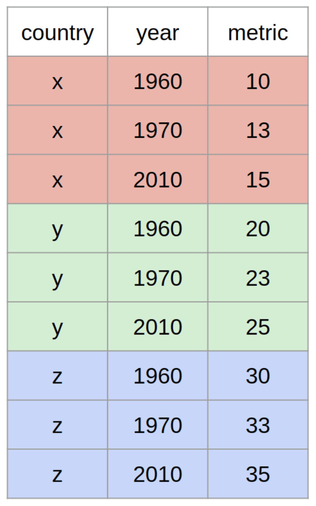

```{r, echo = F, message = F, warning = F}
# Load packages 
if(!require(pacman)) install.packages("pacman")
pacman::p_load(rlang, tidyverse, knitr, here)

## functions
source(here::here("global/functions/misc_functions.R"))

## default render
registerS3method("reactable_5_rows", "data.frame", reactable_5_rows)
knitr::opts_chunk$set(class.source = "tgc-code-block", render = reactable_5_rows)

## autograders
suppressMessages(source(here::here("autograder/ls08_pivoting_autograder.R")))
```

# Intro

Pivoting: it's a verb from our every day life used to describe the movement of an object or a person. Well datasets can pivot too ! Today we are going to see why pivoting them is tool for efficient and high-level.

# Learning Objectives

-   You will understand what a wide data format is, and what a long data format is

-   You will know how to pivot long data to wide data using `pivot_long()`

-   You will know how to pivot wide data to long data using `pivot_wider()`

-   You have the intuition why the long data format is easier for plotting and wrangling

# Packages

```{r warning = F, message = F, echo = F}
# Load packages 
if(!require(pacman)) install.packages("pacman")
pacman::p_load(tidyverse, outbreaks, janitor, rio, here, knitr)
```


# What do wide and long mean?

The terms wide and long are best understood in the context of example datasets. Let's take a look at some now.

Imagine that you have three patients from whom you collect blood pressure data on three days.

You can record the data in a wide format like this:

{width="500"}


Or you could record the data in a long format as so :

{width="200"}

Take a minute to study the two datasets to make sure you understand the relationship between them. 

In the wide dataset, each observational unit (each patient) occupies only one row. And each measurement. (blood pressure day 1, blood pressure day 2...) is in a separate column. 

In the long dataset, on the other hand, each observational unit (each patient) occupies multiple rows, with one row for each measurement. 

------------------------------------------------------------------------

Here is another example with mock data, in which the observational units are countries:

{width="200"} 

{width="300"}


------------------------------------------------------------------------

The examples above are both time-series datasets, because the measurements are repeated across time (day 1, day 2 and so on). But the concepts of long and wide are relevant to other kinds of data too, not just time series data. 

Consider the example below, showing the number of patients in different units of three hospitals: 


::: vocab

The "observational units", sometimes called "statistical units" of a dataset are the primary entities or items described by the columns in that dataset. 

For example, for the 

:::

::: practice
Consider the mock dataset created below: 
```{r}
temperatures <- 
  data.frame(
    country = c("Sweden", "Denmark", "Norway"),
    avgtemp.1994 = 1:3,
    avgtemp.1995 = 3:5,
    avgtemp.1996 = 5:7)
temperatures
```

Is this data in a wide or long format?

```{r, eval = FALSE}
# Enter the string wide or the string long
# Assign your answer to the object Q_data_type
# Then run the CHECK function below
Q_data_type <- "_____"
```

```{r, include = FALSE}
.CHECK_Q_data_type() # Check your answer by running this function
.HINT_Q_data_type()

# To obtain the solution, run the line below
.SOLUTION_Q_data_type()
# Each question has a solution function similar to this.
# Where HINT is replaced with SOLUTION in the function name.
# But you will need to type out the function name on your own.
# This is to discourage you from looking at the solution before answering the question.
```

:::

# When should you use wide vs long data?

The truth is: it really depends on what you want to do! The wide format is great for *displaying data* because it's easy to visually compare values this way. Long data is best for some data analysis tasks, like grouping and plotting.

It will therefore be essential for you to know how to switch from one format to the other easily. Switching from the wide to the long format, or the other way around, is called **pivoting**.

# Pivoting wide to long

To practice pivoting from a wide to a long format, we'll consider data from [Gapminder](https://www.gapminder.org) on the **number of infant deaths** in specific countries over several years.

::: side-note
[Gapminder](https://www.gapminder.org) is a good source of clean, rich health-relevant datasets. You are encouraged to peruse their collections. 
:::

Below, we read in and view this data on infant deaths.

```{r}
infant_deaths_wide <- read_csv(here("data/gapminder_infant_deaths.csv"))
infant_deaths_wide
```

We observe that each observational unit (each country) occupies only one row, with the repeated measurements spread out across multiple columns. Hence this dataset is in a wide format.

To convert to a long format, we can use a convenient function `pivot_longer`. Within `pivot_longer` we define, using the `cols` argument, which columns we want to pivot:


```{r}
infant_deaths_wide %>% 
  pivot_longer(cols = x2010:x2015)
```

Very easy! 

We can observe that the resulting long format dataset has each country occupying 5 rows (one per year between 2010 and 2015). The years are indicated in the variable `names`, and all the death count values occupy a single variable, `values`. The infant deaths used to be in matrix format (2 dimensions; 2D), now they are in a vector format (1 dimension; 1D).

This long dataset will be much more handy for many data analysis procedures. 

As a good data analyst, you may find the default names of the variables, `names` and `values`, to be unsatisfactory; they do not adequately describe what the variables contain. No worries, you can give custom column names, using the arguments `names_to` and `values_to`:

```{r}
infant_deaths_wide %>% 
  pivot_longer(cols = x2010:x2015,
               names_to = "year", 
               values_to = "deaths_count")
```

::: pro-tip

In this example, one might argue that the new long format is more informative than the original wide format. Why? Because of the informative column name "deaths_count". In the wide format, unless the CSV is named `count_infant_deaths` or something similar, or someone tells you "these are the counts of infant deaths per country and per year", you have no idea what the numbers in the cells represent.

:::

You may also want to remove the `x` in front of each year. This can be achieved with the handy `parse_number()` function from the {readr} package, which extracts numbers from strings:

```{r}
infant_deaths_wide %>% 
  pivot_longer(cols = x2010:x2015,
               names_to = "year", 
               values_to = "deaths_count") %>% 
  mutate(year = parse_number(year))
```

Great! Now, we have a clean, long dataset.

For later use, let's now store this data:

```{r}
infant_deaths_long <- 
  infant_deaths_wide %>% 
  pivot_longer(cols = x2010:x2015,
               names_to = "year", 
               values_to = "deaths_count")
```

::: practice
For this practice question, you will use the `euro_births_wide` dataset from [Eurostat](https://ec.europa.eu/eurostat/databrowser/view/tps00204/default/table). It shows the annual number of births in 50 European countries:

```{r}
euro_births_wide <- 
  read_csv(here("data/euro_births_wide.csv"))
head(euro_births_wide)
```

The data is in a wide format. Convert it to a long format, with the following column names: "country", "year" and "births_count"

```{r, eval = FALSE}
Q_euro_births_long <- 
  euro_births_wide %>% # complete the code with your answer
```

```{r, include = FALSE}
.CHECK_Q_euro_births_long()
.HINT_Q_euro_births_long()
```
:::

# Pivoting long to wide

Now you know how to pivot from wide to long data with `pivot_longer()`. To go from long to wide data, you can use the fittingly-named `pivot_wider()` function.

Before we consider how to use this function though, lets consider the question "where does long data come from?".

Wide data often comes from external sources, as we have seen above. Long data, on the other hand, is likely to be created by *you* in the course of your data wrangling, especially in the course of `group_by()`-`summarize()` manipulations. Let's see an example.

We will use a dataset of patient records from an Ebola outbreak in Sierra Leone in 2014. Below we extract this data from the {outbreaks} package and perform some simple manipulations on it.

```{r}
ebola <- 
  outbreaks::ebola_sierraleone_2014 %>% 
  as_tibble() %>% 
  mutate(year = lubridate::year(date_of_onset)) %>% # extract the year from the date
  select(id, district, year)

ebola
```

Now, consider the the following grouped summary of the `ebola` dataset, which counts the number of patients recorded in each district in each year:

```{r}
cases_per_district_per_year <- 
  ebola %>% 
  group_by(district) %>% 
  count(year)

cases_per_district_per_year
```

Do you notice that the output appears to be long data?

Each district occupies multiple rows, with one row for each measurement (each year). 

***

Now, what if we wanted to switch `cases_per_district_per_year` back to a wide format? 


There is an easy function for this: `pivot_wider()` (similar to `pivot_longer()`).

Let's switch our data back to a wide format:

```{r}
cases_per_district_per_year %>% 
  pivot_wider(values_from = n, 
              names_from = year)
```

`pivot_wider()` has two important arguments: `values_from` and `names_from`. `values_from` defines which values will become the core of the wide data format (in other words: which 1D vector will become a 2D matrix). `names_from` identifies which variable to use to define column names in the wide format.

To explain with our dataset `cases_per_district_per_year`. We define our observation unit as the districts. So to have a wide format, we need the variable `years` to become two columns: `2014` and `2015`, the unique values of the variable. We define this in `pivot_wider()` with `names_from`. This would then create a dataframe in the format districts x years, in other words, a matrix. You need to fill the matrix with values, hence the argument `values_from`, which indicates we want to fill the matrix with count values.

Now, imagine we wanted to see the years as our unique observation unit. We would do exactly the same, but our 2nd dimension to the wide format would be the `districts`:

```{r}
cases_per_district_per_year %>% 
  pivot_wider(values_from = n, 
              names_from = district)
```

Here our unique observation units (our rows) are now the years (2014, 2015). Our 2nd dimension (our columns) are the districts. Our matrix input are the count values organized in the format years x districts.

That's it! We'll see more complex examples in the next lesson...

::: practice
Above, using Gapminder's data on the number of infant deaths, we transformed the wide format dataset `infant_deaths_wide` into the long format dataset `infant_deaths_long`. Now, using `pivot_wider()`, let's switch it back to its wide format again. We want the unique observation unit to be the countries and to have a countries x years matrix, filled with the death counts.

```{r, eval = FALSE}
# Q_infant_death_wide_countries <- 
#   infant_death_long %>%
#   pivot_wider(___________)
```

```{r, include = FALSE}
# .CHECK_Q_infant_death_wide_countries()
# .HINT_Q_infant_death_wide_countries()
```

Using again `pivot_wider()` and again `infant_death_long`, let's switch it back to its wide format but this time we want the unique observation unit to be the years and to have a years x countries matrix, filled with the death counts.

```{r, eval = FALSE}
# Q_infant_death_wide_years <- 
#   infant_death_long %>%
#   pivot_wider(___________)
```

```{r, include = FALSE}
# .CHECK_Q_infant_death_wide_years()
# .HINT_Q_infant_death_wide_years()
```
:::

------------------------------------------------------------------------

# Why is long data better for analysis?

Above we mentioned that long data is best for a majority of data analysis tasks. Now we can justify why.

## Filtering grouped data

First, let's talk about filtering grouped data. Some filter operations are difficult to do on wide data.

Here is an example taking the infant deaths dataset. We want to answer the following question: **For each country, which year had the highest number of child deaths?**

This is how we would do so with the long format of the data :

```{r}
infant_deaths_long %>% 
  group_by(country) %>% 
  filter(deaths_count == max(deaths_count))
```

Easy right? We can easily see that Afghanistan had its maximal infant death count in 2010.

------------------------------------------------------------------------

If you wanted to do the same thing with wide data, you would need some weird functions like `rowwise()`:

```{r}
infant_deaths_wide %>% 
  rowwise() %>% 
  mutate(max_count = max(x2010, x2011, x2012, x2013, x2014, x2015))
```

Okay it works, but we still don't know which year is attached to that value in `max_count`. We would have to take that value and index it back to its respective year column... what a hassle! There are solutions to find this but all are very painful. Why make your life complicated when you can just pivot to long format and use the beauty of `group_by()` and `filter()`?

Here we use a special {dplyr} function: `rowwise()`. `rowwise()` is a function which allows further operations to be applied on the rows rather than on the columns. As you can see, here `mutate()` creating a maximum value column, takes the maximum of each row (not the maximum of each column.

::: side-note
Without `rowwise()` you would get this :

```{r}
infant_deaths_wide %>% 
  mutate(max_count = max(x2010, x2011, x2012, x2013, x2014, x2015))
```

The max count over all columns.
:::

::: practice
Using the Eurostat dataset, `euro_births_wide`, wrangle to have the maximal birth count over all years, per country. (like above, you should think of pivoting, then using `group_by()` and `filter()`)

```{r, eval = FALSE}
# Q_euro_births_max <- "_____"
#   
```

```{r, include = FALSE}
# .CHECK_Q_euro_births_max()
# .HINT_Q_euro_births_max()
```
:::

## Summarizing grouped data

Like filtering, most summarizing operations will be difficult to do on wide data. If we pause and think why it is so hard to filter or summarize on wide data, we realize that it is because the wide data prevents us from grouping our data. A data format where each row is a unique observation unit is a data format where each group is a unique observation unit. A long format allows to group data.

For example, if you want to ask: **For each country, between 2015 and 2021, what was the mean number of infant deaths and the standard deviation (variation) in deaths ?**

With long data it is simple:

```{r}
infant_deaths_long %>% 
  group_by(country) %>% 
  summarize(mean_deaths = mean(deaths_count), 
            sd_deaths = sd(deaths_count))
```

With wide data, on the other hand, finding the mean is doable...

```{r}
infant_deaths_wide %>% 
  rowwise() %>% 
  mutate(mean_deaths = sum(x2010, x2011, x2012, 
                           x2013, x2014, x2015, na.rm = T)/6) 
```

But standard deviation would be more difficult.

::: practice
Using the Eurostat dataset, `euro_births_wide`, wrangle to have the mean number and variation (standard deviation) of birth over all years, per country. (like above, you should think of pivoting, then using `group_by()` and `summarize()`)

```{r, eval = FALSE}
# Q_euro_births_mean_sd <- "_____"
#   
```

```{r, include = FALSE}
# .CHECK_Q_euro_births_mean_sd()
# .HINT_Q_euro_births_mean_sd()
```
:::

## Joining datasets

Joining related datasets is often easier with long data.

To illustrate this, let us load another dataset: the number of children born each year (also another jewel dataset from Gapminder!).

```{r}
infant_births_wide <- 
    read_csv(here("data/gapminder_new_births.csv"))

infant_births_wide
```

The dataset looks very similar to the one about infant deaths, only this time, we are viewing the counts of births.

You may want to join this information on births with the number of deaths. With this joint dataset, we could calculate the infant mortality rate for each year

With long data these operations are easy. First pivot new data to long:

```{r}
infant_births_long <- 
  infant_births_wide %>% 
  pivot_longer(cols = x2010:x2015, 
               values_to = "births_count", 
               names_to = "year")

infant_births_long
```

Then join using `left_join()`:

```{r}
infant_deaths_long %>% 
  left_join(infant_births_long)
```

The mortality rate is the number of deaths on the number of births. You can easily calculate the mortality rate for each year using `mutate()`.

```{r}
infant_deaths_long %>% 
  left_join(infant_births_long) %>% 
  mutate(infant_mortality_rate = deaths_count/births_count, 
         infant_mortality_rate_per_cent = infant_mortality_rate * 100)
```

::: practice
Continuing the use of Gapminder, we will load in 2 more datasets that you will then join together.

The first is a count of HIV cases per year and per country.

```{r}
hiv_counts <- 
    read_csv(here("data/gapminder_hiv.csv"))

hiv_counts
```

The second is a count of malaria cases per year and per country.

```{r}
malaria_counts <- 
    read_csv(here("data/gapminder_malaria.csv"))

malaria_counts
```

We are going to join these two datasets together after pivoting them into long format.

```{r, eval = FALSE}
# Q_malaria_hiv_comparison <- 
#   hiv_counts_long %>%
#   left_join(malaria_counts_long)
```

```{r, include = FALSE}
# .CHECK_Q_malaria_hiv_comparison()
# .HINT_Q_malaria_hiv_comparison()
```

After joinging them, filter for the country of Vietnam and for the year 2000. In 2000, did Vietnam have more cases of malaria or HIV ? Your answer should be a string (either "malaria" or "HIV").

```{r, eval = FALSE}
# Q_Vietnam_2000 <- "_______"
```

```{r, include = FALSE}
# .CHECK_Q_Vietnam_2000()
# .HINT_Q_Vietnam_2000()
```
:::

## Plotting

Finally, one of the data analysis tasks that is MOST hindered by wide formats is plotting. You may not yet have any prior knowledge of {ggplot} and how to plot so we will see the figures without going in depth with the code. What you need to remember is: many plots with with ggplot are also only possible with long-format data

Consider again the infant_deaths data `infant_deaths_long`. We will plot the number of deaths for Belgium per year:

```{r render = knit_print}
infant_deaths_long %>% 
  filter(country == "Belgium") %>% 
  ggplot() + 
  geom_col(aes(x = year, y = deaths_count))
```

The plotting works because we can give the variable `year` for the x-axis. In the long format, `year` is a variable variable of its own. In the wide format, each year is a column and your counts are a matrix, not a vector. Plots need vectors of data!

------------------------------------------------------------------------

Another plot that would not be possible without a long format:

```{r render = knit_print}
infant_deaths_long %>% 
  head(30) %>% 
  ggplot(aes(x = year, y = deaths_count, group = country, color = country)) + 
  geom_line() + 
  geom_point()
```

Once again, the reason is the same, we need to tell the plot what to use as an x-axis and a y-axis and it is necessary to have these variables in their own column (as organized in the long format).

# Wrap Up ! {.unnumbered}

You have now explored different datasets and how they are either in a long or wide format. In the end, it's just about how you present the information. Sometimes one format will be more convenient, and other times another could be best. Now, you are no longer limited by the format of your data: don't like it? change it !

# Contributors {.unlisted .unnumbered}

The following team members contributed to this lesson:

`r tgc_contributors_list(ids = c("kendavidn", "lolovanco"))`
